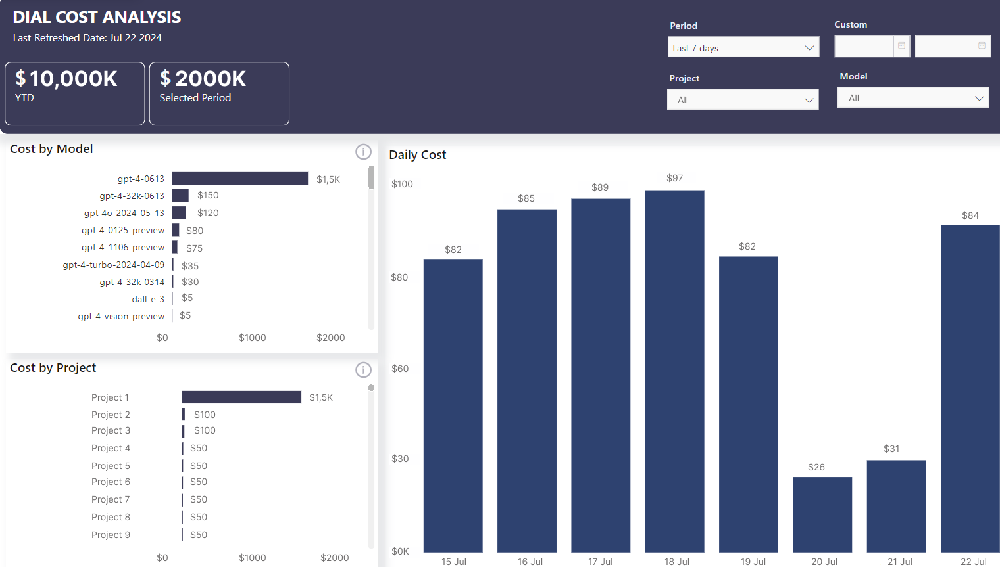

# Overview

## Authentication 

**Authentication** is the process of verifying the identity. 

AI DIAL supports both web-based and programmatic authentication methods. For web-based authentication, we use JWT to verify users' identity, while for server-to-server interactions, we use API keys. 

## Authorization 

**Authorization** happens after authentication and determines what permissions or levels of access an authenticated user has.

Both web and programmatic authorization methods offer detailed permission management, enabling you to regulate access to specific features or resources.

To authorize API keys, roles can be set and configured. These roles can limit access to system resources such as models, applications, addons, and assistants. They can also be used to limit the number of tokens that can be transmitted within a certain time frame. DIAL applications can function without requiring a permanent API key. Instead, a temporary per-request key is used, which is replaced with each new request.

For authorization in browser-based applications, we use JWT to access the information about users' roles and then match them to configuration in DIAL to determine whether a user has access to a particular resource.

## Rate Limits

For any role you can define limits - the number of token that can be passed to a model. [AI DIAL Analytics Realtime](https://github.com/epam/ai-dial-analytics-realtime) service can be configured to collect this information and store it in a time-series DB of your choice (such as InfluxDB). You can then analyze this data and visualize in Grafana, MS PowerBI or other tools: 

