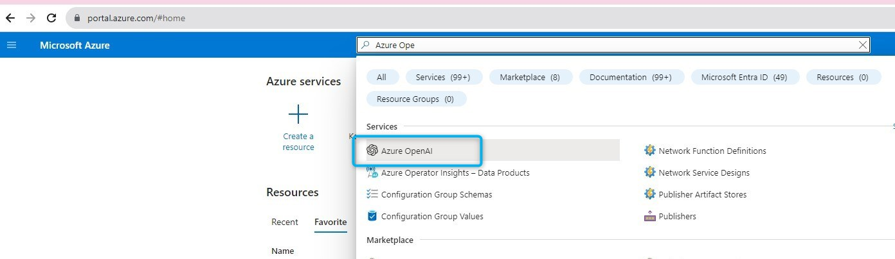
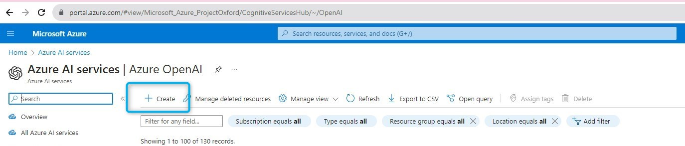
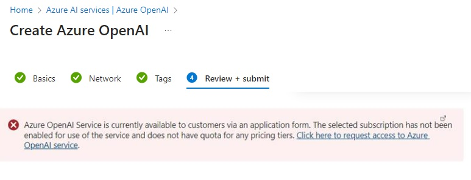
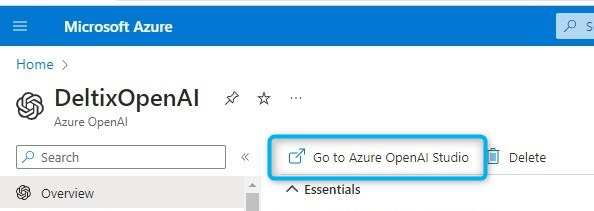
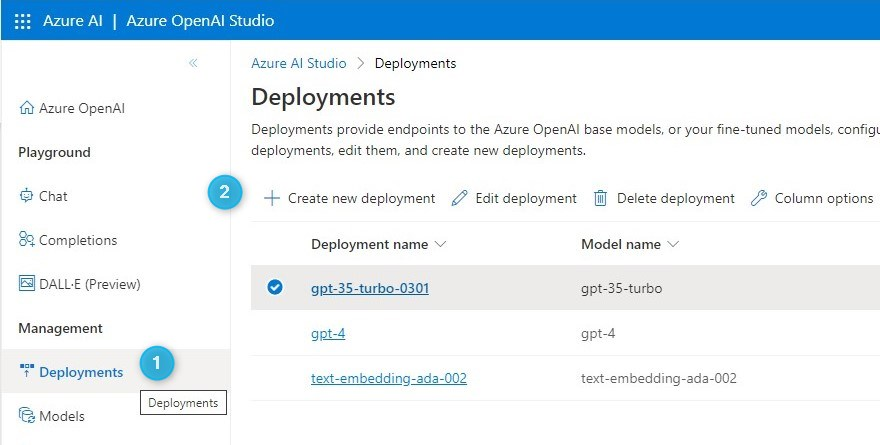
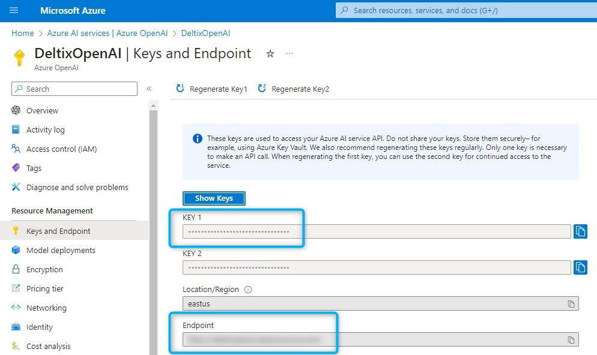
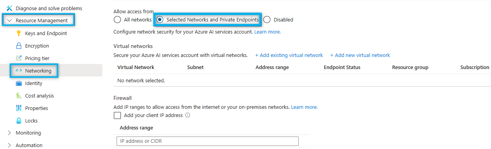

# OpenAI Model Deployment

From this instruction, you will learn how to create an Azure OpenAI model GPT-3.5-turbo/GPT-4.

## Steps

1. [Create a model deployment](#step-1-create-a-model-deployment)
2. [Add model to AI DIAL](#step-2-add-model-to-ai-dial)

## Step 1: Create a model deployment

1. Login to the MS Azure portal (https://portal.azure.com/) with your credentials. Create an account if you do not have one.
2. Use the search bar to look up **Azure OpenAI** and click it to navigate to the **Azure AI Services|Azure OpenAI** page.
   
   
   
3. In **Azure AI Services|Azure OpenAI**, click **Create** and fill in all the required fields.
   
   
   
4. You may need to request access to Azure OpenAI Services. Follow the link in the notification to do that. You can review this form by following [this link](https://customervoice.microsoft.com/Pages/ResponsePage.aspx?id=v4j5cvGGr0GRqy180BHbR7en2Ais5pxKtso_Pz4b1_xUNTZBNzRKNlVQSFhZMU9aV09EVzYxWFdORCQlQCN0PWcu)
   
   
   
5. When done, you should have your OpenAI model in the **Azure AI services** section. Click it to open and then click **Go to Azure OpenAI Studio** in the top bar.
   
   
   
6. In Azure OpenAI Studio, click **Deployment** in the navigation menu and click **Create new deployment**. Fill in the required fields and click **Create** to create a model.
   
   

    > It is important to note that certain models may not be accessible for deployment in a particular region. If you need a particular model, you will have to submit a separate request or relocate Azure OpenAI to a different region.

7. Go back to your model page and click **Keys and Endpoint**. In this section, you can find your key and endpoint that you will need to provide in AI DIAL configuration file.
   
    

8. You can restrict access to your accounts based on a specific subset of networks by configuring network rules, only applications that access data through the designated set of networks are permitted to access the account. You can manage default network access rules for Azure AI services resources in **Resource Management/Networking**.

   > Refer to [Microsoft Documentation](https://learn.microsoft.com/en-us/azure/ai-services/cognitive-services-virtual-networks?context=%2Fazure%2Fcognitive-services%2Fopenai%2Fcontext%2Fcontext&tabs=portal#manage-default-network-access-rules) to learn more.
   > Refer to [Microsoft Data Privacy Policy](https://learn.microsoft.com/en-us/legal/cognitive-services/openai/data-privacy) to learn how data provided by you to the Azure OpenAI service is processed, used, and stored.

   

## Step2: Add model to AI DIAL

In AI DIAL configuration, add your model **endpoint** and **key** in model `upstreams`:

```yaml
            "upstreams": [
              {
                "endpoint": "%%MODEL_ENDPOINT%%",
                "key": "%%MODEL_KEY%%"
              }
```

Refer to [AI DIAL Configuration](https://github.com/epam/ai-dial-helm/blob/8a2d6ebe301965ef0e4f06bc5f6e47aadc7b597f/charts/dial/examples/generic/simple/values.yaml#L17) to view the configuration template. 


