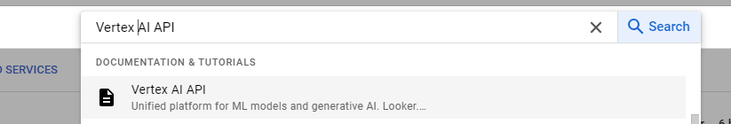
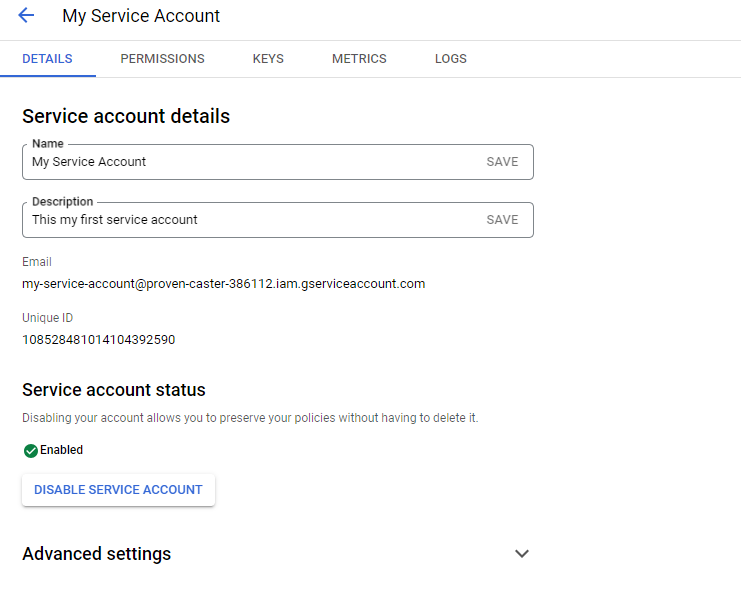
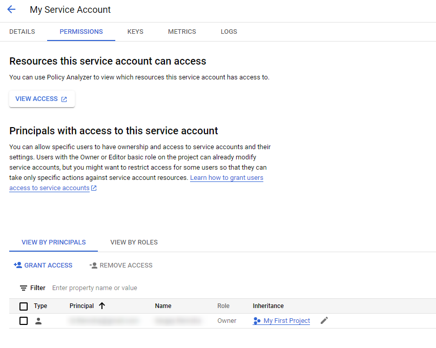

# GCP VertexAI Model Deployment

In this instruction, you will learn how to create VertexAI model in Google Cloud Platform and deploy it in AI DIAL config.

## Prerequisites

* Active Google Cloud project
* Enabled billing for the project

## Steps
  
1. Enable Vertex AI API
2. Create a Service Account
3. Configure AI DIAL Adapter

## How to enable API

> Refer to [Google Cloud Documentation](https://cloud.google.com/vertex-ai/docs/featurestore/setup) to learn how to create an account and enable billing.

1.	Log into your Google Cloud account.
2.	In the navigation panel on the left, select **APIs & Services** and there click **+ Enable APIs and Services** at the top of the screen.

  	
  	
4.	In the search bar, type **Vertex AI API** and select the **Vertex AI API** panel when it appears in search results.
   
5.	Click **Enable** or **Start Free** to turn on the Vertex AI API for your Google Cloud project.
   
## Create a service account

To communicate with VertexAI models, it is necessary to have a service account.

**To create a Service Account**:

1.	In your Google Cloud account, on the main dashboard, open the Navigation Menu at the top-left corner of the page.
2.	On the Navigation menu, in **IAM & Admin**, navigate to **Service Accounts**.
   
3.	To create a new service account, click **+ Create Service Account** and fill in the details for your new service account and click **Done**. The new service account appears on the Service Account page. Click it to view the details
  
4.	In your Service Account, you can configure details, permissions, and keys:

    * **In DETAILS** you can view and edit your account details.
    
    * **In PERMISSIONS**, set permissions for the service account. Grant this service account access to roles on the project level, following the concept of less privilege.
    
    * **In KEYS**, create a key for this service account and download it in JSON format.
    

## Deploy the model in AI DIAL config

Mount your model key JSON file as a secret to VertexAI adapter pod.

```yaml
proxy:
  vertex:
    secrets:
      gcp-ai-proxy-key: '["/mnt/secrets-store/your-key.json"]'
```
> Refer to [AI DIAL Config](https://github.com/epam/ai-dial/tree/main/docs/Deployment/dialConfig.yaml) to view a config example.
