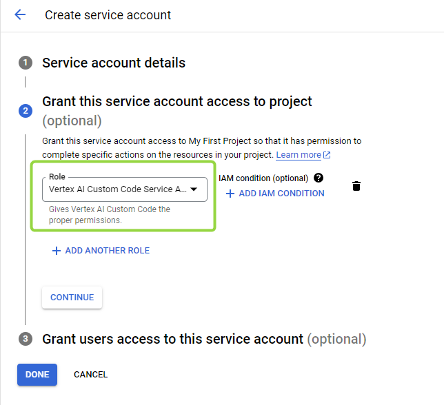

# GCP VertexAI Model Deployment

In this instruction, you will learn how to create VertexAI model in Google Cloud Platform and deploy it in AI DIAL config.

## Prerequisites

* Active Google Cloud project
* Enabled billing for the project

## Steps
  
1. Enable Vertex AI API
2. Create a Service Account
3. Configure AI DIAL Adapter

## How to enable API

> Refer to [Google Cloud Documentation](https://cloud.google.com/vertex-ai/docs/featurestore/setup) to learn how to create an account and enable billing.

1.	Log into your Google Cloud account.
2.	In the navigation panel on the left, in **APIs & Services**, select **Enable APIs and Services**.

  	
  	
3. In **APIs and Services** click **+ Enable APIs and Services** to access the API library.
4. In the search bar, type **Vertex AI API** and select the **Vertex AI API** panel when it appears in search results.
5.	Click **Enable** to turn on the Vertex AI API for your Google Cloud project.
      
   
## Create a service account

To communicate with VertexAI models, it is necessary to have a service account.

**To create a Service Account**:

1.	In your Google Cloud account, in the main navigation menu find **IAM & Admin** and navigate to **Service Accounts**.
   
3.	To create a new service account, click **+ Create Service Account** and fill in the details for your new service account:
	  
    * Fill in the **Service account details**.
    * In the next step **Grant this service account access to project**, add **Vertex AI Custom Code Service Agent** role. Refer to [GCP Documentation](https://cloud.google.com/vertex-ai/docs/general/access-control#grant_service_agents_access_to_other_resources) to learn more.
      		
    *  Click **Done** to complete.
5.	The new service account appears on the Service Account page. Click it to view the details:
    * **In KEYS**, create a key for this service account and download it in JSON format.
    

## Deploy the model in AI DIAL config

> Refer to [AI DIAL Config](https://github.com/epam/ai-dial/blob/86773b4b7a716a60684d36d6d7739bc64aaba80d/docs/Deployment/dialConfig.yaml#L288) to view a config example.

Mount your model key JSON file as a secret to VertexAI adapter pod.

```yaml
proxy:
  vertex:
    secrets:
      gcp-ai-proxy-key: |
```


