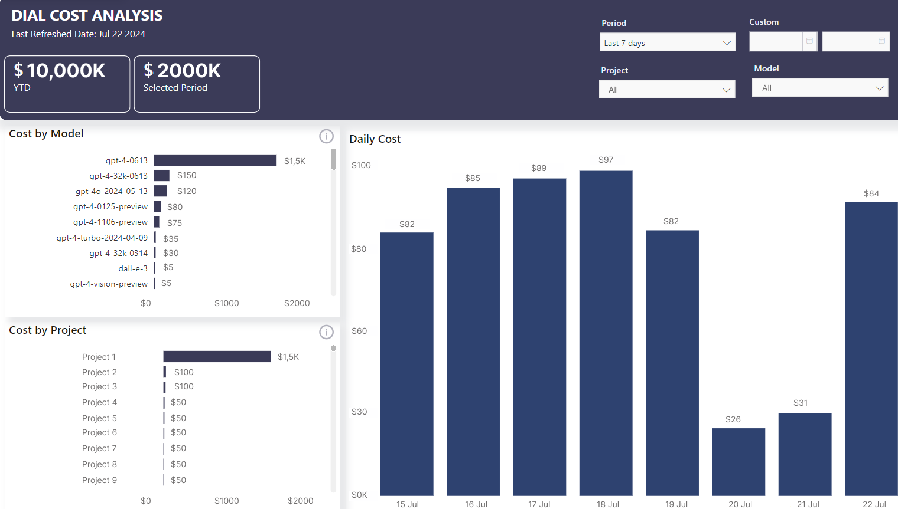

# Overview

## Introduction

Authorization determines what permissions an authenticated user or application has. We use **roles** to manage this.

## Roles & Limits

You can create roles in AI DIAL, to manage access of users and applications to different system resources such as models, applications, addons, and assistants.


> Refer to [API Keys](./API%20Keys) and [Chat Users](./chat-users) to learn how assign roles.

### Roles

Roles can be added and assigned in AI DIAL Core configuration.

> Refer to [settings](https://github.com/epam/ai-dial-core?tab=readme-ov-file#dynamic-settings) to view parameters description and to [configuration example](https://github.com/epam/ai-dial-core/blob/development/sample/aidial.config.json) to view the full example.


When you create a role, it is required to associate it with a specific system resource (model, application, addon, and assistant). In the following example, a `default` role is created with access to `chat-gpt-35-turbo` model:

```Json
//Example extract from aidial.config.json

"roles": {
    "default": { //role name
        "limits": {
            "chat-gpt-35-turbo": {} //system resource
        }
    }
}
```
### Limits

You can create limits for roles. Use them to specify a particular system resources a role can access, and also to impose restrictions on the allowed quantity of requests to this resource. Limits can be left empty to apply an unlimited value which is the default value.

In the following example, limits applied for the `default` role to work with `chat-gpt-35-turbo` model and there are no limits for `role1` to work with the same model:

```Json
//Example extract from aidial.config.json

"roles": {
    "default": { //role name
        "limits": {
            "chat-gpt-35-turbo": { //model name
                "minute": "100000", //overrides the default value
                "day": "10000000"
            }
        }
    },
    "role1": {
        "limits": {
            "chat-gpt-35-turbo": {} // the default value applies - unlimited
        }
    },
}
```


## Monitoring

[AI DIAL Analytics Realtime](https://github.com/epam/ai-dial-analytics-realtime) service can be configured to collect information about the used limits and store it in a time-series DB of your choice (such as InfluxDB). You can then analyze this data and visualize in Grafana, MS PowerBI or other tools: 

