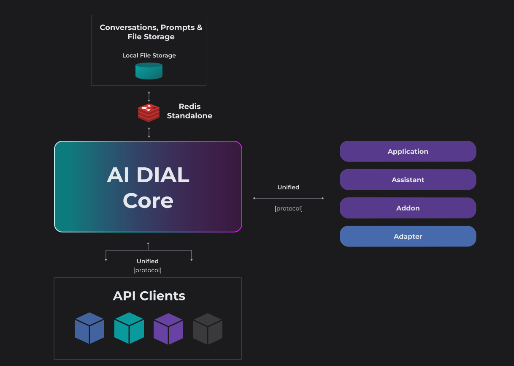

# AI DIAl Core

> Refer to [DIAL Core](https://github.com/epam/ai-dial-core) GitHub repository.

**AI DIAL Core** serves as the primary system component, acting as a **main integration center**, that employs a **Unified Protocol** ([OpenAI](https://learn.microsoft.com/en-us/azure/ai-services/openai/reference) compatible) for communication between internal and external clients, including LLM models, Applications, and other to access all its features in a governed and unified manner.

**The Unified Protocol supports**:

- Streaming
- Token usage (even in the streaming mode)
- Seeds: helps to achieve deterministic results for LLM responses.
- Tools: (formerly known as functions ) are specialized utilities that streamline development by implementing standardized methods for LLMs to access external APIs.
- Multi-modality: allows supporting non-textual communications such as image-to-text, text-to-image, file transfers and more.
- Compatibility with OpenAI

This approach streamlines communication and fosters interoperability by eliminating the need for multiple protocols for each integration. In case of Addons, they are expected to provide own [OpenAPI specification](https://www.openapis.org/what-is-openapi).

AI DIAL Core is headless and is the **only mandatory component**. It includes all the key platform features:

