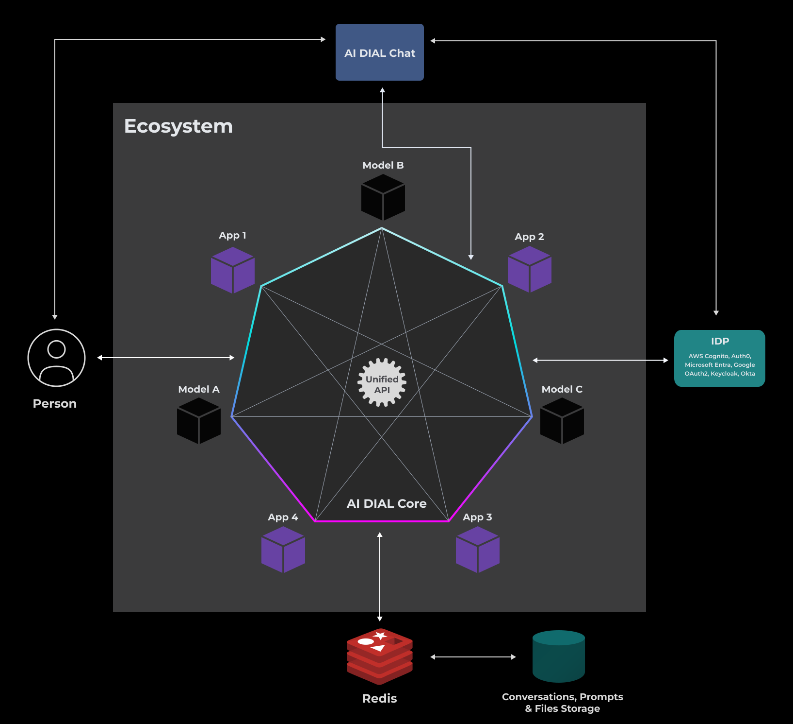
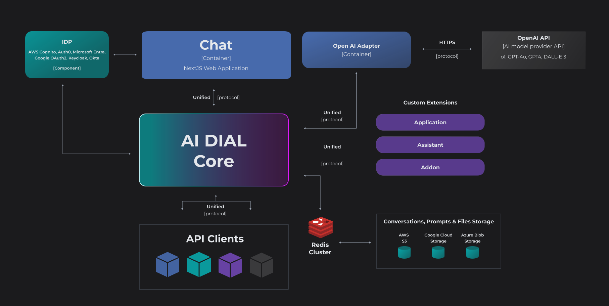
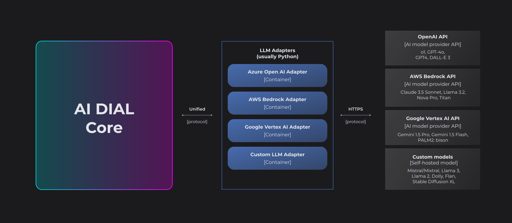

# Architecture

## Our Vision

AI DIAL is a secure, enterprise-grade and open-source platform. It has an API-first, cloud and model-agnostic design that makes it suitable for a wide variety of use cases.
Our primary focus is to avoid reliance on particular cloud or LLM vendors, support scalability and security, avoid increasing tech complexity or licensing risks.
We prioritize developing use case-agnostic generic features that facilitate developing of GenAI applications.

> To contribute to AI DIAL development, refer to [CONTRIBUTING](https://github.com/epam/ai-dial/blob/main/CONTRIBUTING.md) instruction on GitHub.

## AI DIAL Architecture

### Introduction

Modular architecture of AI DIAL allows implementing scalable and customized solutions to fit specific business needs. Its key building blocks include [Core](#ai-dial-core) (the main and the only mandatory component), [Chat](#chat) (web application with user interface), [Adapters](#llm-adapters) (align APIs of LLMs with the Universal API), [Applications](https://docs.epam-rail.com/architecture#extension-framework) (any custom logic with a conversation interface packaged as a ready-to-use solution), and a [persistent layer](#persistent-layer) that relies on a configured resilient and scalable cloud blob storage, with Redis layer on top to enhance performance. AI DIAL, allows to use various Identity Service Providers (IDPs) to manage user identities.

The [Unified API](https://epam-rail.com/dial_api) enables universal connectivity between models (including models of different modalities), unified access to different embedding models, and facilitates communication with the AI DIAL Core for both external and internal clients. 

Applications can form an **ecosystem and interact with each other** through the Unified API with access to all DIAL Core features among which is connectivity to models, file storage, access control, per-request API keys and other - see the following illustration. To enhance performance and fault tolerance, AI DIAL Core employs a proprietary load balancer and a retry mechanism. This significantly reduces delays and boosts throughput especially during peak demand. Refer to the [document](./tutorials/high-load-performance) with the overview of the performance tests to learn more.



You can have a [minimal installation](#minimal-installation) (it includes only AI DIAL Core) which can be easily installed even on a personal laptop or a desktop computer and is a good starting point for getting familiar with AI DIAL. To engage chat users and access different LLMs, you can have a setup with Core, Chat and LLM adapters – we call it a [standard installation](#standard-installation). This package is more suitable for use in enterprise-level production environments.

A modular architecture allows adding as many components as needed up to a [full platform landscape](#full-platform-landscape).

### Minimal Installation

AI DIAL has only one required component – [AI DIAL Core](#ai-dial-core).


AI DIAL Core is headless. It exposes a **Unified Protocol** that can be used by custom extensions, internal and external API clients to get full access to all AI DIAL Core features.

Unified Protocol streamlines communication and fosters interoperability by eliminating the need for multiple protocols for each integration. It is fully compatible with OpenAI API and supports streaming, tokens, seeds, tools, and multi-modality.

### Standard Installation

A **Standard** installation of AI DIAL includes, Core (including API), Chat and Adapters to selected LLMs. It can also include custom extension such as Applications, Addons or Assistants.



This configuration enables the utilization of Chat functionality, allowing users to engage with LLMs, as well as the integration of custom extensions with AI DIAL Core through the API.

### Full Platform Landscape

The diagram below demonstrates the most complete landscape of AI DIAL ecosystem:


## AI DIAL Components

### AI DIAL Core

> Refer to [DIAL Core](https://github.com/epam/ai-dial-core) GitHub repository.

**AI DIAL Core** serves as the primary system component, acting as a **main integration center**, that employs a **Unified Protocol** ([OpenAI](https://learn.microsoft.com/en-us/azure/ai-services/openai/reference) compatible) for communication between internal and external clients, including LLM models, Applications, and other to access all its features in a governed and unified manner.


**The Unified Protocol supports**:

- Streaming
- Token usage (even in the streaming mode)
- Seeds: helps to achieve deterministic results for LLM responses.
- Tools: (formerly known as functions ) are specialized utilities that streamline development by implementing standardized methods for LLMs to access external APIs.
- Multi-modality: allows supporting non-textual communications such as image-to-text, text-to-image, file transfers and more.
- Compatibility with OpenAI

This approach streamlines communication and fosters interoperability by eliminating the need for multiple protocols for each integration. In case of Addons, they are expected to provide own [OpenAPI specification](https://www.openapis.org/what-is-openapi).

AI DIAL Core is headless and is the **only mandatory component**. It includes all the key platform features:


#### Authentication and Authorization

AI DIAL provides native support for [OpenID Connect](https://openid.net/developers/how-connect-works/) and [OAuth2](https://oauth.net/2/) and offers integration with various Identity Providers (IDP) such as Azure AD, Auth0, Okta, Microsoft Entra, Google OAuth2, and AWS Cognito where you can define user roles and attributes to support your custom permissions model. Additionally, you can leverage Keycloak to work with even wider range of IDPs.

> Refer to [IDP Configuration](./Deployment/idp-configuration/auth0.md) to view deployment tutorials for supported IDP providers.

There are two methods of CORE API calls authorization supported: JWT token and key. Both options provide granular permission management, allowing you to control access to specific functionalities or resources. Additionally, these authorization methods also enable rate and cost control, giving you the ability to manage the frequency of API calls.

> Refer to [API Keys Roles and Limits](./tutorials/roles-management.md) to learn how to authenticate and authorize API keys.

#### Load Balancer

For self-hosted models, you can use the standard load balancer (LB) capabilities provided by the target cloud platform. As for cloud-deployed models like Azure OpenAI and others, we typically rely on our custom-developed load balancing solution.

In this approach, a configuration file includes multiple upstream endpoints for a model. When a request is received, it is forwarded to one of the endpoints using the round-robin method. If an upstream returns an overload limit error such as a 429 (Too Many Requests) or a 504 (Gateway Timeout), the system attempts another upstream and temporarily excludes the one that generated the error. This strategy ensures efficient load distribution and fault tolerance for optimal performance and reliability. Refer to the [document](./tutorials/high-load-performance) with the overview of the performance tests to learn more.

#### Rate Limits & Cost Control

A well-distributed rate-limiting mechanism ensures the control over the total number of tokens that can be sent to a model (typically a one-minute or 24-hour window) by any Application, Addon, or Assistant.

> Refer to [AI DIAL Configuration](./Deployment/configuration#dynamic-settings) to learn more about roles and rate limits.

#### Extension Framework

AI DIAL presents a robust Extension Framework and plug-in infrastructure, enabling seamless integration of your data and business workflows with Language Models (LLM) to enrich your enterprise applications.

You can use AI DIAL SDK to develop such extensions. Applications and model Adapters implemented using this framework will be compatible with [AI DIAL API](https://epam-rail.com/dial_api) that was designed based on [Azure OpenAI API](https://learn.microsoft.com/en-us/azure/ai-services/openai/reference).

> Refer to [AI DIAL SDK](https://github.com/epam/ai-dial-sdk) and [Development Examples](https://github.com/epam/ai-dial-sdk/tree/development/examples) to learn more.

**Addon**: Addon is similar to a concept of tool or function in some other frameworks. Within the AI DIAL framework, an Addon is a service — or any component adhering to its own or provided [OpenAPI specification](https://www.openapis.org/what-is-openapi) — that empowers LLMs to access and utilize any desired data source or technology to produce their responses.

**Application**: any custom logic with a conversation interface packaged as a ready-to-use solution. It can be any component conforming with Unified Protocol requirements.

**The Assistant Service** is used to enable communication between Addons and the AI DIAL Core. Assistants can range from simple implementations, like instructing the LLM to provide answers using a specific language tone or style, to more complex use cases, such as limiting the LLM's data scope to a particular geographical location.

**Adapter**: unifies APIs of respective LLMs to align with the Unified Protocol of AI DIAL Core.

#### Logging

AI DIAL Core uses [Vector](https://vector.dev/docs/reference/configuration/sinks/) (a lightweight, ultra-fast tool for building observability pipelines) to redirect users’ messages to S3, Azure Blob Store, GCP Cloud Storage or any other "sink".

You can gather standard logs (which do not contain user messages) from components using the ELK stack (Elasticsearch, Logstash, Kibana) or other log collection system.

#### Entitlements

In AI DIAL Core, user roles are defined and configured in the application config file. This allows administrators to specify which users or user groups are authorized to access specific resources or features within the application. These user roles match the once created in your IDP.

### Persistent Layer

AI DIAL architecture includes a persistent layer, that relies on a resilient and scalable cloud blob storage (you can configure either AWS S3, Google Cloud Storage, Azure Blob Storage or a local file storage) where all conversations, prompts, and user files will be stored. Redis Cache (either cluster or a standalone) is deployed on top of it to enhance performance.


This architecture facilitates the swift retrieval of stored resources, supporting features such as sharing and publication of conversations and prompts.

### Auth Helper

Auth Helper is used to resolve challenges (such as access control issues with the `/userinfo` endpoint and retrieving user profile pictures) that may arise during integration with IDPs like Azure AD.

It is a proxy service that implements OpenID-compatible Web API endpoints to avoid direct interaction with such IDPs.

> Refer to [AI DIAL Auth Helper](https://github.com/epam/ai-dial-auth-helper) repository in GitHub to learn more.

### Chat

Chat is a default AI DIAL UI which provides access to the full set of its features.

> Refer to [Chat](https://github.com/epam/ai-dial-chat) repository in GitHub to learn more.


#### Overlay

UI Overlay allows adding Chat to a web application with zero effort by simply inserting a short HTML block.

```html
<html>
  <head>
    <meta name="viewport" content="width=device-width, initial-scale=1.0" />
  </head>
  <body>
    <script type="module">
      import CHATAIOverlay from "./script.js";

      const chatAiOverlay = new CHATAIOverlay("http://localhost:3000");
      chatAiOverlay.load();
    </script>
  </body>
</html>
```

#### Themes

Chat Themes are used to customize the styles of Chat UI.

> Refer to [AI DIAL Chat Themes](https://github.com/epam/ai-dial-chat-themes) GitHub repository to learn more.

### Analytics Realtime

The AI DIAL Analytics Realtime tool uses diverse techniques such as embedding algorithms, clustering algorithms, frameworks, light-weight self-hosted language models, to analyze the conversation data and extract the needed results, which can be presented in tools such as Grafana for visualization.

> Refer to [Analytics Realtime](https://github.com/epam/ai-dial-analytics-realtime) GitHub repository.

Analytics Realtime tool is a sink of `vector.dev`. It does not retain any private information, such as user prompts or conversations, beyond the system. Instead, only the computed artifacts are collected and stored in time-series databases like InfluxDB or any scalable database capable of handling voluminous, constantly changing information.

Examples of the computed artifacts:

- Who has used the AI? – user hash, title, and never personal data such as names.
- What areas have people asked questions about?
- Are there any recurring patterns?
- Topics of conversations.
- Unique users.
- Sentiments.
- Cost analysis of the communication.
- Language of conversations.
- Any other calculated statistics based on conversations.

## Extensions

Extensions such as Applications, Addons, Assistants and Adapters can be additionally developed and deployed to communicate with the AI DIAL Core via the Unified Protocol.

You can use AI DIAL SDK to develop such extensions. Applications and model Adapters implemented using this framework will be compatible with [AI DIAL API](https://epam-rail.com/dial_api) that was designed based on the [Azure OpenAI API](https://learn.microsoft.com/en-us/azure/ai-services/openai/reference).

> Refer to [AI DIAL SDK](https://github.com/epam/ai-dial-sdk) and [Development Examples](https://github.com/epam/ai-dial-sdk/tree/development/examples) to learn more.


Extensions have freedom to employ a technology of their preference, be it any LLM framework, [LlamaIndex](https://github.com/run-llama/llama_index/tree/main), [LangChain](https://github.com/langchain-ai/langchain), [Semantic Kernel](https://github.com/microsoft/semantic-kernel?tab=readme-ov-file), vector DBs or any other.

### LLM Adapters

LLM Adapters unify the APIs of respective LLMs to align with the Unified Protocol of AI DIAL Core. Each Adapter operates within a dedicated container. Multi-modality allows supporting non-textual communications such as image-to-text, text-to-image, file transfers and more.



> Refer to [Azure OpenAI](https://github.com/epam/ai-dial-adapter-openai), [GCP Vertex AI](https://github.com/epam/ai-dial-adapter-vertexai) and [AWS Bedrock AI DIAL](https://github.com/epam/ai-dial-adapter-bedrock) repositories in GitHub.

## Telemetry

AI DIAL uses [OpenTelemetry](https://opentelemetry.io/), an open-source observability framework that provides a vendor-agnostic, unified approach to collecting, processing, and exporting telemetry data in cloud-native environments.

Metrics are gathered for the entire system and/or for individual system components, and subsequently stored in a time-series databases like Prometheus or any other database capable of handling substantial volumes of time-series data and integrating with visualization tools like Grafana.

You can use any OTLE Collector such as Prometheus, Jaeger, Fluentd, Zipkin and other.

## Key Vault

All sensitive information is stored according to the best practices of the selected cloud platform, utilizing systems like GCP Cloud Key Management Service, AWS Secrets Manager, Azure Key Vault, and Vault by Hashicorp.
