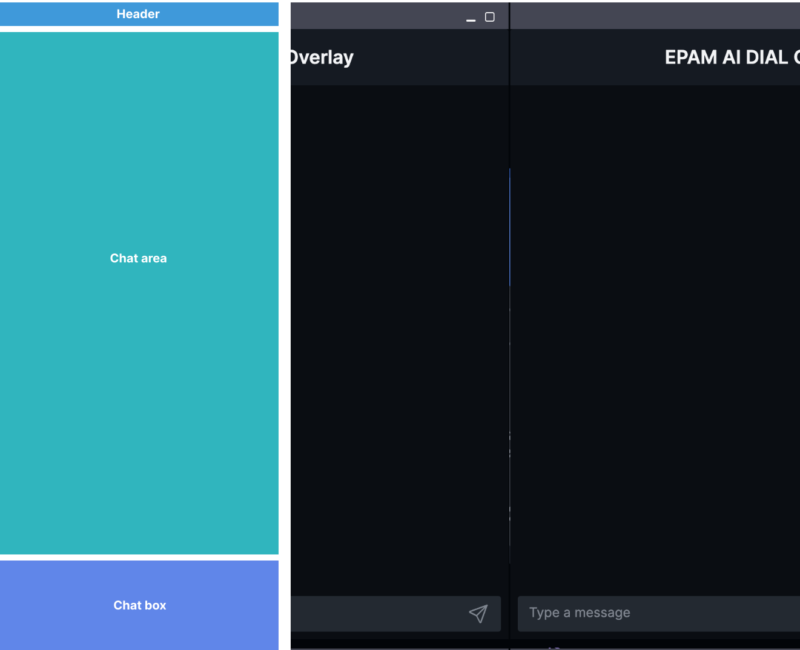

# AI DIAL Chat Design Structure Guidelines

## Document Goal

This document will familiarize you with the layout, available modifications, color schemes, and other essential features necessary for successful customization of the chat application.

The main goal of this document is to standardize visual and interactive elements, keeping within the technical possibilities of customization, and to provide a cohesive user experience across all platforms. 
Ultimately, we aim to innovate without compromising on simplicity and ensure that our users remain at the forefront of all design decisions.

## Layout Overview

Basic layout consists of the following components:

* Header: component where customizable logo element is displayed. This component also contains: Conversation list button, Prompt list button and a user settings.
* Conversation list: contains all active conversations and a button to start a new one.
* Prompt list: contains user prompts and an action to add a new one.
* Chat area: area where user questions and LLM responds will take place.
* Start Chat window: is only visible for new chats. Allows to set a specific settings for your new chat (for example, select LLM, Temperature, Addons, etc).
* Chat box: contains input where you manually type your questions or commands for models.

## Available Modifications

We aim to reuse the existing layout for future applications, yet we understand that it may need to undergo some modifications to cater to specific business or user needs and goals. 
Therefore, we propose several viable layout modifications that can be implemented with minimal or limited developer effort. 
Please note that any further modifications will necessitate additional discussions with the product team and may require contribution from your project development team.

## Desktop

### Hide Conversation List

In this modification, the user will not be able to add multiple conversations nor save them. The user will have only one chat.

### Hide Prompt List

The ability to save prompts and use any existing ones will not be available.

### Hide Prompt and Conversation Lists

The capability to save prompts and use any existing ones will not be available.

### Hide Start Chat Window

The user will not see settings for a new chat. These settings will not be accessible from any part of the system on the user side.

## Mobile

### Default Mobile

Mobile version is a modification that users see when they open AI DIAL on their mobile devices or resize their browser window.

1. Conversation list
2. Start new chat button
3. Prompt list

### Simplified Mobile

Modification where majority of action controls are hidden. User can’t save prompts and only has one chat. 

## Overlay

Overlay is a modification where user can see AI DIAL application within the other application (other website or even desktop app).
Currently, we have 2 possible modifications: Wide and Narrow.

### Wide Overlay

Can be used for demo purposes on different websites.

### Narrow Overlay

Can be used on desktop applications (e.g. Excel) or as a standalone component.

## Color Schemes

Figma Variables component is used for color scheme. This will allow us quickly apply custom color themes for the application. 

> **Important**: Variables names should remain the same when you create a new color scheme.

### Basic Palette

Basic palette contains a list of all colors used in the system for Dark theme. Each item consists of a name and a value.

## Custom Color Schemes

### Mapping Schema

A mapping schema outlines the rules for using colors of interface components for various modifications (using Variables). 
Each item in the schema consists of a name and values for different modes, which refer to the items in the base palette.

> **Important**: The mapping schema is closely connected to developers' variables. Therefore, it's crucial to keep design variables consistent in both name and quantity to ensure seamless application of the new theme.

To create a new style, establish a new mode in the Mapping schema. This new mode details how interface components will be colored using the basic palette.
This approach maintains design consistency while allowing flexibility.
Please note that additional changes to the base palette may require discussion with the product team and potentially additional development resources.

### Example: Dark DIAL Theme

### Example: Light DIAL Theme

### Example: Custom DIAL Theme

## Logo

Logo can be modified by uploading a new image.
Logo requirements:
* Accepted type: images
* Max file size: up to 512MB
* Max width: 100px 

