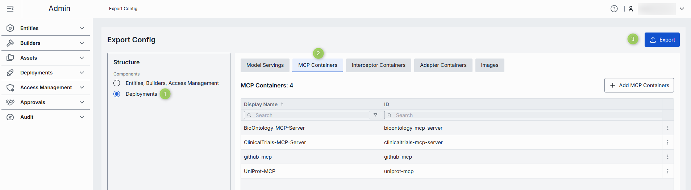
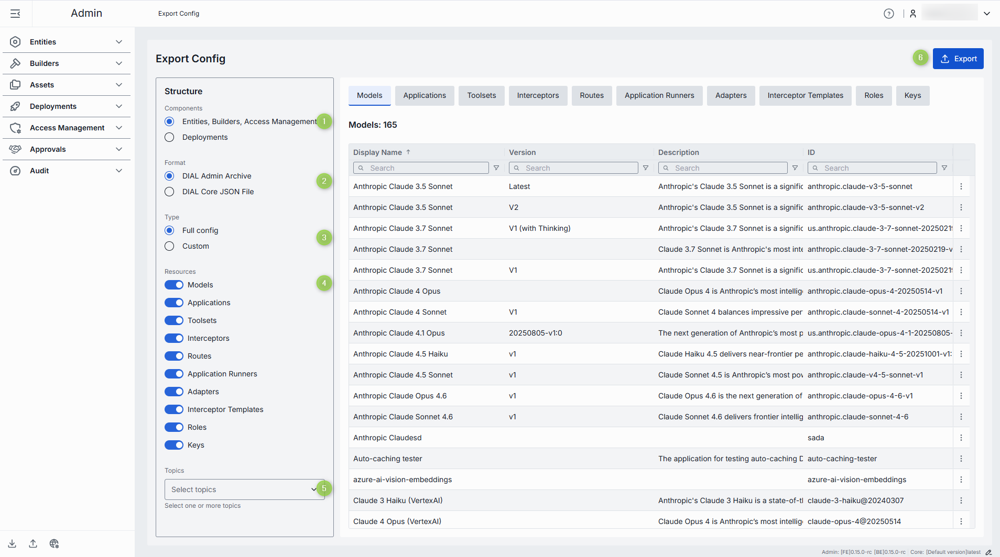
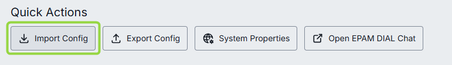
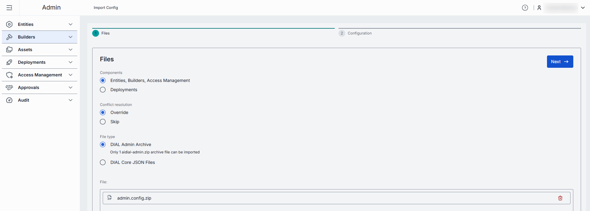
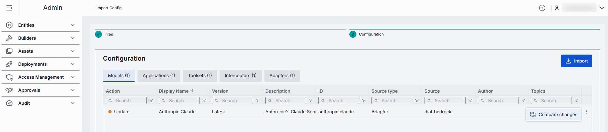
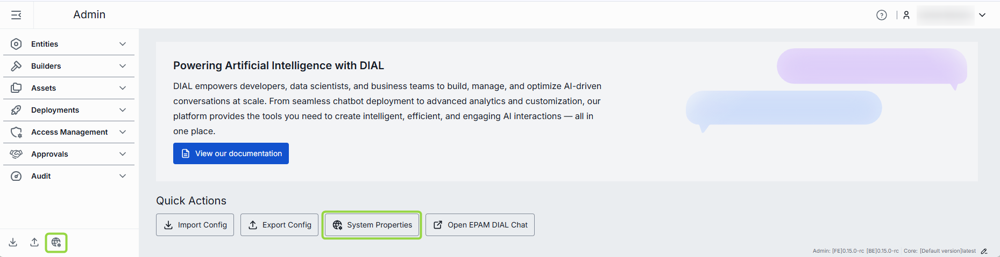
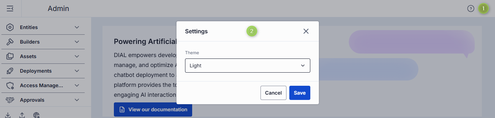

# Back up, restore, and set global properties

This guide covers the system-wide tasks an administrator runs from the DIAL Admin home page: exporting
configuration for backup or migration, importing it into another environment, defining global
interceptors, and pinning the DIAL Core version. It is for administrators with write access to DIAL
Admin. For an orientation to the panel, start with the [Admin Panel overview](0.index.md).

## Export configuration

Use **Export Config** to download the full or selected configuration of the current instance — useful
for backups, audit snapshots, or sharing with teammates.

### Export deployments

Export the configuration of selected deployments (model servings, images, MCP, interceptor, and
adapter containers).

1. Click **Export config** and select **Deployments** under **Components**.
2. Add the deployments you want to export. You can choose to ignore or include the dependencies the
   selected resources need to operate.
3. Click **Export** to open the **Export File Preview** window.
   - Enable **Include secrets** to include secret values (keys, passwords, and similar) in the
     deployment configuration.
   - Enable **Include global firewall** to include the
     [global domain whitelist](deployments/images.md#global-firewall) in the configuration file.
4. Click **Export** to download a `.zip` archive.

### Export entities, Builders, and access management

Export the configuration of selected entities (models, applications, tool sets, interceptors,
routes), [Builders](3.builders.md) (application runners, adapters, interceptor templates), and access
management configuration (API keys and roles).

1. Click **Export config** and select **Entities, Builders, Access Management** under **Components**.
2. Choose the export format:
   - **DIAL Admin Archive** — a `.zip` archive.
   - **DIAL Core JSON File** — a single `.json` file compatible with
     [DIAL Core](https://github.com/epam/ai-dial-core?tab=readme-ov-file#configuration-%EF%B8%8F).
3. Choose the export type:
   - **Full** — use the **Resources** toggles to enable or disable specific resource categories.
   - **Custom** — use the resource tabs to manually select which entities to include. With a custom
     export, you can include or ignore dependencies (adapters, interceptors, applications,
     application runners, and similar) that the selected resources need.
4. Use **Topics** to filter resources by associated topic.
5. Click **Export** to open the **Export File Preview** window, where you can preview your selections
   and any included dependencies, and enable **Include secrets**.
6. Review your selection and click **Export** to download a `.zip` archive.

## Import configuration

Use **Import Config** to upload a configuration file when migrating between environments or restoring
a backup.

1. Click **Import Config** to open the import screen.
2. In the **Files** section, make the following selections:

   

   - **Components** — choose to import the configuration of deployments (model servings, images, MCP,
     interceptor, and adapter containers), entities (models, applications, tool sets, interceptors,
     routes), Builders (application runners, adapters, interceptor templates), and access management
     (API keys and roles).
   - **Conflict resolution** — choose a strategy for conflicts between imported and existing files:
     - **Override** — any resource in the archive that matches an existing one by identifier replaces
       it.
     - **Skip** — any resource in the archive that matches an existing one by identifier is ignored,
       and the current resource is unchanged.
   - **File type** — choose to import a DIAL Core `.json` file or a `.zip` archive.
3. Add a file or archive in the **Files** section, then continue to the **Configuration** step to
   preview all resources being imported.

   

4. For each resource, click **Compare changes** in the actions menu to compare the current version
   with the version to be imported.

   

5. Click **Import** to start the import.

**Note**
> Import and export controls are disabled for read-only administrators. See
> [Read-only access](0.index.md#read-only-access).

## Set global interceptors {#system-properties}

Click the **Globe** icon in the footer, or in **Quick Actions** on the home page, to open the
**System Properties** screen, where you add and configure global interceptors.

Global interceptors apply to every deployment — applications and models — in DIAL. When local
interceptors are also configured for a specific model or application, global interceptors process each
request first, before the local interceptors, and review the response after the local interceptors
have processed it.

To add a global interceptor:

1. Click **+ Add** on the **System Properties** screen.
2. Select from the list of available [interceptors](entities/interceptors.md).
3. Click **Apply** to add the interceptor. Repeat to add more. When there is more than one, drag and
   drop to set the execution order. Interceptors run in ascending order (1 → 2 → 3). Requests flow
   through them in this order; response interceptors run in reverse.
4. Click **Save** to apply, or **Discard** to cancel unsaved changes.

When a global interceptor is added, its status in [Entities > Interceptors](entities/interceptors.md)
changes to **Global**, and it is listed under the **Global Interceptors** tab in the configuration of
any application or model.

## Set the DIAL Core version

Administrators can set the DIAL Core version manually to resolve compatibility issues that can arise
during upgrades.

1. Click the **Edit** icon in the footer next to the Core version.
2. In the pop-up, enter the desired
   [DIAL Core version](https://github.com/epam/ai-dial-core/releases) manually, or choose to detect
   it automatically.
3. Click **Apply**. The updated version appears in the footer.

## Change user settings

Click your avatar or name in the top-right corner of the header to open the profile menu, where you
can sign in or out and select a UI theme.

## Next steps

- [Admin Panel overview](0.index.md) — how the Admin Panel sections fit together.
- [Manage Builders](3.builders.md) — configure the application runners, adapters, and templates you
  export and import.
- [Activity and rollback](audit/activity-and-rollback.md) — review configuration changes and roll
  back when needed.
