# Manage Builders

Builders are the factory definitions that DIAL administrators register once and then instantiate into deployable entities. Each Builder type acts as a blueprint: Application Runners define the schema and endpoints that Applications are stamped from; Adapters bridge provider-specific model APIs to the DIAL Unified Protocol; Interceptor Templates provide reusable configurations for Interceptor entities. This guide covers all three Builder types available in DIAL Admin.

**Prerequisites**: Access to DIAL Admin with administrator privileges.

## Application runners

An Application Runner is an application factory that allows end users to create individual logical instances of applications, each with its own configuration. An Application Runner definition includes a JSON configuration schema that enforces the data structure persisted for each instance. The JSON schema of Application Runners conforms to the main [meta schema](https://github.com/epam/ai-dial-core/blob/development/config/src/main/resources/custom-application-schemas/schema.json).

Quick Apps, Code Apps, and Mind Maps are Application Runners available in DIAL out of the box. You can use DIAL SDK to create custom Application Runners.

For example, a custom RAG Application Runner may allow an end user to configure a personalized RAG agent by connecting it to chosen data sources—such as internal knowledge bases, document repositories, or external APIs—and then share it with other users and groups.

**Note**
> Refer to [Schema-rich Applications](/docs/platform/3.core/7.apps.md#schema-rich-applications) to learn more.

### Main screen

In **Builders → Application Runners**, you can add and manage all Application Runners registered in your DIAL instance.

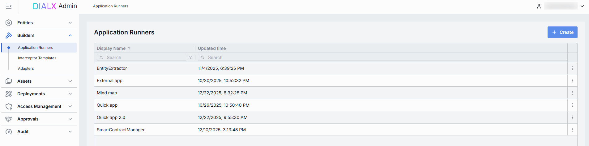

| Column | Description |
|--------|-------------|
| **Display Name** | Name of the Application Runner rendered on the UI (e.g. "Python Lambda Runner", "NodeJS App Service"). |
| **ID** | Unique identifier of the Application Runner. Typically the base URL of the service (e.g. `https://my-runner.example.com`). DIAL Core uses this endpoint to POST orchestration payloads. |
| **Description** | Description of the Application Runner capabilities, cluster location, version, or SLA (e.g. "v2 on GKE, 2 vCPU, 8 GB RAM"). |
| **Topics** | Tags associated with the Application Runner for identification and filtering in DIAL Admin (e.g. "finance", "support"). |
| **Creation Time** | Timestamp of when the Application Runner was created. |
| **Updated Time** | Timestamp of the last update to this runner's configuration. |

### Create an Application Runner

1. Click **+ Create** to open the **Application Runner** modal.
2. Define key parameters for the new Application Runner:

   | Field | Required | Description |
   |-------|----------|-------------|
   | **ID** | Yes | Unique identifier. Typically the base URL of the service (e.g. `https://my-runner.example.com`). DIAL Core uses this endpoint to POST orchestration payloads. |
   | **Display Name** | Yes | Name rendered on the UI. |
   | **Description** | No | Description of capabilities, cluster location, version, or SLA. |
   | **Source type** | Yes | Must be either Chat Endpoint or MCP Endpoint, or both. Provide endpoints that DIAL Core will POST orchestration payloads to for any application bound to this runner. |
   | **Chat Endpoint** | Optional | **Completion endpoint**: Endpoint to process chat completion requests (e.g. `https://my-runner.example.com/v1/execute`). **Responses endpoint**: Endpoint to process OpenAI Responses API calls. |
   | **MCP Endpoint** | Optional | MCP endpoint of the Application Runner. **Transport**: Transport used by the MCP server (HTTP by default). **Forward per request key**: Set to `true` to forward a [per-request key](/docs/platform/3.core/3.per-request-keys.md) to the MCP endpoint so the MCP server can access files in DIAL storage. **Configuration delivery**: How application properties are sent to the MCP server—`Header` delivers them in an HTTP header; `Meta` includes them in the `_meta` field within the MCP message payload. |

3. Click **Create**. The dialog closes and the new runner's [configuration screen](#configure-an-application-runner) opens. The new runner appears immediately in the listing, though changes may take some time to propagate to DIAL Core.

   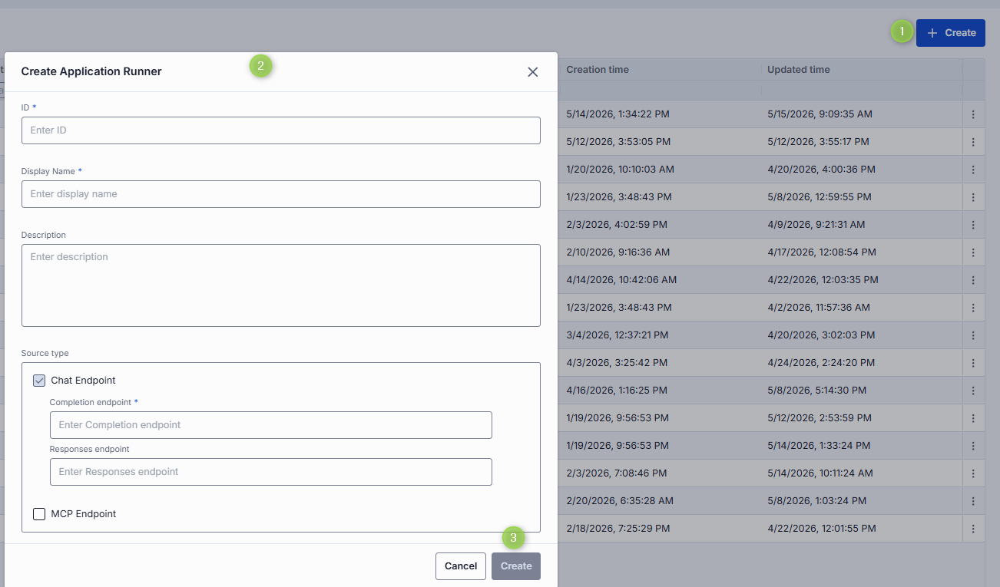

### Configure an Application Runner

Click any Application Runner on the main screen to open its configuration page.

**Top bar controls**

| Control | Description |
|---------|-------------|
| **Create** | Create an application with the current runner. **Application**: creates a deployment in [Entities → Applications](entities/applications.md). **Assets Application**: creates a public-folder application in [Assets → Applications](4.assets.md#applications). |
| **Delete** | Permanently removes the selected runner. All applications still bound to it are deleted as well. |
| **JSON Editor** (toggle) | Switch between the form UI and raw [JSON view](#json-editor-application-runners). |
| **Save** | Commits any unsaved changes. Changes may take time to propagate to DIAL Core. |
| **Discard** | Reverts any unsaved changes since the last save. |

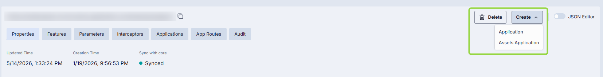

#### Properties tab

In the **Properties** tab, configure the core identity, metadata, and integration endpoints for your Application Runner.

| Field | Required | Editable | Description |
|-------|----------|----------|-------------|
| **ID** | — | No | The base URL or unique identifier of the runner's service (e.g. `https://my-runner.example.com/v1/execute`). DIAL Core POSTs orchestration payloads here for any Application bound to this runner. |
| **Updated Time** | — | No | Timestamp of the last configuration update. |
| **Creation Time** | — | No | Timestamp of when the configuration was created. |
| **Sync with core** | — | No | Synchronization state between DIAL Admin and DIAL Core. Synchronization occurs automatically every 2 minutes (configurable via `CONFIG_AUTO_RELOAD_SCHEDULE_DELAY_MILLISECONDS`). **Synced**: states are identical in Admin and Core for valid entities, or the entity is missing in Core for invalid entities. **In progress...**: sync conditions are not met and changes were applied within the last 2 minutes (configurable via `CONFIG_EXPORT_SYNC_DURATION_THRESHOLD_MS`). **Out of sync**: sync conditions are not met and changes were applied more than 2 minutes ago. **Unavailable**: the entity's state in Core cannot be determined—either the config was not received from Core, or Core's configuration is not fully compatible with Admin's. **Note**: Sync state is not available for sensitive information (API keys, tokens, auth settings). |
| **Display name** | Yes | Yes | Name displayed on the UI (e.g. "Python Lambda Runner" or "NodeJS Service Worker"). |
| **Description** | No | Yes | Description of the runner, including its environment (staging vs. prod), resource profile (2 vCPU, 8 GB RAM), or special instructions. |
| **Icon** | No | Yes | Icon representing the runner visually in the UI. |
| **Title** | No | Yes | Title of the Application Runner. |
| **Bucket copy** | Yes | Yes | Determines whether files stored in the application's file storage bucket should be copied when the application is copied, moved, or published. |
| **Topics** | No | Yes | Semantic tags. Click to display available topics. Custom topics must be ≤ 255 characters with no leading or trailing spaces. |
| **Source type** | Yes | Yes | Must be Chat Endpoint or MCP Endpoint, or both. |
| **Chat Endpoint** | Yes | Yes | **Completion endpoint**: Processes chat completion requests. **Responses endpoint**: Processes OpenAI Responses API calls. |
| **MCP Endpoint** | No | Yes | MCP endpoint. **Transport**: HTTP by default. **Forward per request key**: Forward a [per-request key](/docs/platform/3.core/3.per-request-keys.md) to the MCP endpoint. **Configuration delivery**: `Header` or `Meta`. |
| **Viewer URL** | No | Yes | URL of an alternative end-user UI. If set, overrides the standard DIAL Chat UI for applications built on this runner. |
| **Editor URL** | No | Yes | URL of a UI screen for configuring application settings when creating or updating an application instance. |
| **Schema endpoint** | No | Yes | Endpoint that returns the JSON schema defining parameters of the application type. When set, the [Parameters](#parameters-tab) section is populated from this endpoint and is read-only. |

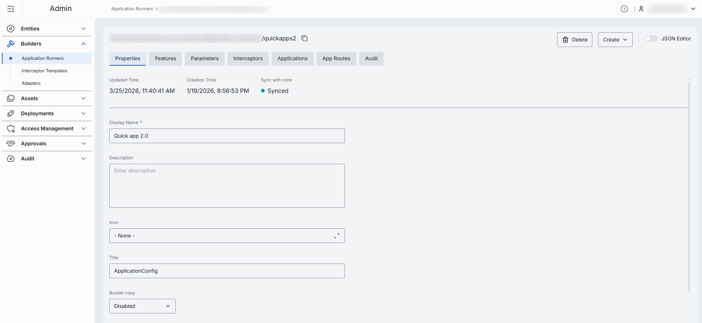

#### Features tab

In the **Features** tab, define additional capabilities of applications created with this Application Runner. Features defined here are propagated to all applications created from this runner. Features left undefined at the runner level can be set per-application in [Entities → Applications](entities/applications.md#features).

| Field | Required | Description |
|-------|----------|-------------|
| **Configuration endpoint** | No | URL to fetch a JSON Schema describing the application's settings. DIAL Core exposes this as `GET v1/deployments/<deployment name>/configuration`. Clients must provide a JSON value matching this schema in `custom_fields.configuration` on chat completion requests. |
| **Rate endpoint** | No | URL of a custom rate-estimation API to compute cost or quota usage (e.g. grouping by tenant, complex billing rules). |
| **Tokenize endpoint** | No | URL of a custom tokenization service for precise, app-wide token counting (for mixed-model or multi-step prompts). |
| **Truncate prompt endpoint** | No | URL of your own prompt-truncation API for advanced context-window management (e.g. dynamic summarization). |
| **Application properties header** | No | When enabled, DIAL appends the app's configuration to chat completion request headers. |
| **Playback support** | No | Enables [Playback](/docs/tutorials/0.user-guide.md#playback), which lets users simulate a conversation without invoking model responses, for review and analysis. |
| **Assistant attachments in request** | No | When `true`, DIAL Chat preserves `attachments` in `messages` from `role=assistant` in [chat completion requests](https://dialx.ai/dial_api#operation/sendChatCompletionRequest). Useful for apps that generate and consume attachments. |

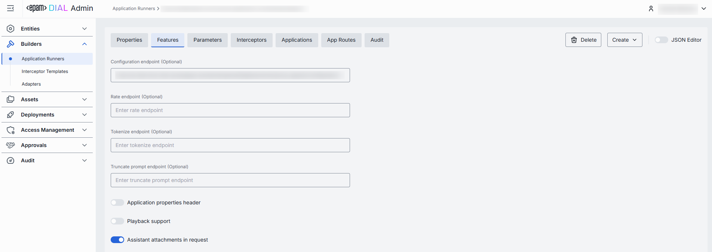

#### Parameters tab

This tab displays the JSON schema parameters for the application type. It defines [parameters that must be configured](entities/applications.md#parameters) to create an instance of an application based on this runner.

Content is defined by `properties`, `required`, and `$defs` in the JSON editor (editable in the UI) or supplied via the **Schema endpoint** in the runner's Properties tab (read-only when provided by endpoint).

**Note**
> JSON schema of Application Runners conforms to the main [meta schema](https://github.com/epam/ai-dial-core/blob/development/config/src/main/resources/custom-application-schemas/schema.json). Refer to [Schema-rich Applications](/docs/platform/3.core/7.apps.md#schema-rich-applications) to learn more.

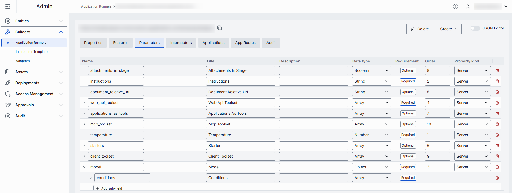

#### Interceptors tab

In the **Interceptors** tab, add [local interceptors](https://github.com/epam/ai-dial-core/blob/development/docs/dynamic-settings/interceptors.md#application-type-interceptors) that will process requests and responses for all applications built on this runner. These appear as **runner interceptors** in the [configuration of each application](entities/applications.md#interceptors).

This tab also shows **global** interceptors defined in [System Properties](1.config-backup-and-global-settings.md#system-properties) that apply to all deployments in DIAL.

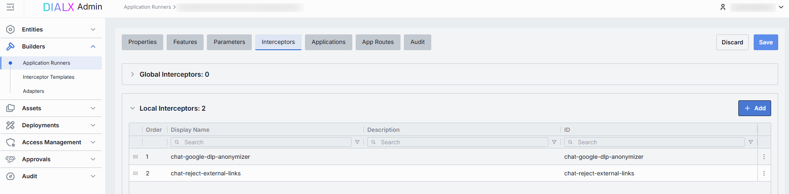

| Column | Description |
|--------|-------------|
| **Order** | Execution sequence. Interceptors run in ascending order (1 → 2 → 3). Response interceptors run in reversed order. |
| **Display Name** | The interceptor's display name from its definition. |
| **Description** | Free-text summary from the interceptor's definition. |
| **ID** | Unique identifier of the interceptor. |

To add interceptors:

1. Click **+ Add** (top-right of the Interceptors grid).
2. In the modal, select one or more interceptors from the list of [available interceptors](entities/interceptors.md).
3. Click **Apply** to insert them into the table.

To remove an interceptor:

1. Click the **actions** menu in the interceptor's row.
2. Choose **Remove**.

#### Applications tab

The **Applications** tab shows which DIAL applications are bound to this runner. Assigning applications here tells DIAL Core to dispatch orchestration payloads for those apps to the endpoints of the selected runner.

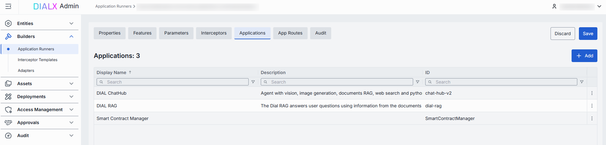

| Column | Description |
|--------|-------------|
| **ID** | Unique identifier of the application. |
| **Display Name** | Name displayed on the UI. |
| **Description** | Description of the application. |

To add applications (defined in [Entities → Applications](entities/applications.md)):

1. Click **+ Add** (top-right of the Applications grid).
2. Select one or more applications in the modal.
3. Click **Apply**.

To remove an application:

1. Click the **actions** menu in the application's row.
2. Choose **Remove**.

#### App Routes tab

In the **App Routes** tab, define and manage routes that DIAL Core uses when interacting with applications created from this runner via specified endpoints. Applications created from this runner inherit these routes automatically—their [App Routes section](entities/applications.md#app-routes) is pre-populated and read-only.

Supported HTTP methods: `GET`, `POST`, `PUT`, `DELETE`, `HEAD`, `PATCH`. `OPTIONS` and `TRACE` are not available.

**Note**
> Refer to [DIAL Core documentation](https://github.com/epam/ai-dial-core/blob/development/docs/dynamic-settings/routes.md) to learn more about routes.

To create a route:

1. Click **+ Add** (top-right of the App Routes pane).
2. Enter the route **Display name**. Validation rule: `^[a-zA-Z0-9_]+$`—only alphanumeric characters and underscores are allowed.
3. Click **Create**.

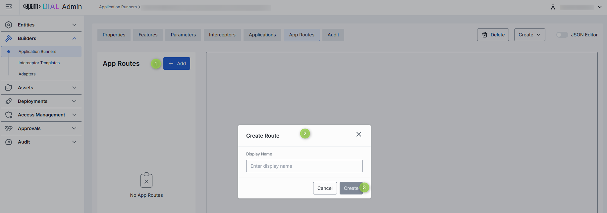

Each route has three sub-tabs:

**Properties sub-tab**

Configure the route's identity and request-handling behavior. Configuration is similar to [Entities → Routes](entities/routes.md).

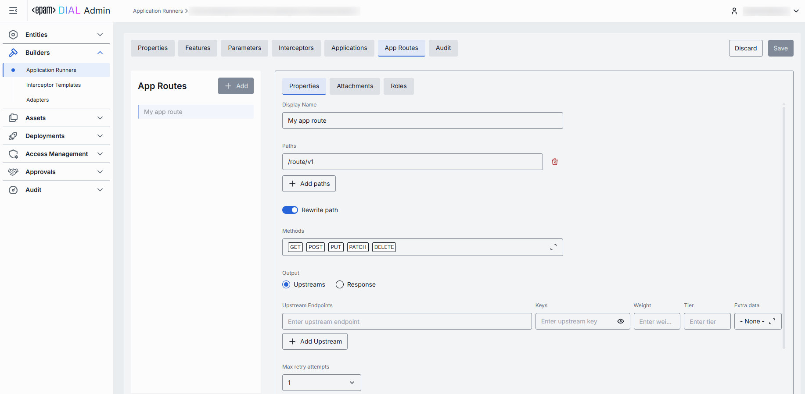

**Attachments sub-tab**

Configure attachment paths for requests and responses.

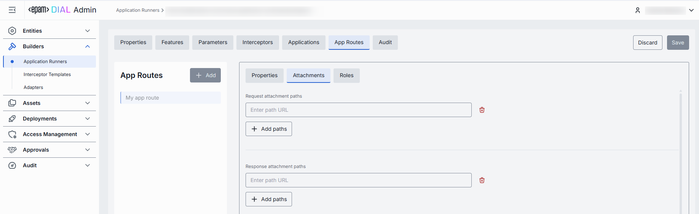

**Roles sub-tab**

Define route-specific role assignments to control access to each individual route. Configuration is similar to [Entities → Routes](entities/routes.md). Use **Inherit Application Roles** to apply roles from the application built on this runner.

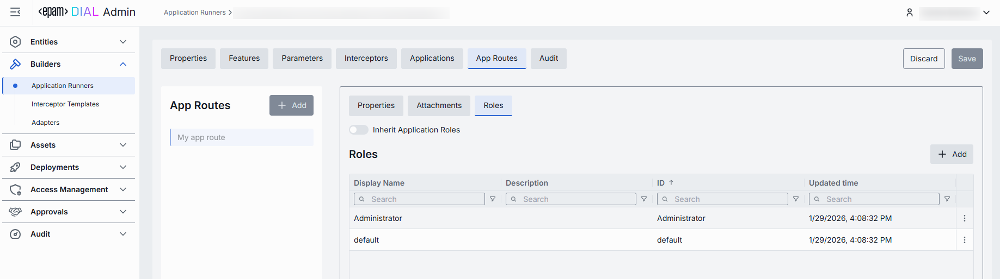

#### Audit tab

View a detailed history of changes to this Application Runner and revert any of them.

**Tip**
> This section mirrors the global [Audit → Activities](audit/activity-and-rollback.md) view, scoped to the selected runner.

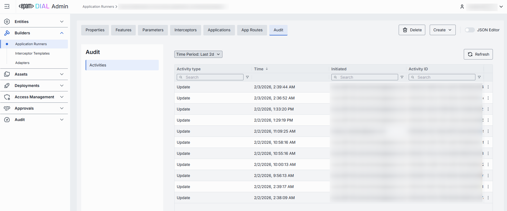

#### JSON editor (Application Runners) {#json-editor-application-runners}

Advanced users can work with the raw JSON of the Application Runner configuration. JSON mode is useful for bulk updates, copying configuration between environments, or editing settings not exposed in the form UI.

**Tip**
> Switching modes is disabled when there are unsaved changes.

In JSON editor mode, use the view dropdown to select between Admin format and Core format. These formats are for convenience only and do not affect the actual configuration stored in DIAL Core. After saving, the **Sync with core** indicator shows the synchronization state.

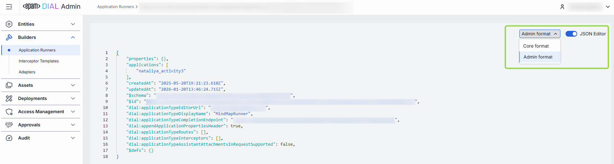

To use the JSON editor:

1. Navigate to **Builders → Application Runners** and select the runner you want to edit.
2. Click the **JSON Editor** toggle (top-right). The raw JSON is revealed.
3. Choose between Admin and Core format. **Note**: Core format does not show the configuration stored in DIAL Core—it shows the Admin configuration rendered in Core format.
4. Make your changes and click **Save**.
5. Monitor the **Sync with core** indicator to confirm propagation.

---

## Adapters

Model Adapters unify provider-specific model APIs with the Unified Protocol of DIAL Core. Each adapter consists of:

- **Coded implementation** that communicates with the AI model and implements the Unified Protocol.
- **Metadata object** managed in **Builders → Adapters**, which establishes the relationship to models.

DIAL includes adapters for [Azure OpenAI](https://github.com/epam/ai-dial-adapter-openai), [GCP Vertex AI](https://github.com/epam/ai-dial-adapter-vertexai/?tab=readme-ov-file#supported-models), and [AWS Bedrock](https://github.com/epam/ai-dial-adapter-bedrock) models. Compatibility with the Azure OpenAI API makes it straightforward to add new adapters for language models or develop them with [DIAL SDK](https://github.com/epam/ai-dial-sdk).

DIAL supports both [self-hosted](deployments/container-management.md) adapters (deployed within the DIAL infrastructure) and external adapters.

### Main screen

The main screen displays all registered adapters in your DIAL instance.

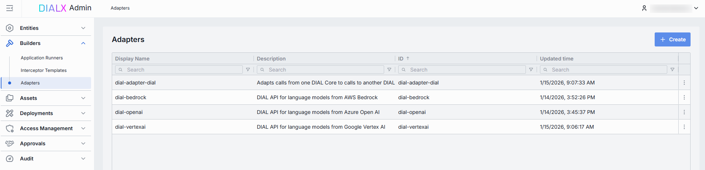

| Column | Description |
|--------|-------------|
| **ID** | Unique identifier of the adapter. |
| **Display Name** | Name displayed on the UI. |
| **Description** | Brief description of the adapter (e.g. "Adapter for OpenAI models"). |
| **Updated Time** | Timestamp of the last update. |
| **Creation Time** | Creation timestamp. |
| **Topics** | Semantic tags associated with the adapter. |
| **Source type** | Type of the adapter source: external endpoint or adapter container. |
| **Source** | URL for externally-deployed adapters, or the name of the adapter container for self-hosted adapters. |

### Create an adapter

1. Click **+ Create** to open the **Create Adapter** modal.

   | Field | Required | Description |
   |-------|----------|-------------|
   | **ID** | Yes | Unique identifier. |
   | **Display name** | Yes | Unique name displayed on the UI. |
   | **Description** | No | Description of the adapter. |
   | **Source type** | Yes | **External Endpoint** for externally-deployed adapters; **Adapter Container** for self-hosted adapter images. |
   | **Completion endpoint** | Yes | Endpoint to process chat completion requests. Implements the Unified Protocol (format: `{ADAPTER_ORIGIN}/openai/deployments/`). If Source Type is Adapter Container, the base URL is determined by the selected container and the endpoint path is editable. If Source Type is External Endpoint, the URL is fully editable. |
   | **Responses endpoint** | No | Endpoint supporting the OpenAI Responses API. Currently only OpenAI adapters support this. When set, DIAL Core routes `POST /openai/v1/responses` requests here. Only basic Responses API behavior is supported—background requests, `previous_request_id`, conversations, prompts, and files are not supported. |
   | **Container** | Conditional | Name of the running [adapter container](deployments/container-management.md). Click to select from available containers. Applies to Adapter Container source type. |

2. Once all required fields are filled, click **Create**. The dialog closes and the new adapter's configuration screen opens. The new adapter appears immediately on the main screen.

   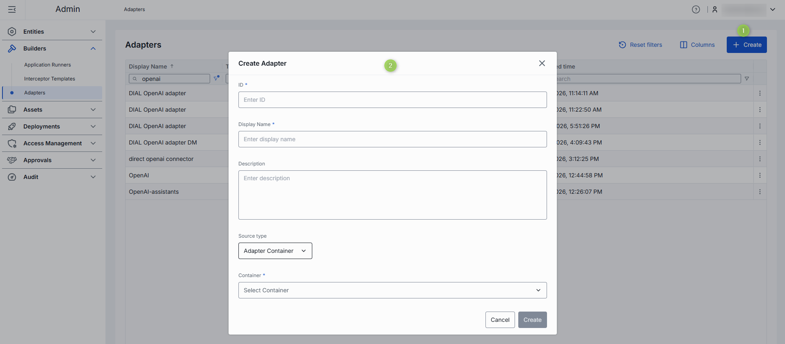

### Configure an adapter

Click any adapter on the main screen to open its configuration page.

**Top bar controls**

| Control | Description |
|---------|-------------|
| **Create Model** | Create a model deployment using this adapter as source. Created models appear in [Entities → Models](entities/models.md). |
| **Delete** | Remove the adapter and all models using it. After confirmation, the adapter and all related models are deleted. |
| **Save** | Save and apply any changes. |
| **Discard** | Discard any unsaved changes. You can also revert changes via the [Audit tab](#audit-tab-adapters). |
| **JSON Editor** (toggle) | Switch between the form UI and raw [JSON view](#json-editor-adapters). |

#### Properties tab

In the **Properties** tab, view and define the identity and metadata of the selected adapter.

| Field | Required | Editable | Description |
|-------|----------|----------|-------------|
| **ID** | — | No | Unique read-only identifier of the adapter. |
| **Updated Time** | — | No | Timestamp of the last configuration update. |
| **Creation Time** | — | No | Adapter creation timestamp. |
| **Display Name** | Yes | Yes | Unique name displayed on the UI. |
| **Description** | No | Yes | Brief description of the adapter. |
| **Source type** | Yes | Yes | **External Endpoint** for externally-deployed adapters; **Adapter Container** for self-hosted adapter images. |
| **Completion endpoint path** | Yes | Yes | Endpoint URL to process chat completion requests. Implements the Unified Protocol (format: `{ADAPTER_ORIGIN}/openai/deployments/`). If Source Type is Adapter Container, the base URL is determined by the selected container and the path can be partially customized. If Source Type is External Endpoint, the URL is fully editable. |
| **Responses endpoint path** | No | Yes | Endpoint supporting the OpenAI Responses API. Currently only OpenAI adapters support this. If Source Type is Adapter Container, the base URL is determined by the container and the path can be partially customized. If Source Type is External Endpoint, the URL is fully editable. |
| **Container** | Conditional | Yes | Name of the running [Adapter Container](deployments/container-management.md). Click to select from available containers. Required when Source Type is Adapter Container. |
| **Topics** | No | Yes | Semantic tags. Custom topics must be ≤ 255 characters with no leading or trailing spaces. |

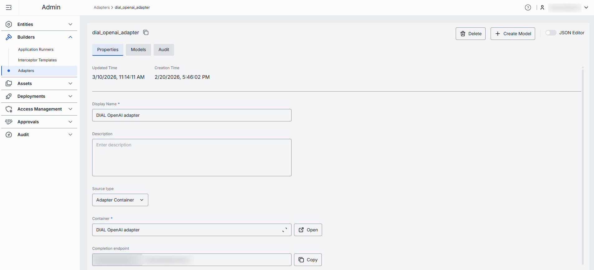

#### Models tab

The **Models** tab shows the AI models exposed by the selected adapter.

| Column | Description |
|--------|-------------|
| **ID** | Model identifier. |
| **Display Name** | Name of the model displayed on the UI. |
| **Description** | Description of the model. |

To add models processed by this adapter:

1. Click **+ Add**.
2. Select one or more available models in the modal. You can check all available models in [Entities → Models](entities/models.md). Use **+ Create Model** in the [top bar](#configure-an-adapter) to create a new model on the fly.
3. Click **Apply**.

To remove a model:

1. Click the **actions** menu in the model's row.
2. Choose **Remove**.

#### Audit tab (Adapters) {#audit-tab-adapters}

View a detailed history of changes to this adapter and revert any of them.

**Tip**
> This section mirrors the global [Audit → Activities](audit/activity-and-rollback.md) view, scoped to the selected adapter.

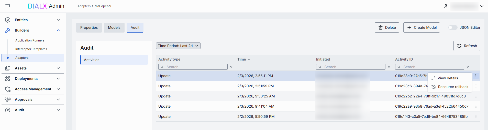

#### JSON editor (Adapters) {#json-editor-adapters}

Advanced users can work with adapter properties in a JSON editor view mode. Useful for bulk updates, copying configuration between environments, or editing settings not exposed in the form UI.

**Tip**
> Switching modes is disabled when there are unsaved changes.

To use the JSON editor:

1. Navigate to **Builders → Adapters** and select the adapter you want to edit.
2. Click the **JSON Editor** toggle (top-right). The raw JSON is revealed.

---

## Interceptor templates

Interceptor templates are reusable blueprints that streamline the creation of interceptors in DIAL. They save time by eliminating repetitive configuration when setting up similar interceptors.

Once created, interceptor templates can be [selected as a source type](entities/interceptors.md#create) when creating new interceptor entities.

**Note**
> To learn more about interceptors, refer to [Interceptors](/docs/platform/3.core/6.interceptors.md).

### Main screen

On the main screen, you can add and manage all Interceptor Templates in your DIAL instance.

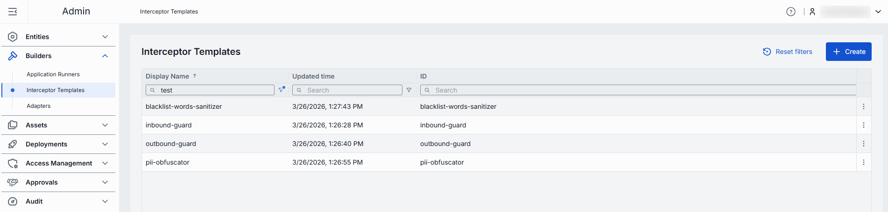

| Column | Description |
|--------|-------------|
| **Display name** | Name displayed on the UI (e.g. "PII Obfuscator", "Words Blacklist"). |
| **ID** | Unique identifier. |
| **Description** | Description of the interceptor template. |
| **Topics** | Semantic tags for identification and filtering on the UI. |
| **Creation Time** | Creation timestamp. |
| **Updated Time** | Timestamp of the latest update. |

### Create an interceptor template

1. Click **+ Create** to open the **Interceptor Template** modal.
2. Define key parameters:

   | Field | Required | Description |
   |-------|----------|-------------|
   | **ID** | Yes | Unique identifier. |
   | **Display name** | Yes | Name displayed on the UI. |
   | **Description** | No | Description of the interceptor template. |

3. Click **Create**. The dialog closes and the new template's [configuration screen](#configure-an-interceptor-template) opens. The new template appears immediately in the listing, though changes may take some time to propagate to DIAL Core.

   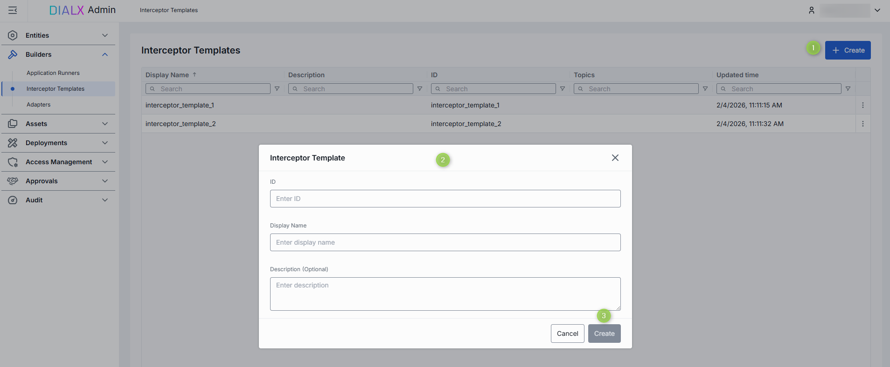

### Configure an interceptor template

Click any interceptor template on the main screen to open its configuration page.

**Top bar controls**

| Control | Description |
|---------|-------------|
| **Create Interceptor** | Creates an interceptor entity from this template. Created interceptors appear in [Entities → Interceptors](entities/interceptors.md). |
| **Save** | Saves any changes to the interceptor template. |
| **Discard** | Reverts any unsaved changes. |
| **Delete** | Permanently removes the template. All related interceptors still bound to it are deleted as well. |

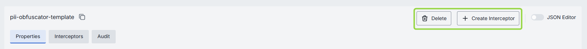

#### Create interceptor from template

On the configuration screen, click **+ Create Interceptor** to create a new [interceptor entity](entities/interceptors.md) based on this template.

1. Click **+ Create Interceptor** and fill in the pop-up form.
2. Click **Create**. The configuration of the new interceptor entity opens. The **Interceptor Template** field in the new interceptor is pre-populated with this template.

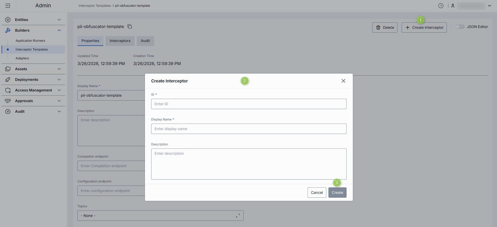

#### Properties tab

In the **Properties** tab, preview and modify the identity, metadata, and endpoints of the interceptor template.

| Field | Required | Editable | Description |
|-------|----------|----------|-------------|
| **ID** | — | No | Unique ID of the template (copyable). Cannot be changed after creation. |
| **Updated Time** | — | No | Timestamp for change tracking and audit. |
| **Creation Time** | — | No | Creation timestamp. |
| **Display Name** | Yes | Yes | Name displayed on the UI (e.g. "PII Obfuscator", "Words Blacklist"). |
| **Description** | No | Yes | Description of the template and how it can be used. |
| **Completion endpoint** | No | Yes | URL of the interceptor service. DIAL Core uses this to handle requests and responses for the interceptor. |
| **Configuration endpoint** | No | Yes | URL that exposes the interceptor's configuration as a JSON schema. |
| **Topics** | No | Yes | Semantic tags associated with this template. |

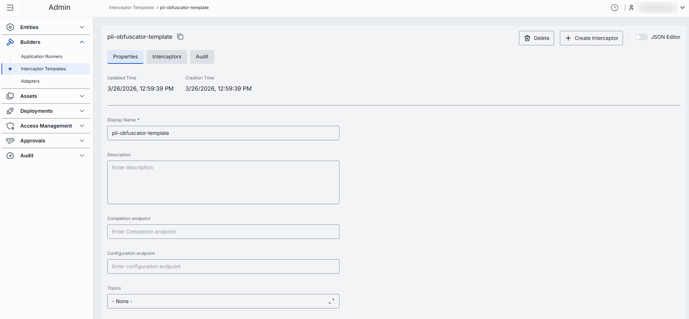

#### Interceptors tab

A read-only grid showing all interceptor instances created from this template. Use it to assess the potential impact before editing or deleting the template.

From the actions menu of each row, navigate to the interceptor's configuration in [Entities → Interceptors](entities/interceptors.md#configuration).

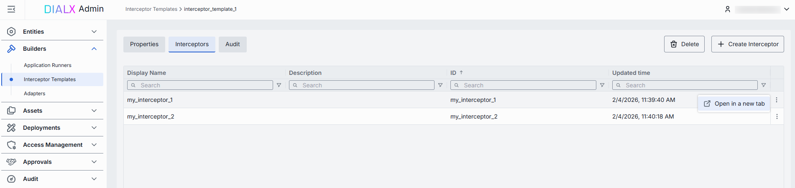

#### Audit tab (Interceptor templates) {#audit-tab-interceptor-templates}

View a detailed history of changes to this interceptor template and revert any of them.

**Tip**
> This section mirrors the global [Audit → Activities](audit/activity-and-rollback.md) view, scoped to the selected template.

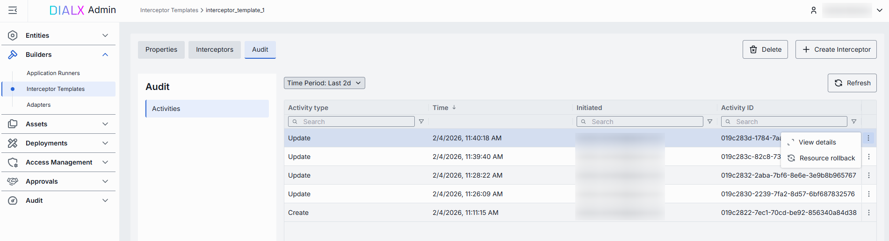

## Next steps

- [Manage Assets](4.assets.md) — place applications, tool sets, prompts, and files in the public folder
- [Manage Entities](entities/applications.md) — create and configure application deployments that reference these Builders
- [Monitor activity and roll back changes](audit/activity-and-rollback.md) — track changes to Builders across the global audit log
