# Manage MCP containers

This page explains how to deploy and manage MCP server containers in DIAL Admin, and how to create tool sets from running containers. Administrators use this page to add MCP containers from internal images, external Docker references, or the MCP Registry, and then expose their capabilities as tool sets to DIAL users. Familiarity with DIAL deployment images is assumed.

**Prerequisite**: The Deployments section requires the [Deployment Manager Backend](https://github.com/epam/ai-dial-admin-deployment-manager-backend) to be installed and configured in your DIAL environment.

## Creating a tool set from an MCP container

The high-level flow for making an MCP server available to DIAL users as a tool set is:

1. [Deploy an image](./images.md) of type MCP.
2. Create an MCP container from the installed image (described on this page).
3. In the running container's configuration screen, use the [Create](#create-a-tool-set) button to create a tool set.
4. The tool set appears in [Entities/Toolsets](../entities/toolsets.md).

Tool sets created this way can be used in Quick Apps workflows to perform specific tasks.

## MCP containers grid

The main screen lists all MCP containers with their current status and details.

| Column | Description |
|--------|-------------|
| ID | Unique identifier of the MCP container. |
| Display Name | Name of the container rendered in the UI. |
| Description | Brief description of the container. |
| Source Type | Source used to create the container: - **Internal MCP Image** - **Docker image reference** - **MCP Registry** |
| Source Name | Name of the source: - For Internal MCP Image: ID of the image. - For Docker image reference: URL of the external Docker image. - For MCP Registry: name of the MCP server in the centralized registry. |
| Status | Current status (e.g., Running, Stopped). |
| Container URL | URL to access the running MCP container. |
| Author | Email address of the container creator. |
| Topics | Semantic labels associated with the container. |
| Creation Time | Creation timestamp. |
| Updated Time | Timestamp of the last update. |
| Actions | Per-row actions: - **Open in a new tab**: Open the container configuration screen in a new browser tab. - **Duplicate**: Create a copy of the container. - **Stop/Run**: Start or stop the container. - **Delete**: Remove the container. |

## Create an MCP container

On the main screen, click **Create** and select one of the following options:

- **From Internal MCP Image**: Select the desired [image](./images.md) from the list and choose an installed version (marked with a green indicator).
- **From Docker Image Reference**: Provide the URI of the external Docker image you want to use.
- **From MCP Registry**: Enter the name of an MCP server from the [MCP Registry](https://registry.modelcontextprotocol.io/). Start typing to search, or click **Select from registry** to browse available servers and their details.

**Warning**
> When creating from MCP Registry, the selected MCP server must have an OCI package and must support Remote transport: `streamable-http` or `sse`.

Specify **ID**, **Display Name**, and **Description**, then click **Finish** to create the container. The configuration screen opens immediately.

**Note**
> Configuration fields are disabled for editing when a container is in a transition state (launching or stopping).

## Configuration actions

The configuration screen header provides the following actions:

| Action | Description |
|--------|-------------|
| **Create** | Available for running containers. Opens a dropdown to create a [Toolset](#create-a-tool-set) or [Asset Toolset](#create-an-asset-toolset). |
| **Run / Stop** | Start or stop the MCP container. |
| **Delete** | Remove the MCP container. Deleting a container affects tool sets created from it. |

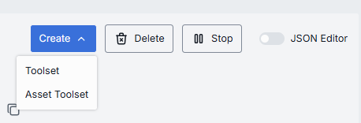

## Create a tool set

You can create a new tool set from a running MCP container. The tool set uses the container as its source and appears in [Entities/Toolsets](../entities/toolsets.md).

1. In the configuration screen of the running MCP container, click **Create** and select **Toolset**.
2. Fill in the dialog:
   - **ID**: Unique identifier for the tool set. Auto-populated from the container.
   - **Display Name**: Name shown in the UI. Auto-populated from the container.
   - **Description**: Brief description of the tool set.
3. Click **Create** to submit the form.

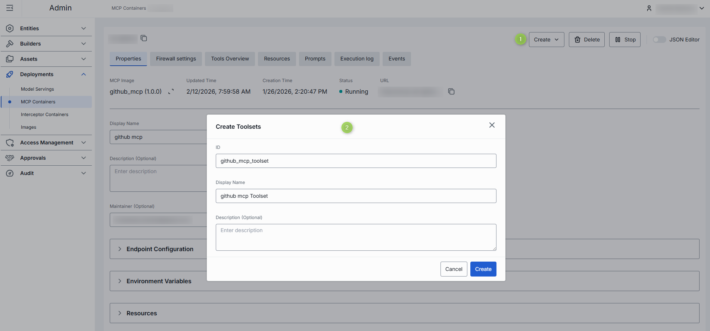

## Create an asset toolset

Assets are stored in the Public folder in the DIAL file system. All authorized users have access to this folder. Sub-folders can have specific access rules applied to them, which you manage in Folders Storage.

You can create an asset toolset from a running MCP container. The asset toolset appears in Assets/Toolsets.

1. In the configuration screen of the running MCP container, click **Create** and select **Asset Toolset**.
2. Fill in the dialog:
   - **Folder Storage**: Select a folder in Public storage for the asset toolset.
   - **ID**: Unique identifier. Auto-populated from the container.
   - **Display Name**: Name shown in the UI. Auto-populated from the container.
   - **Version**: Version of the asset toolset.
   - **Description**: Brief description.
   - **External Endpoint**: External endpoint for the asset toolset.
3. Click **Create** to submit the form.

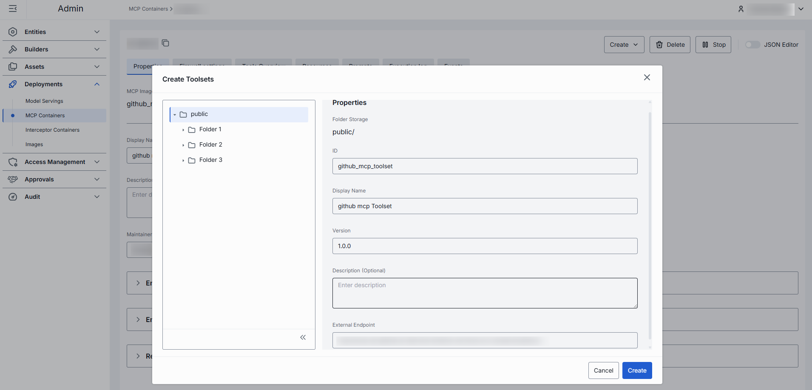

## Properties

The **Properties** tab shows the container's configuration.

| Property | Required | Editable | Description |
|----------|----------|----------|-------------|
| ID | — | No | Unique read-only identifier. 2–36 characters. Lowercase letters, numbers, and hyphens only. |
| Source Type | — | No | Source type of the container: Internal MCP Image or Docker image reference. |
| Creation Time | — | No | Container creation timestamp. |
| Updated Time | — | No | Timestamp of the last update. |
| Status | — | No | Current status (e.g., Running, Stopped). |
| URL | — | No | URL to access the running container. |
| Restarts | — | No | Restart counter for launching containers. Use to identify crash loops. Details are in the [Execution log](#execution-log). |
| Display Name | Yes | Yes | Name rendered in the UI. 2–255 characters. |
| Description | No | Yes | Brief description of the container. |
| Maintainer | No | Yes | Email address of the creator and maintainer. |
| Topics | No | Yes | Semantic labels (e.g., "finance", "support") for navigation. Custom topics: maximum 255 characters, no leading or trailing spaces. |
| MCP Image | Conditional | Yes | Internal MCP image used to create the container. Available for containers created from internal images. |
| Docker Image Reference | Conditional | Yes | URI of the external Docker image. Available when an external image was used to create the container. |
| MCP server name | Conditional | Yes | Name of the MCP server from the MCP Registry. Start typing to search, or click **Select from registry** to browse. Available when the container was created from the MCP Registry. |
| Endpoint Configuration | No | Yes | Endpoint settings for the MCP container: - **Transport**: HTTP (default) or SSE. - **Container endpoint path**: Specific path where the MCP service is accessible. - **Port**: Network port (must be between 1 and 65535 if provided). Changes trigger a RollingUpdate restart. |
| Autoscaling | No | Yes | Replica scaling settings: - **Automatic scale to zero**: Reduces replicas to zero after inactivity. Enabled by default for new MCP containers with a 5-minute delay. - **Min and Max Replicas**: Minimum and maximum instances. Default for new containers: 0 to 1 replica. - **Pending requests to trigger autoscaling**: Queue depth that triggers scale-up. **Note** > Existing containers retain their current autoscaling configuration. |
| Environment Variables | No | Yes | Environment variables for the container. Changes trigger a RollingUpdate restart. - **Name**: 1–253 characters. Letters, numbers, dots (`.`), hyphens (`-`), and underscores (`_`). - **Value**: 1–253 characters. Letters, numbers, dots (`.`), hyphens (`-`), and underscores (`_`). |
| Resources | No | Yes | CPU, memory, and GPU resource limits. Changes trigger a RollingUpdate restart. Validation rules: - Values must be numeric and greater than 0. - Maximum allowed values for `cpu`, `memory`, and `nvidia.com/gpu` are defined on the backend. - For each resource key (e.g., `cpu`), the limit must not be less than the request. |
| Configuration | No | Yes | Executable command and arguments used to launch the container. |
| Startup probe | No | Yes | Health check that signals when the container is ready to serve traffic. - **Type**: HTTP (GET request; success = HTTP 200–399) or TCP (connection success). - **Port**: Container port for the probe. - **Path**: Request path. Applies to HTTP type only. - **Initial delay seconds**: Wait time after container start before the first probe. - **Period seconds**: Interval between consecutive probes. - **Timeout seconds**: Maximum time allowed for a single probe to complete. - **Failure threshold**: Consecutive failures before the container is marked as failed. |

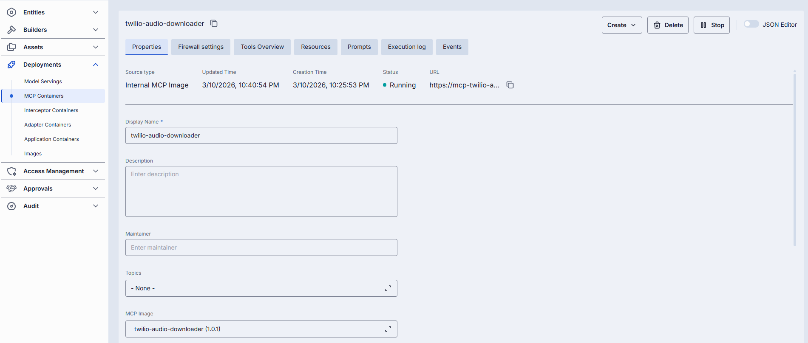

**Note**
> Advanced users can switch to the JSON editor view for bulk updates, copying configuration between environments, or adjusting settings not exposed in the form UI.

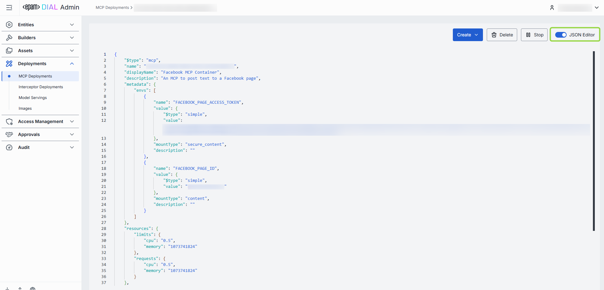

## Firewall settings

The firewall settings specify which external domains the MCP container is allowed to connect to. This controls outgoing traffic, restricting communication to trusted domains only.

**Domain name requirements**: Enter domain names without a protocol prefix, for example `github.com`. Each domain must contain at least one dot. Labels may include letters, numbers, and hyphens (1–63 characters each, not starting or ending with a hyphen). The top-level domain must be at least two letters.

## Tools overview

[Tools](https://modelcontextprotocol.io/specification/2025-06-18/server/tools) are specific functions supported by the MCP server that clients can invoke to perform actions such as processing, transforming, or analyzing data.

This tab shows the list of tools supported by the selected MCP server along with their details. Tool sets created from this container inherit these tools in the [Tools Overview](../entities/toolsets.md) configuration tab.

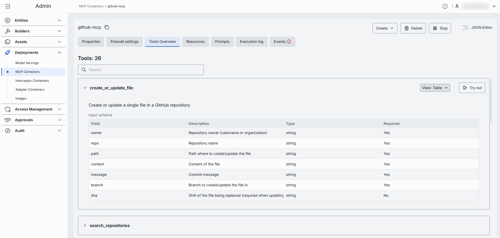

### Try a tool

Click or hover over any enabled tool and click **Try out** to enter test mode.

In test mode you can send a request to the server using either the rendered form UI or a raw JSON mode.

**To try a tool:**

1. Click a tool to view its description and input schema parameters. Toggle between table and JSON view modes.
2. Click **Try out** to open the request sidebar.
3. Populate the **Request body** using the table or JSON view.
4. Click **Send Request**. The server's response appears in the **Response body** area.

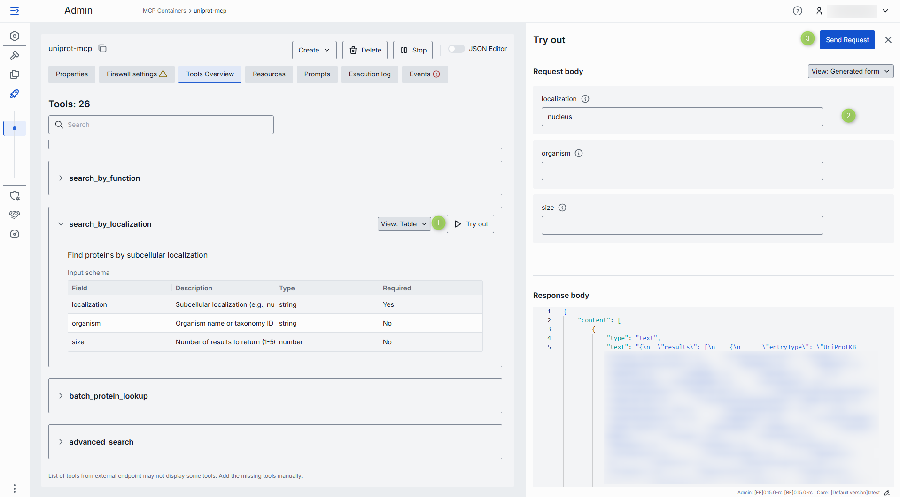

## Resources

The **Resources** tab shows contextual data attached to and managed by the MCP server. This data provides additional context to AI models.

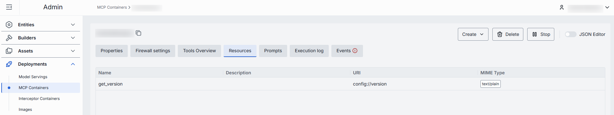

## Prompts

The **Prompts** tab shows pre-defined templates or instructions that guide language model interactions. These are defined by the MCP server.

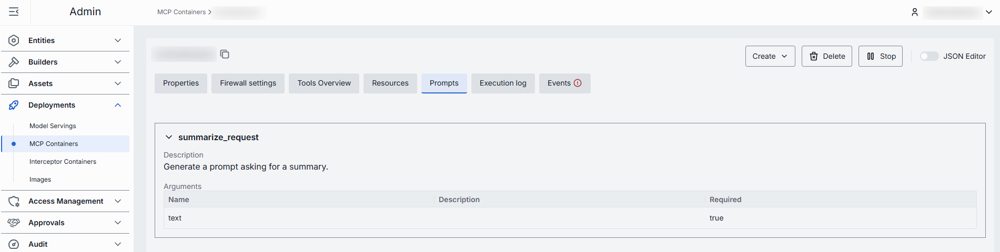

## Execution log

The **Execution Log** tab shows real-time output from the container, including status messages, errors, and operational events.

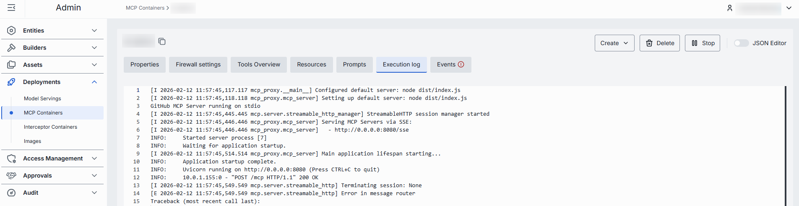

When a container starts with more than one pod, logs are shown per pod:

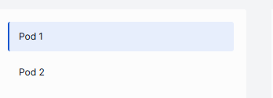

When issues occur, health indicators appear:

| Indicator | Description |
|-----------|-------------|
| Restarts | Restart counter. Use to identify crash loops. |
| Last restarted at | Timestamp of the last restart. |
| Last reason | Restart failure reason. |

## Events

The **Events** tab shows significant state changes within the container: starts, stops, configuration changes, and error conditions. Unlike the continuous execution log, this tab focuses on discrete events.

## Audit

The **Audit** tab shows activity, usage, and operational metrics for the selected MCP container, including configuration changes, runtime actions, and tool-set-related usage.

**Note**
> This tab shows the same data as the global [Activity](../audit/activity-and-rollback.md) section, scoped to the selected MCP container.

## Next steps

- [Manage tool sets](../entities/toolsets.md) — configure and publish tool sets created from MCP containers
- [Manage deployment images](./images.md) — build and version MCP images
- [Manage containers](./container-management.md) — deploy adapter, application, and interceptor containers
