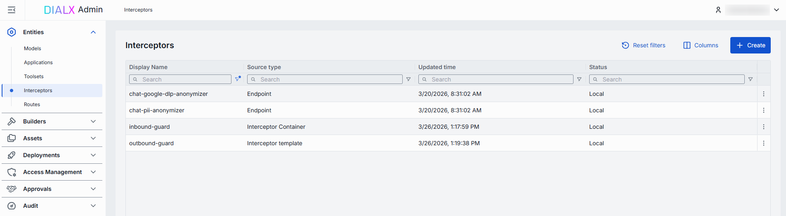
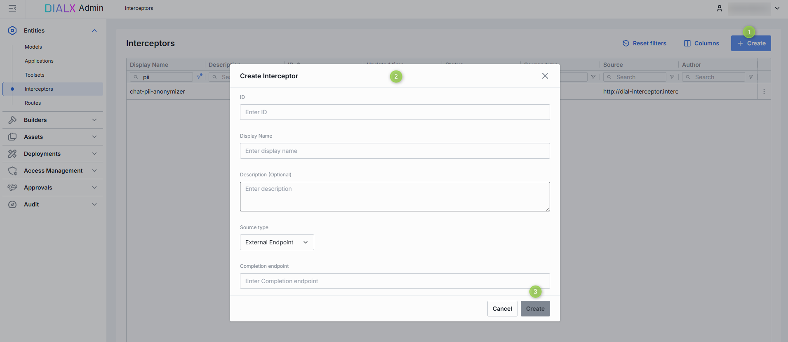
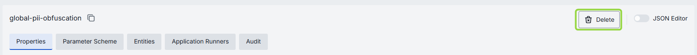
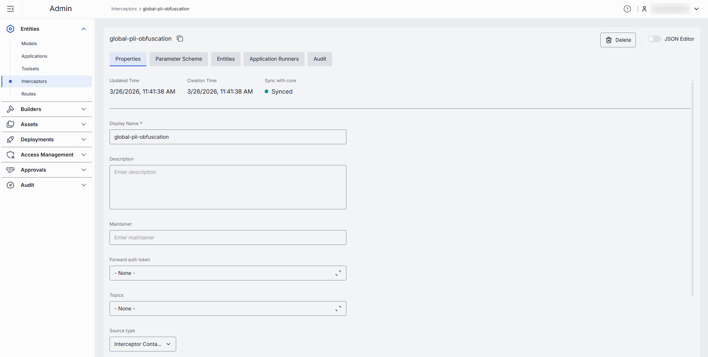
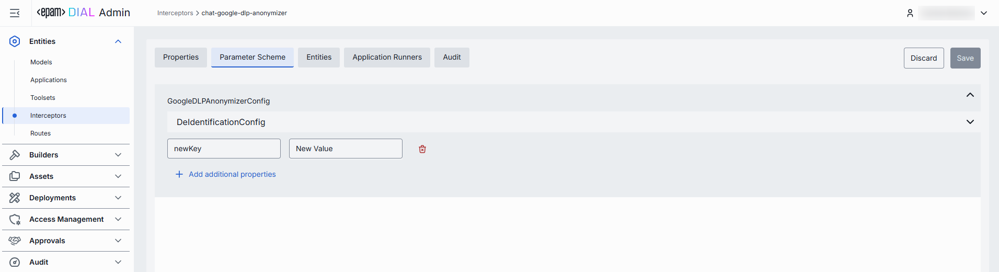
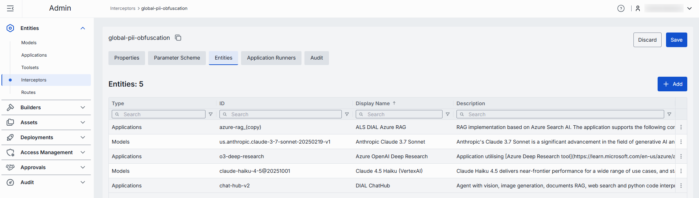
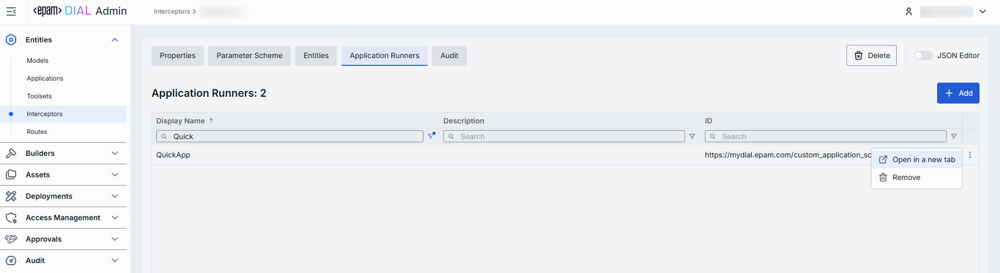
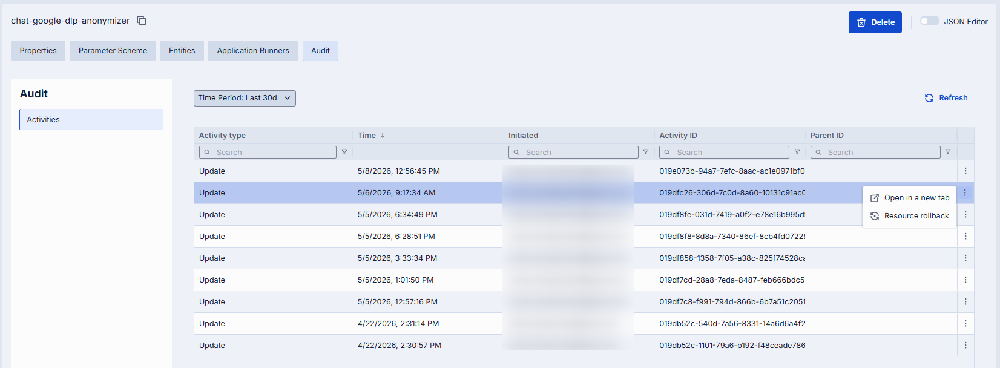
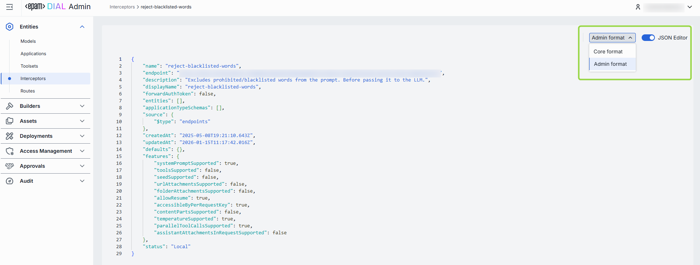

# Manage interceptors

This page explains how administrators use DIAL Admin to add and configure interceptors. It covers creating an interceptor, configuring its source type and parameters, associating it with models or applications, and reviewing its scope. You need access to DIAL Admin with administrator permissions.

DIAL interceptors are pluggable components with the primary goal of implementing a Responsible AI approach and enforcing compliance with organization and external policies and standards (biased answers, data leaks, etc.).

Interceptors provide the ability to delegate content analysis to third-party systems or dedicated models used within an organization, or to carry any other custom implementation.

Selected use cases:

- Prevent harmful requests from reaching the model
- Prevent harmful replies from reaching the user
- Modify the request/response, introduce disclaimers
- DLP (Data Loss Prevention)
- Smart information collection
- Implement caching strategies
- Application of watermarks

[DIAL Interceptors Python SDK](https://github.com/epam/ai-dial-interceptors-sdk) makes development of new interceptors easier and enables integration with external systems like Google Model Armor, MS Presidio, and more.

In DIAL, you can create and use templates to add interceptors, create interceptors based on images deployed in DIAL, or connect to third-party systems.

You can configure global interceptors that apply on a system level in [System Properties](../1.config-backup-and-global-settings.md#system-properties) and local interceptors that are triggered for specific [model](./models.md#interceptors) or [application](./applications.md#interceptors) deployments, or apps created based on [application runners](../3.builders.md).

**Note**
> - Refer to [Interceptors](/docs/platform/3.core/6.interceptors.md) to learn more.
> - Refer to [DIAL Interceptors Python SDK](https://github.com/epam/ai-dial-interceptors-sdk) for comprehensive information, configuration, and implementation examples.

## Main screen

On this screen, you can access all the available interceptors added via DIAL Admin or direct modification of the [DIAL Core config file](https://github.com/epam/ai-dial-core/blob/development/docs/dynamic-settings/interceptors.md). Here, you can manage and add interceptors to your DIAL environment.

### Interceptors grid

| Field | Description |
|-------|-------------|
| **Display Name** | Name of the interceptor displayed on UI (e.g. "PII Information Remover"). |
| **Description** | Brief summary of what this interceptor does and any parameters it uses (e.g. `BLACKLIST={"foo","bar"}` or Logs request/response payloads). |
| **ID** | Unique identifier for the interceptor (e.g. reject-blacklisted-words, audit-logger). This key is used when you attach it to a Model or Application. |
| **Source Type** | Source type of the interceptor: - [Interceptor Template](../3.builders.md): Interceptor is based on a template. - [Interceptor deployment](../deployments/container-management.md): Interceptor is based on a deployed interceptor image. - External Endpoint: Interceptor is based on an external HTTP endpoint. |
| **Source** | Identifier of the interceptor source: interceptor's template, interceptor container ID, or completion endpoint URL, depending on the choice of source type. |
| **Author** | Information about the interceptor's author. |
| **Status** | The current status of the interceptor: - **local**: Applies to selected deployments. - [global](../1.config-backup-and-global-settings.md#system-properties): Applies to all deployments. |
| **Topics** | Tags that associate an interceptor with one or more topics or categories (e.g. "compliance", "logging"). |
| **Creation Time** | Entity creation timestamp. |
| **Updated Time** | Timestamp of the latest update of the entity. |

## Create

Follow these steps to add a new interceptor definition:

1. Click **+ Create** to invoke the **Create Interceptor** modal.
2. Define interceptor parameters:

    | Column | Required | Description |
    |--------|----------|-------------|
    | **ID** | Yes | Unique identifier for the interceptor (e.g. reject-blacklisted-words, audit-logger). This key is used when you attach it to a Model or Application. |
    | **Display Name** | Yes | Name of the interceptor (e.g. "PII Information Remover") displayed on UI. |
    | **Description** | No | Brief summary of what this interceptor does and any parameters it uses (e.g. `BLACKLIST={"foo","bar"}` or Logs request/response payloads). |
    | **Source Type** | Yes | Source type of the interceptor: - [Interceptor Template](../3.builders.md): Interceptor is based on a template. - [Interceptor deployment](../deployments/container-management.md): Interceptor is based on a deployed interceptor image. - External Endpoint: Interceptor is based on an external HTTP endpoint. |
    | **Interceptor template** | Conditional | Interceptor's Template ID. Applies for the Interceptor Template source type. |
    | **Container** | Conditional | Interceptor's [Container ID](../deployments/container-management.md). Applies for the Interceptor Container source type. |
    | **Completion endpoint** | Conditional | URL of the chat completion endpoint. Applies for the External Endpoint source type. |

3. Once all required fields are filled, click **Create**. The dialog closes and the new interceptor [configuration screen](#configuration) is opened. Once added, a new entry appears in the **Interceptors** listing. It may take some time for the changes to take effect after saving.

    

## Delete

Use the **Delete** button in the Configuration screen toolbar or in the main screen actions menu to permanently remove the selected interceptor.

## Configuration

Click any interceptor on the main screen to open its configuration details.

### Properties

In the **Properties** tab, you can define metadata and execution endpoints for interceptors.

| Field | Required | Editable | Description |
|-------|----------|----------|-------------|
| **ID** | - | No | Unique key under `interceptors` in DIAL Core's [dynamic settings](https://github.com/epam/ai-dial-core?tab=readme-ov-file#dynamic-settings) (e.g. data-clustering, support-bot). |
| **Updated Time** | - | No | Date and time when the interceptor's configuration was last updated. |
| **Creation Time** | - | No | Date and time when the interceptor's configuration was created. |
| **Status** | - | No | Current status of the interceptor: - **local**: Configured and applied to a specific instance of a deployment. - [global](../1.config-backup-and-global-settings.md#system-properties): Applies to any deployment in DIAL and tends to have the strictest rules, because global interceptors receive original input first and examine the response last. |
| **Sync with core** | - | No | Indicates the state of the entity's configuration synchronization between Admin and DIAL Core. Synchronization occurs automatically every 2 mins (configurable via `CONFIG_AUTO_RELOAD_SCHEDULE_DELAY_MILLISECONDS`). **Important**: Sync state is not available for sensitive information (API keys/tokens/auth settings). - **Synced**: Entity's states are identical in Admin and in Core for valid entities, or entity is missing in Core for invalid entities. - **In progress...**: Synced conditions are not met and changes were applied within last 2 mins (this period is configurable via `CONFIG_EXPORT_SYNC_DURATION_THRESHOLD_MS`). - **Out of sync**: Synced conditions are not met and changes were applied more than 2 mins ago (this period is configurable via `CONFIG_EXPORT_SYNC_DURATION_THRESHOLD_MS`). - **Unavailable**: Displayed when it is not possible to determine the entity's state in Core. This occurs if the config was not received from Core for any reason, or the configuration of entities in Core is not entirely compatible with the one in the Admin service. |
| **Display Name** | Yes | Yes | Name of the interceptor displayed on UI (e.g. "PII Information Remover"). |
| **Description** | No | Yes | Description of the interceptor (e.g. `BLACKLIST={"foo","bar"}`). Helps to identify the interceptor and its purpose. |
| **Maintainer** | No | Yes | Identification of a responsible person or team overseeing the interceptor and its configuration. |
| **Forward Auth Token** | Yes | Yes | Determines whether to forward an Auth Token to your interceptor's endpoint. Use this when your interceptor service requires its own authentication. If enabled, the HTTP header with the authorization token is forwarded to the chat completion endpoint of the interceptor. |
| **Source Type** | Yes | Yes | Source type of the interceptor: - [Interceptor Template](../3.builders.md): Interceptor is based on a template. - [Interceptor deployment](../deployments/container-management.md): Interceptor is based on a deployed interceptor image. - External Endpoint: Interceptor is based on an external HTTP endpoint. |
| **Completion Endpoint** | Conditional | Yes | URL of the chat completion endpoint. Applies for the External Endpoint source type. |
| **Configuration Endpoint** | Conditional | Yes | The URL that exposes the configuration of the interceptor. This endpoint returns a JSON schema with configuration parameters that are rendered in the [Parameter scheme tab](#parameter-scheme). Applies for the External Endpoint source type. |
| **Interceptor template** | Conditional | Yes | Interceptor's template ID. Applies for the Interceptor Template source type. |
| **Container** | Conditional | Yes | Interceptor's Container ID. Applies for the Interceptor deployment source type. |
| **Defaults** | No | Yes | The interceptor configuration can be preset on a per-interceptor basis via the `defaults` field. Default parameters are applied if a request doesn't contain them in an OpenAI chat/completions API call. Refer to [Interceptors SDK](https://github.com/epam/ai-dial-interceptors-sdk/blob/development/README.md#interceptor-configuration) to learn more. |

### Parameter scheme

In this tab, you can define additional configuration parameters for the interceptor. The parameters displayed in this section are defined by the JSON schema returned by the configuration endpoint specified in the [Properties tab](#properties) when the External Endpoint source type is selected, or by the configuration endpoint of the [related interceptor template](../3.builders.md). If a valid endpoint is specified, the content on this screen is rendered automatically based on the JSON schema returned by that endpoint. Rendered parameters are pre-populated with their default values. If an invalid configuration endpoint is provided, a "No Configuration Scheme" state is shown instead.

### Entities

In the **Entities** tab, you can see Models and Applications this interceptor is currently associated with.

**Tip**
> You can also define this mapping on the [Models](./models.md#interceptors) and [Applications](./applications.md#interceptors) configuration screens in the Interceptors tab.

| Column | Description |
|--------|-------------|
| **ID** | Unique identifier of the Application or Model deployment. |
| **Display Name** | Name of the Application/Model deployment (e.g. "Data Clustering Application"). |
| **Description** | Description of the deployment. |
| **Type** | Type of the entity using the given interceptor: Model, Application. |

#### Add an entity

On this screen, you can add a model or application to associate them with the selected interceptor.

1. Click **+ Add** (top-right of the Entities grid).
2. Select one or more apps/models in the modal.
3. Click **Apply** to complete the action.

#### Remove an entity

1. Click the **actions** menu in the entity's row.
2. Choose **Remove** in the menu.

### Application runners

In this tab, you can see Application Runners that a specific interceptor is currently associated with. Application Runners are used to run [schema-rich applications](/docs/platform/3.core/7.apps.md#schema-rich-applications) of specific types. By creating this binding, you can determine what types of applications will use the selected interceptor during their execution.

**Tip**
> You can also define this mapping on the [Application Runners](../3.builders.md) configuration screen in the Interceptors tab.

### Audit

On this screen, you can access a detailed preview and revert any changes made to the selected interceptor.

**Note**
> This section mimics the functionality available in the global [Activity](../audit/activity-and-rollback.md) section, but is scoped specifically to the selected interceptor.

### JSON editor

Advanced users with technical expertise can work with the interceptor properties in a JSON editor view mode. It is useful for advanced scenarios of bulk updates, copy/paste between environments, or tweaking settings not exposed on UI.

**Tip**
> You can switch between UI and JSON only if there are no unsaved changes.

#### Working with the JSON editor

1. Navigate to **Entities → Interceptors**, then select the interceptor you want to edit.
2. Click the **JSON Editor** toggle (top-right). The UI reveals the raw JSON.
3. Choose between the Admin and Core format to see and work with properties in the necessary format. **Note**: Core format view mode does not render the actual configuration stored in DIAL Core but the configuration in the Admin service displayed in the DIAL Core format.
4. Make changes and click **Save** to apply them.
5. After making changes, the **Sync with core** indicator on the main configuration screen will inform you about the synchronization state with DIAL Core.

## Next steps

- [Manage AI model deployments](./models.md) — attach interceptors to individual AI model deployments.
- [Manage applications](./applications.md) — attach interceptors to application deployments or application runners.
- [Global settings and system properties](../1.config-backup-and-global-settings.md) — configure interceptors that apply globally across all deployments.
