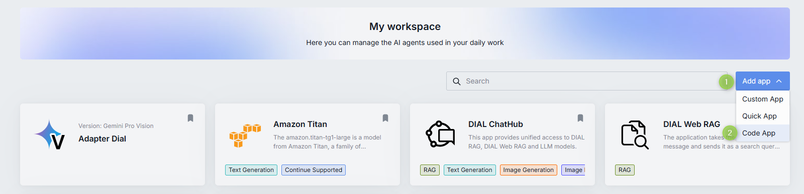
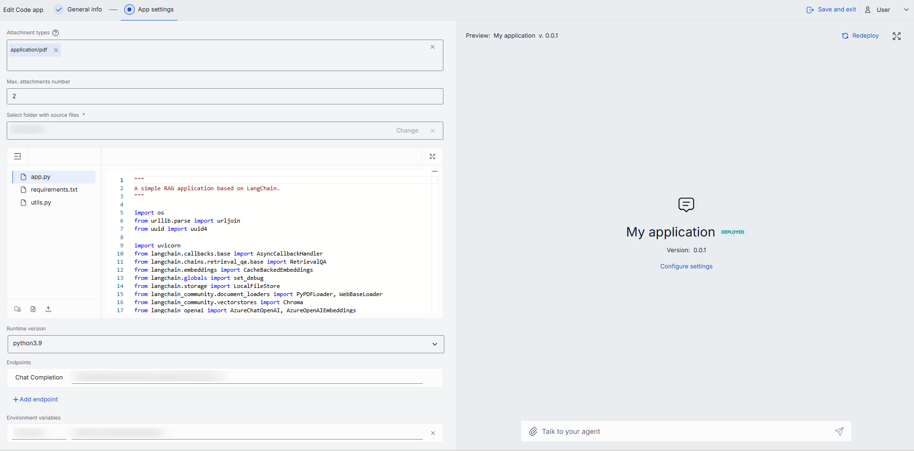

# Getting started with Code Apps

In this tutorial, you will create, deploy, and test your first Code App directly in the DIAL Chat browser interface. You will build a simple echo application that repeats the user's message. No local tools, terminal commands, or Docker setup required — everything happens in the browser.

## Prerequisites

- Access to a DIAL Chat instance with Code Apps enabled
- A user role that allows creating Code Apps (contact your administrator if **Add app** is unavailable)
- Basic Python knowledge

## What you will build

An echo application that receives a message through DIAL Chat and responds with the same text. The app runs as a platform-managed container — you write the code, and DIAL handles deployment and hosting.

## Step 1: Open Application Builder

1. In DIAL Chat, navigate to **My workspace**.
2. Click **Add app** and select **Code App**.

Application Builder opens with a Python code editor and a configuration form.



## Step 2: Write the application code

In the built-in code editor, create a file named `app.py` with the following content:

```python
import uvicorn

from aidial_sdk import DIALApp
from aidial_sdk.chat_completion import ChatCompletion, Request, Response


class EchoApplication(ChatCompletion):
    async def chat_completion(
        self, request: Request, response: Response
    ) -> None:
        last_user_message = request.messages[-1]

        with response.create_single_choice() as choice:
            choice.append_content(last_user_message.content or "")


app = DIALApp()
app.add_chat_completion("echo", EchoApplication())

if __name__ == "__main__":
    uvicorn.run(app, port=5000, host="0.0.0.0")
```

Key elements in this code:

- **`ChatCompletion`** — base class for all DIAL applications. You implement one method: `chat_completion`.
- **`Request`** — contains the conversation history. `request.messages[-1]` is the most recent user message.
- **`Response`** — the object you write output to. `create_single_choice()` opens a response stream with one choice.
- **`DIALApp`** — a FastAPI-based application router. `add_chat_completion("echo", ...)` registers your handler under the deployment name `echo`.

## Step 3: Configure the app

Fill in the configuration form next to the code editor.



Use these values for the tutorial:

| Field | Value |
|---|---|
| **Name** | `My Echo App` |
| **Version** | `0.0.1` |
| **Description** | `Simple app that echoes your message` |
| **Runtime version** | Select the latest available runtime |
| **Endpoints** | The chat completion endpoint is required and pre-filled |

Leave other fields at their defaults. The full set of configuration fields:

| Field | Required | Description |
|---|:---:|---|
| Name | Yes | Display name for the Code App. |
| Version | Yes | Version string in `x.y.z` format (numbers and dots only). |
| Icon | No | Icon displayed in DIAL Chat and the Marketplace. |
| Topics | No | Pre-defined topic tags. Topics and their styles are defined in DIAL Chat Themes. |
| Description | No | Short description shown in DIAL Chat and the Marketplace. Add two line breaks for an extended description. |
| Attachment types | No | Allowed MIME types (e.g., `image/png`). Enter `*/*` to allow all types. |
| Max. attachments number | No | Maximum number of attachments accepted. Leave empty for no limit. Enter `0` to disable attachments. |
| Select folder with source files | Yes | Opens the built-in Python code editor. Write code from scratch or upload existing source files. |
| Runtime version | Yes | Python runtime environment for code execution. |
| Endpoints | Yes | Chat completion endpoint (required). Rate and configuration endpoints are optional. |
| Environment variables | No | Key-value pairs accessible to the application at runtime. |

Click **Save and exit** to register the app in DIAL.

**Verify:** The app appears in **My workspace** with a yellow status icon (not yet deployed).

## Step 4: Deploy the app

1. In **My workspace**, find your Code App and open its context menu (three dots).
2. Click **Deploy**.
3. Wait for the status icon to change from yellow to green. This may take a few minutes while the platform builds the container.


**Verify:** The status icon is green, indicating the app is running.

## Step 5: Test in DIAL Chat

1. Select the deployed Code App in **My workspace**.
2. Click **Use application** to start a new conversation.
3. Type a message — for example, `Hello, DIAL!` — and send it.

**Verify:** The app responds with the exact text you sent: `Hello, DIAL!`.

## Step 6: View logs

1. Open the context menu for your deployed Code App.
2. Click **Logs**.


A pop-up window displays the application logs. You can refresh and download the log file from this window.


**Verify:** The logs show request activity from your test message.

## What you learned

- How to create a Code App using Application Builder in DIAL Chat.
- How to write a DIAL-compatible Python application using the `ChatCompletion` base class.
- How to configure, deploy, and test a Code App entirely in the browser.
- How to access application logs for debugging.

## Demo video

For a visual walkthrough of Code Apps, including a more advanced RAG example, watch the demo video:

<iframe width="560" height="315" src="https://www.youtube.com/embed/oysFwinnox4" title="DIAL Code Apps demo" frameborder="0" allow="accelerometer; autoplay; clipboard-write; encrypted-media; gyroscope; picture-in-picture" allowfullscreen></iframe>

## Next steps

- [Tutorial: build a RAG Code App](./tutorial-build-deploy) — create a retrieval-augmented generation app with file upload and model calls
- [Code Apps overview](./index) — understand the runtime environment, security model, and deployment lifecycle
- [What are Quick Apps](../quick-apps/index) — use your Code App as a tool in no-code workflows
