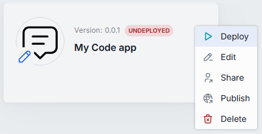
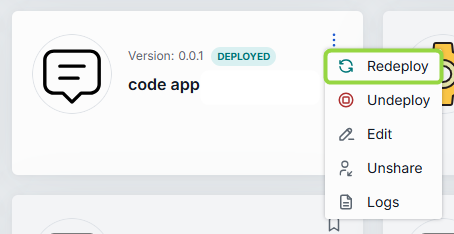

# Tutorial: build a RAG Code App

In this tutorial, you will build a Code App that answers questions about an uploaded text document. The app reads the file content, sends it along with the user's question to a language model through DIAL Core, and returns the model's answer. Everything happens in the DIAL Chat browser interface — no local tools or terminal required. You should have completed the [Getting started with Code Apps](./getting-started) tutorial first.

## Prerequisites

- Completed the [Getting started with Code Apps](./getting-started) tutorial
- At least one language model available in your DIAL instance (e.g., GPT-4, Claude, or a locally-hosted model)
- A short text file to use as a test document (any `.txt` file with a few paragraphs)

## What you will build

A Code App that:

1. Accepts a text file attachment from the user.
2. Reads the file content from DIAL file storage.
3. Constructs a prompt combining the document content and the user's question.
4. Calls a language model through DIAL Core to generate an answer.
5. Returns the model's response.

```
User (with attached .txt file)
  → DIAL Chat
    → DIAL Core
      → Your RAG Code App
        → DIAL Core (model call)
          → Language Model
        ← Model response
      ← Answer based on document
    ← Displayed in chat
```

:::note
Code Apps cannot access the internet, but they can call DIAL Core APIs. This includes calling language models, reading files from DIAL file storage, and using other DIAL services.
:::

## Step 1: Create a new Code App

1. In DIAL Chat, navigate to **My workspace**.
2. Click **Add app** and select **Code App**.

Application Builder opens with the code editor and configuration form.

## Step 2: Write the RAG application code

In the code editor, create a file named `app.py` with the following content:

```python
import os
import json

import httpx
import uvicorn

from aidial_sdk import DIALApp
from aidial_sdk.chat_completion import ChatCompletion, Request, Response

DIAL_URL = os.environ.get("DIAL_URL", "http://localhost:8080")
MODEL_DEPLOYMENT = os.environ.get("MODEL_DEPLOYMENT", "gpt-4o-mini")


class RAGApplication(ChatCompletion):
    async def chat_completion(
        self, request: Request, response: Response
    ) -> None:
        last_message = request.messages[-1]
        user_question = last_message.content or ""

        # Read the attached file content
        document_text = await self._read_attachment(request)
        if not document_text:
            with response.create_single_choice() as choice:
                choice.append_content(
                    "No text file attached. Please attach a .txt file "
                    "and ask a question about it."
                )
            return

        # Call the language model with the document as context
        answer = await self._ask_model(request, user_question, document_text)

        with response.create_single_choice() as choice:
            choice.append_content(answer)

    async def _read_attachment(self, request: Request) -> str | None:
        """Read the first text attachment from the most recent message."""
        last_message = request.messages[-1]

        if not last_message.custom_content or not last_message.custom_content.attachments:
            return None

        attachment = last_message.custom_content.attachments[0]

        if attachment.data:
            return attachment.data

        if attachment.url:
            abs_url = f"{DIAL_URL}/v1/{attachment.url}"
            headers = request.headers or {}
            async with httpx.AsyncClient() as client:
                resp = await client.get(abs_url, headers=headers)
                resp.raise_for_status()
                return resp.text

        return None

    async def _ask_model(
        self, request: Request, question: str, context: str
    ) -> str:
        """Call a language model through DIAL Core."""
        url = (
            f"{DIAL_URL}/openai/deployments/"
            f"{MODEL_DEPLOYMENT}/chat/completions"
        )
        headers = {
            "Content-Type": "application/json",
            **(request.headers or {}),
        }
        payload = {
            "messages": [
                {
                    "role": "system",
                    "content": (
                        "You are a helpful assistant. Answer the user's "
                        "question based on the provided document. If the "
                        "document does not contain relevant information, "
                        "say so.\n\n"
                        f"Document:\n{context}"
                    ),
                },
                {"role": "user", "content": question},
            ],
        }

        async with httpx.AsyncClient() as client:
            resp = await client.post(
                url, headers=headers, json=payload, timeout=60.0
            )
            resp.raise_for_status()
            data = resp.json()
            return data["choices"][0]["message"]["content"]


app = DIALApp(dial_url=DIAL_URL, propagate_auth_headers=True)
app.add_chat_completion("rag", RAGApplication())

if __name__ == "__main__":
    uvicorn.run(app, port=5000, host="0.0.0.0")
```

Key elements in this code:

- **`_read_attachment`** — extracts text from the first file attachment. Attachments may include inline `data` or a `url` pointing to DIAL file storage. The method handles both cases.
- **`_ask_model`** — calls a language model through DIAL Core using `httpx`. The request headers (including the per-request API key) are forwarded to authenticate with DIAL Core.
- **`DIALApp(dial_url=DIAL_URL, propagate_auth_headers=True)`** — enables automatic per-request key propagation. DIAL Core sends a per-request API key with each request to your app. The SDK captures this key and injects it into outgoing calls to `DIAL_URL`.
- **`httpx`** is used for HTTP calls because it is available in Code App runtimes. The OpenAI Python SDK also works if your runtime includes it.

## Step 3: Configure the app

Fill in the configuration form with these values:

| Field | Value |
|---|---|
| **Name** | `My RAG App` |
| **Version** | `0.0.1` |
| **Description** | `Answers questions about uploaded text documents` |
| **Attachment types** | `text/plain` |
| **Max. attachments number** | `1` |
| **Runtime version** | Select the latest available runtime |
| **Endpoints** | Chat completion endpoint (pre-filled) |

Add one environment variable:

| Variable | Value | Purpose |
|---|---|---|
| `MODEL_DEPLOYMENT` | The deployment name of a model available in your DIAL instance (e.g., `gpt-4o-mini`) | Specifies which model to call for generating answers |

:::tip
Ask your DIAL administrator for the deployment name of an available model. You can also find it in the Marketplace — the deployment name is shown in the model's details.
:::

Click **Save and exit** to register the app.

**Verify:** The app appears in **My workspace** with a yellow status icon.

## Step 4: Deploy and test

1. Open the context menu for your RAG Code App and click **Deploy**.
2. Wait for the status icon to change from yellow to green.



3. Select the deployed app and click **Use application**.
4. Attach a `.txt` file using the attachment button. Use any text document — for example, a company FAQ, a product description, or a few paragraphs copied into a text file.
5. Type a question about the document content and send it.

**Verify:** The app responds with an answer that references information from your uploaded document. If you ask a question not covered by the document, the app should indicate that.

## Step 5: Iterate with redeploy

Improve the system prompt to make answers more specific. In the code editor, change the system message in `_ask_model`:

```python
                {
                    "role": "system",
                    "content": (
                        "You are a document analyst. Answer the user's "
                        "question based solely on the provided document. "
                        "Quote relevant passages when possible. If the "
                        "document does not contain the answer, respond "
                        "with: 'The document does not contain information "
                        "about this topic.'\n\n"
                        f"Document:\n{context}"
                    ),
                },
```

Click **Redeploy** from the context menu or directly in Application Builder. The platform applies your changes without downtime.



**Verify:** Send the same question again. The response should now quote passages from the document and clearly state when information is missing.

## Step 6: Share the app

To let others use your RAG Code App:

1. Open the context menu for the app in **My workspace**.
2. Click **Share**.
3. Choose the access level:
   - **READ** — the recipient can use the app but cannot edit or redeploy it.
   - **WRITE** — the recipient can edit the code and redeploy.

To make the app available to a wider audience, use **Publish** to submit it to the Marketplace through the standard approval workflow.

**Verify:** The shared user can see and use the app in their workspace.

## What you learned

- How to read file attachments from user messages in a Code App.
- How to call a language model through DIAL Core using `httpx` and per-request key propagation.
- How to configure environment variables for deployment-specific settings.
- How to use Redeploy for iterative development without downtime.
- How to share a Code App with other users or publish it to the Marketplace.

## Demo video

A video walkthrough of building a RAG Code App is available:

<iframe width="560" height="315" src="https://www.youtube.com/embed/oysFwinnox4" title="DIAL Code Apps RAG demo" frameborder="0" allow="accelerometer; autoplay; clipboard-write; encrypted-media; gyroscope; picture-in-picture" allowfullscreen></iframe>

## Next steps

- [Code Apps overview](./index) — understand the runtime environment, security model, and deployment lifecycle in detail
- [Custom Apps: architecture and lifecycle](../custom-apps/index) — when your app outgrows Code Apps and needs custom dependencies, external API access, or dedicated infrastructure
- [What are Quick Apps](../quick-apps/index) — use your Code App as a tool in no-code orchestration workflows
