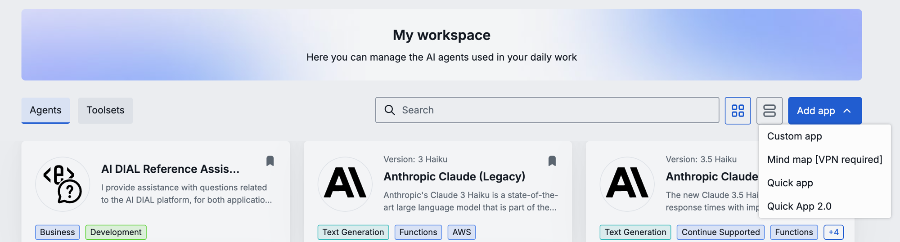
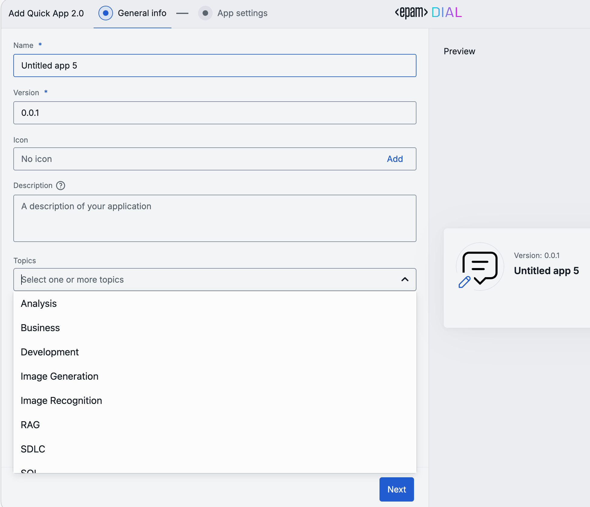
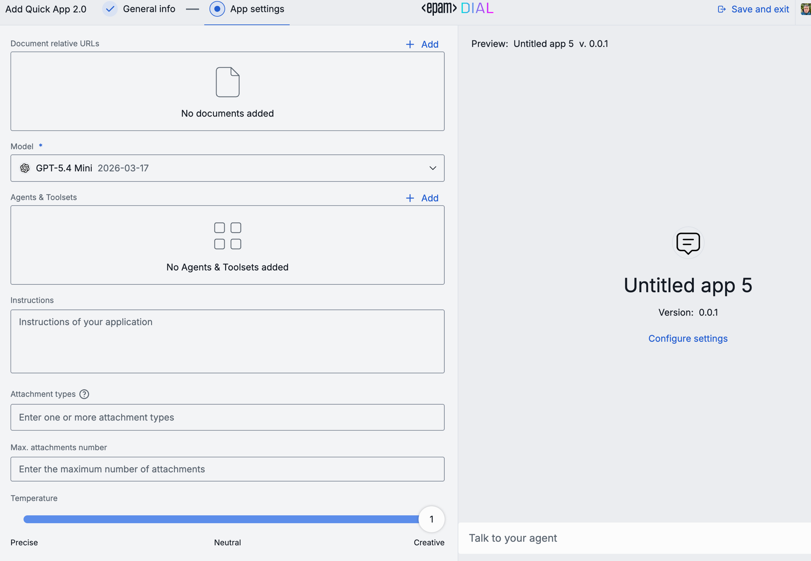
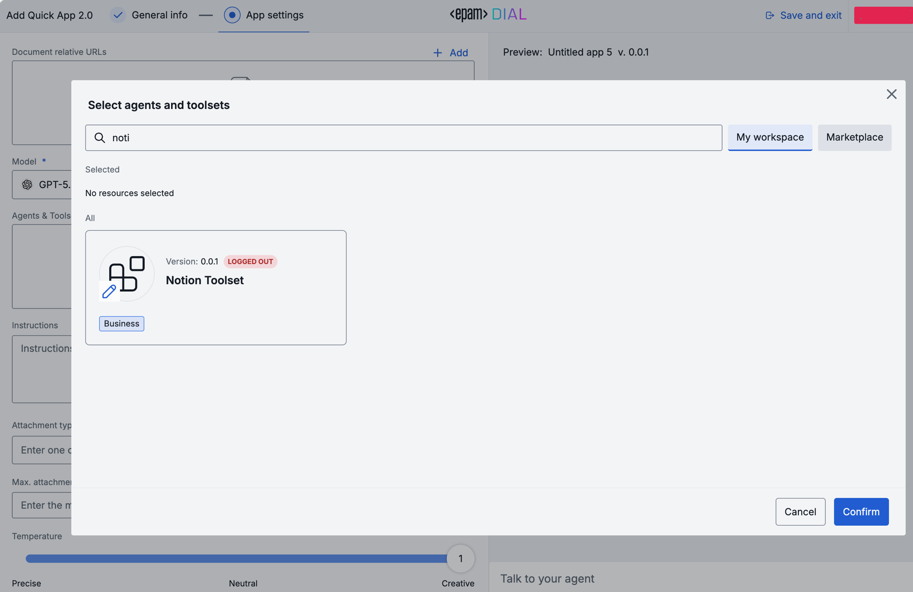
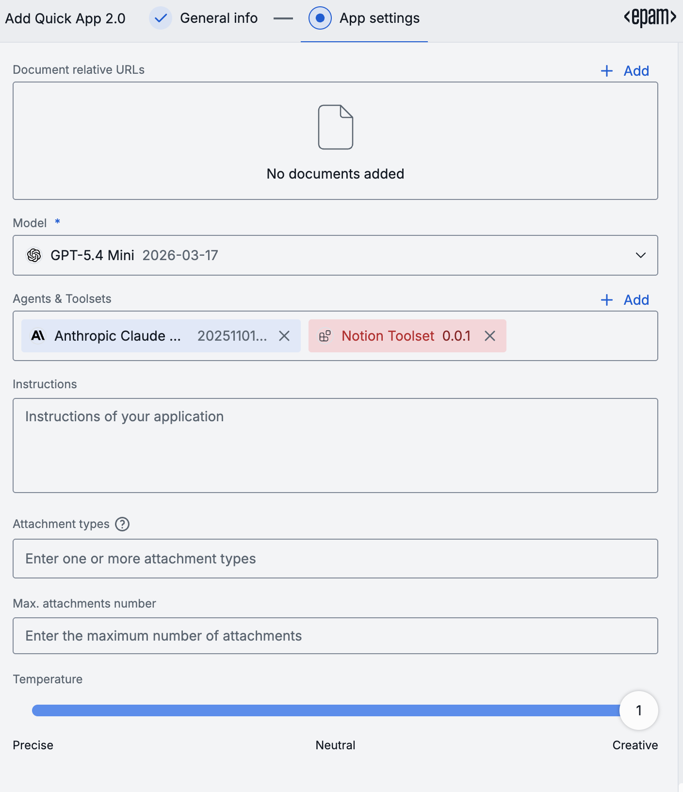

# Create a Quick App 2.0 in DIAL Chat

This guide walks through creating a Quick App 2.0 using the visual wizard in DIAL Chat. You will set a model, write a system prompt, add tools, and test the app before saving.

To create a Quick App 2.0 programmatically, see [Create via API](./create-via-api) or [Create via config.json](./create-via-config).

## Prerequisites

- Access to DIAL Chat with an authenticated user account.
- At least one language model deployed in your DIAL instance.
- (Optional) A Tool Set registered in DIAL Core if you want to add MCP tools.

---

## Step 1: Open the app wizard

In DIAL Chat, open **My workspace** and click the **Add app** button in the top-right corner. From the dropdown, select **Quick App 2.0**.

The wizard opens with a two-step flow: **General info** → **App settings**.

---

## Step 2: General info

Fill in the app's identity fields:

| Field | Required | Description |
|---|---|---|
| **Name** | Yes | The app's display name. |
| **Version** | Yes | Version string (e.g., `0.0.1`). |
| **Icon** | No | Click **Add** to upload a custom icon image. |
| **Description** | No | A short description shown to users in the app card. |
| **Topics** | No | Select one or more category tags (e.g., Analysis, Business, RAG) to help users find the app in the Marketplace. |

A preview of the app card appears on the right side of the screen.

Click **Next** to proceed.

---

## Step 3: App settings

The second step configures the app's behavior. The fields appear in this order:

### Document relative URLs

To ground the model's responses in a document stored in DIAL, click **+ Add** and enter the file's relative URL (e.g., `files/mybucket/knowledge-base.pdf`). This enables RAG (Retrieval Augmented Generation) using the document as a knowledge source.

### Model

Select the language model for the orchestrator. The model processes user messages and decides when to invoke tools. Choose a model capable of function calling (e.g., GPT-4o, GPT-5.4 Mini).

### Agents & Toolsets

Click **+ Add** to open the agent and toolset picker dialog.

In the dialog:

1. Use the **search bar** to find agents or Tool Sets by name.
2. Switch between **My workspace** (your own and shared items) and **Marketplace** (published items available to your organization).
3. Select one or more items and click **Confirm**.

Selected agents and Tool Sets appear as chips in the Agents & Toolsets section. Click the **X** on a chip to remove it.

See [Add tools and agents to a Quick App 2.0](./working-with-tools-and-agents) for a complete walkthrough of all tool types, including REST API and MCP configurations.

### Instructions

Write the system prompt that guides the model's behavior. The instructions field is a full-featured text area — use plain text or Markdown-formatted content.

**Tips for effective instructions:**

- State the app's purpose clearly in the first sentence.
- Describe what the model should and should not do.
- If tools are connected, tell the model when and how to use them.
- Use `{{variable}}` syntax for values that may change across deployments.

### Attachment types and count

Optionally restrict which file types users can attach (e.g., `.pdf`, `.docx`), and set a maximum number of attachments per message. Leave these blank to allow all types with no limit.

### Temperature

The temperature slider controls response randomness:

- **Precise** (0.0–0.3) — More deterministic. Good for factual, structured tasks.
- **Neutral** (0.4–0.7) — Balanced. Good for most conversational use cases.
- **Creative** (0.8–1.0) — More creative. Good for writing, brainstorming.

### Preview and test

While configuring, use the **Preview** panel on the right to send test messages and verify the app behaves as expected. The preview shows a "Talk to your agent" input at the bottom.

Test the main workflow and at least one edge case before saving:

- Does the model follow the instructions?
- Do tools get invoked when expected?
- Is the response quality acceptable at the chosen temperature?

---

## Step 4: Save the app

Click **Save and exit** in the top-right corner. The app is saved to your personal workspace and is private by default.

---

## Edit an existing Quick App 2.0

To edit an app you own:

1. Open the app in DIAL Chat.
2. Click the **Settings** or **Edit** icon.
3. The wizard reopens with the current configuration pre-filled.
4. Make changes and click **Save**.

Co-editing is supported if you grant WRITE access to another user — changes from either user are saved in real time.

---

## Next steps

- [Create via API](./create-via-api) — create Quick App 2.0 instances programmatically
- [Create via config.json](./create-via-config) — provision Quick App 2.0 through DIAL Core configuration
- [Add tools and agents](./working-with-tools-and-agents) — connect MCP servers, REST APIs, and DIAL deployments
- [Tutorial: agent loop (UI)](./tutorial-agent-loop-ui) — end-to-end example building a Research Assistant
- [Configuration reference](./tool-sets/reference) — full schema documentation
