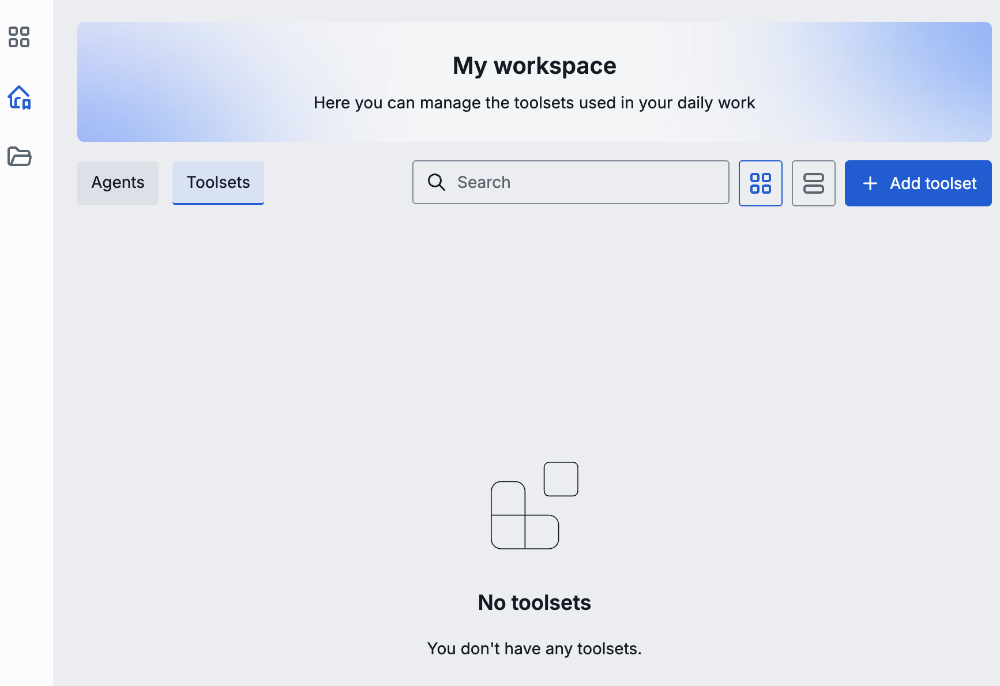
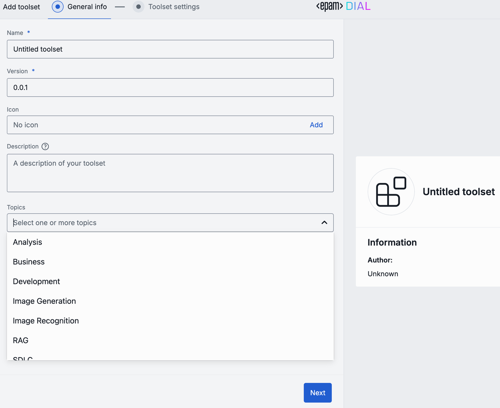
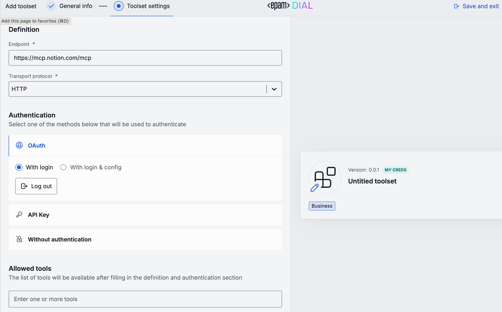
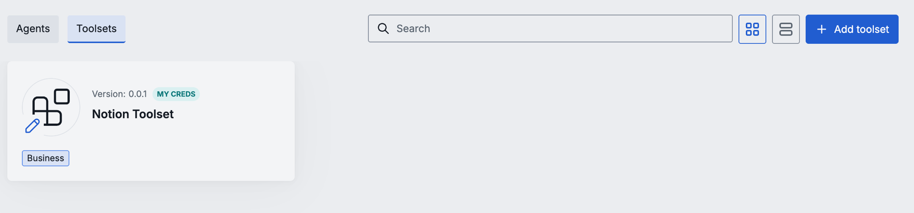

# Define and register a Tool Set

A Tool Set is an MCP server connection registered in DIAL. Once registered, any Quick App 2.0 can reference it by its DIAL ID using the `dial-mcp` tool set type — without embedding connection credentials directly in the app config.

There are two registration paths:

- **UI (DIAL Chat)** — end users register Tool Sets in My Workspace. Suitable for personal or team use.
- **`config.json` (admin)** — admins provision Tool Sets centrally. Suitable for organization-wide tools.

---

## Register a Tool Set in DIAL Chat

### Step 1: Open My Workspace

In DIAL Chat, open **My Workspace** from the sidebar. Navigate to the **Toolsets** tab.

Click **+ Add toolset** to open the toolset editor.

---

### Step 2: General info

The editor opens on the **General info** tab.

| Field | Required | Description |
|---|---|---|
| **Name** | Yes | Display name shown in DIAL Chat and Marketplace. Defaults to "Untitled toolset". |
| **Version** | Yes | Version string in `x.y.z` format. Defaults to `0.0.1`. |
| **Icon** | No | Image displayed in the chat UI and Marketplace card. |
| **Description** | No | A short description shown to users on the Marketplace card. |
| **Topics** | No | Category tags for Marketplace discovery. Available options: Analysis, Business, Development, Image Generation, Image Recognition, RAG, SDLC. |

A live preview card on the right updates as you type.

Click **Next** to continue.

---

### Step 3: Toolset settings

The **Toolset settings** tab configures the server connection, authentication, and allowed tools.

#### Definition

| Field | Required | Description |
|---|---|---|
| **Endpoint** | Yes | The MCP server URL. |
| **Transport protocol** | Yes | `HTTP` or `SSE`. HTTP is the default and works for most MCP servers. Use SSE when the server streams tool results incrementally. |

#### Authentication

Choose the authentication method that matches your MCP server:

| Option | When to use |
|---|---|
| **OAuth — With login** | The server uses OAuth 2.0. Users log in through the provider's authorization page. DIAL stores the token for subsequent calls. |
| **OAuth — With login & config** | OAuth 2.0 with additional configuration (client ID, scopes, audience). |
| **API Key** | The server requires a static API key. Users enter the key themselves. |
| **Without authentication** | The MCP server is publicly accessible or uses IP-based access control. |

See [Integrate an MCP server](./mcp-server-integration) for configuration details on each option.

#### Allowed tools

Optionally restrict which tools from the MCP server are exposed to Quick Apps. Enter tool names in the **Allowed tools** field (one per line or comma-separated).

If left empty, all tools the server exposes are available.

When ready, click **Save and exit** in the top right corner.

---

### Step 4: Verify the saved toolset

The toolset appears as a card in **My Workspace → Toolsets**.

The toolset is private to your account until you [share or publish it](./sharing-and-permissions). To use it in a Quick App 2.0, see [Add tools and agents to a Quick App 2.0](../working-with-tools-and-agents).

---

## Register a Tool Set via `config.json` (admin)

Administrators can provision Tool Sets centrally by adding entries to `config.json`. These Tool Sets are available to all users according to their `userRoles` settings.

For the full field reference and configuration examples, see:

- [Toolsets — `config.json` reference](/docs/NEW/operating-dial/configuration/core/config-json/toolsets) — all attributes: `endpoint`, `transport`, `authType`, `userRoles`, `allowedTools`, and more
- [Toolsets security — `settings.json` reference](/docs/NEW/operating-dial/configuration/core/settings-json/toolsets-security) — OAuth redirect URIs, resource settings, and KMS encryption

---

## Next steps

- [Integrate an MCP server](./mcp-server-integration) — transport options and authentication details
- [Share and manage Tool Set permissions](./sharing-and-permissions) — publish to Marketplace
- [Add tools to a Quick App 2.0](../working-with-tools-and-agents) — reference Tool Sets from an app
