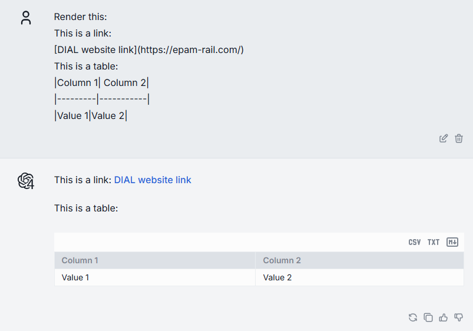
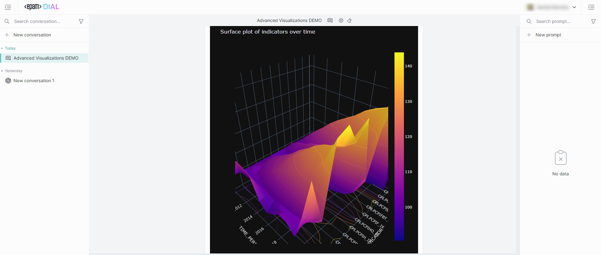

# Data visualization

This guide explains how to render charts, tables, and other visual content in DIAL Chat from your application code. It covers three approaches: built-in Markdown rendering, built-in Plotly chart support, and custom visualizers for anything else. You should be familiar with building DIAL applications using the [DIAL SDK](https://github.com/epam/ai-dial-sdk) or the raw [Unified API](https://dialx.ai/dial_api#/paths/~1openai~1deployments~1%7BDeployment%20Name%7D~1chat~1completions/post).

## Markdown rendering

DIAL Chat automatically renders Markdown in the `content` field of any assistant message. Tables, links, inline images, code blocks, and LaTeX formulas all work out of the box—no extra configuration or special fields required.



To return Markdown from your application, write it directly into the response content. With the DIAL SDK:

```python
with response.create_single_choice() as choice:
    choice.append_content(
        "| Month | Savings |\n"
        "| --- | --- |\n"
        "| January | $250 |\n"
        "| February | $80 |"
    )
```

Without the SDK, set the `content` field in the assistant message of your HTTP response body:

```json
{
  "role": "assistant",
  "content": "| Month | Savings |\n| --- | --- |\n| January | $250 |\n| February | $80 |"
}
```

For the full list of supported content types (attachments, stages, LaTeX), see [Custom content in Chat](1.custom-content.md#markdown).

## Plotly charts

DIAL Chat has built-in support for [Plotly JavaScript](https://plotly.com/javascript/) and [React Plotly.js](https://plotly.com/javascript/react/). Plotly charts appear as interactive, zoomable visualizations inside the conversation.



### How it works

Your application creates a JSON file following the standard [Plotly JSON schema](https://plotly.com/chart-studio-help/json-chart-schema/) (with `data`, `layout`, and optional `frames` properties), uploads it to DIAL file storage, and returns an attachment pointing to that file. DIAL Chat detects the Plotly MIME type and renders the chart automatically.

### Add a Plotly chart with the DIAL SDK

Use `choice.add_attachment()` in your application's `chat_completion` method. The `url` field is the path to the Plotly JSON file in DIAL storage, and the `type` must be `application/vnd.plotly.v1+json`:

```python
with response.create_single_choice() as choice:
    choice.append_content("Here is the sales data:")
    choice.add_attachment(
        type="application/vnd.plotly.v1+json",
        title="Sales by quarter",
        url="files/bucket/appdata/app_name/chart.json",
    )
```

### Add a Plotly chart without the SDK

If you build your application without the DIAL SDK, include the attachment in the `custom_content` object of the HTTP response body:

```json
{
  "role": "assistant",
  "content": "Here is the sales data:",
  "custom_content": {
    "attachments": [
      {
        "index": 1,
        "type": "application/vnd.plotly.v1+json",
        "title": "Sales by quarter",
        "url": "files/bucket/appdata/app_name/chart.json"
      }
    ]
  }
}
```

See [Custom content in Chat — Plotly](1.custom-content.md#plotly) for the complete field reference and more attachment types.

## Custom visualizers

For content types beyond Markdown and Plotly—3D models, domain-specific diagrams, interactive widgets—build a custom visualizer. A custom visualizer is a standalone web application that DIAL Chat loads inside an iframe and passes data to via the [ChatVisualizerConnector](https://github.com/epam/ai-dial-chat/blob/development/libs/chat-visualizer-connector/README.md) library.

### When to use a custom visualizer

| Approach | Use when |
|---|---|
| Markdown | Tables, formatted text, inline images, LaTeX formulas |
| Plotly | Standard charts—bar, line, scatter, heatmap, 3D surface |
| Custom visualizer | Anything else—protein structures, CAD models, custom dashboards, interactive forms |

### Configuration

Custom visualizers require two environment variables in your DIAL Chat deployment:

- **`ALLOWED_IFRAME_SOURCES`** — space-separated list of allowed iframe origins (for example, `http://localhost:8000 https://viz.example.com`). Restricts which origins can render inside Chat.
- **`CUSTOM_VISUALIZERS`** — JSON array defining each visualizer's title, MIME types it handles, icon, and URL.

See [DIAL Chat configuration](/docs/docs/NEW/operating-dial/configuration/3.chat-configuration.md) for the full environment variable reference.

### Getting started

Follow the [Create a custom visualizer](3.create-custom-visualizer.md) tutorial for a step-by-step walkthrough of building and deploying a custom visualizer.

## Next steps

- [Custom content in Chat](1.custom-content.md) — full reference for attachments, stages, Markdown, and Plotly in the Unified API
- [Create a custom visualizer](3.create-custom-visualizer.md) — step-by-step tutorial for building a custom visualizer
- [DIAL Chat configuration](/docs/docs/NEW/operating-dial/configuration/3.chat-configuration.md) — environment variables and feature flags for Chat
