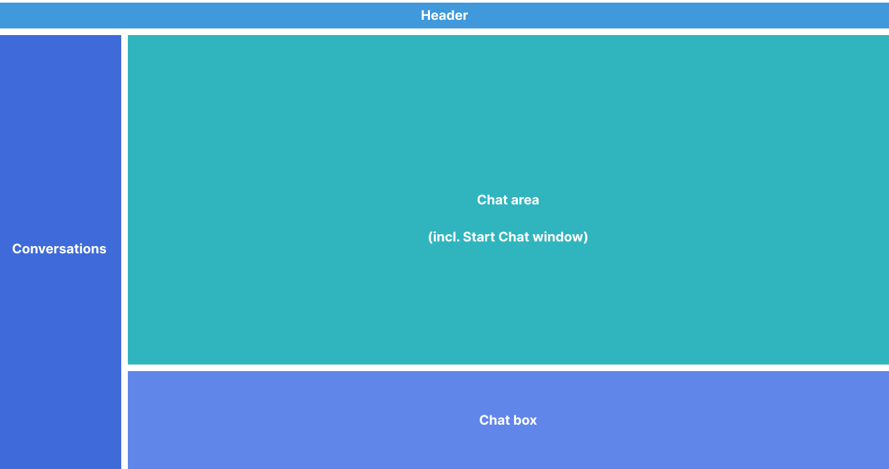
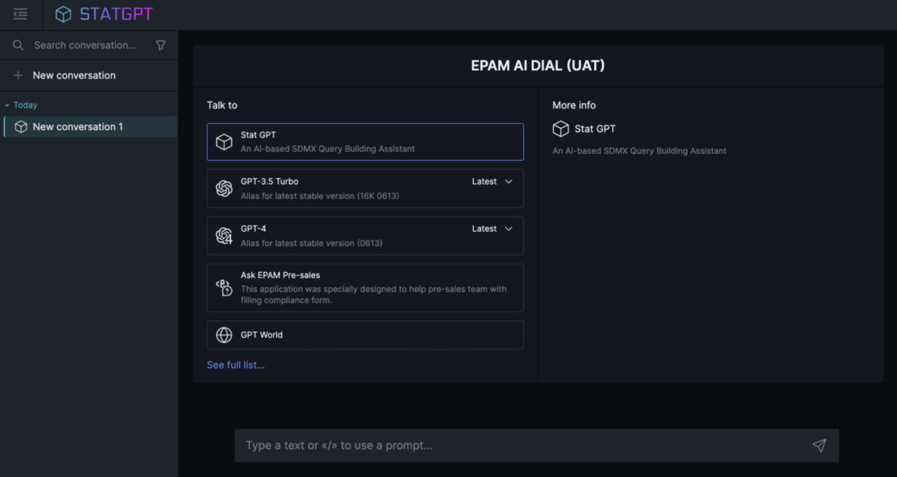

# DIAL Overlay

DIAL Overlay is a TypeScript library that embeds DIAL Chat inside external web applications through an iframe and a `postMessage`-based communication protocol. If you need conversational AI capabilities in your product without building a chat UI from scratch, Overlay gives you a drop-in component with programmatic control over conversations, system prompts, and events.

## When to use Overlay

| Approach | Best for | Trade-off |
|---|---|---|
| **DIAL Chat standalone** | Full-featured chat as its own application | No integration with host app logic |
| **DIAL Overlay** | Embedding chat in an existing web app or desktop tool | Host app controls the experience but relies on the iframe boundary |
| **Custom UI via Unified API** | Complete control over rendering and interaction flow | You build and maintain the entire frontend |

Choose Overlay when you want DIAL Chat's full UI—conversations, Marketplace, file handling—embedded in your application with minimal frontend code. Choose a custom UI when you need rendering that diverges significantly from what DIAL Chat provides.

## Architecture

The host application loads the Overlay library and creates an iframe pointing to a dedicated DIAL Chat instance configured for overlay mode. All communication between the host and Chat flows through the browser's `postMessage` API.

```text
┌─────────────────────────────────┐
│         Host application        │
│                                 │
│  ┌───────────────────────────┐  │
│  │  @epam/ai-dial-overlay    │  │
│  │  (ChatOverlay instance)   │  │
│  └──────────┬────────────────┘  │
│             │ postMessage        │
│  ┌──────────▼────────────────┐  │
│  │  <iframe>                 │  │
│  │  DIAL Chat (overlay mode) │  │
│  └──────────┬────────────────┘  │
└─────────────┼───────────────────┘
              │ HTTPS
┌─────────────▼───────────────────┐
│          DIAL Core              │
│  (models, apps, storage)        │
└─────────────────────────────────┘
```

DIAL Chat in overlay mode is a separate deployment from your main DIAL Chat instance. The `IS_IFRAME` environment variable switches Chat into overlay mode, and `ALLOWED_IFRAME_ORIGINS` restricts which host origins may embed it.

## Core classes

The library exports two classes. `ChatOverlay` manages a single embedded instance. `ChatOverlayManager` is a factory that creates, shows, hides, and removes multiple overlay instances by ID.

### ChatOverlay

`ChatOverlay` creates one iframe and exposes async methods for interaction:

```typescript
import { ChatOverlay } from '@epam/ai-dial-overlay';

const overlay = new ChatOverlay(containerElement, {
  hostDomain: window.location.origin,
  domain: 'https://chat-overlay.example.com',
  theme: 'light',
  modelId: 'gpt-4o',
});

await overlay.ready();
await overlay.sendMessage('Summarize the Q3 report.');
const { messages } = await overlay.getMessages();
```

| Method | Description |
|---|---|
| `ready()` | Resolves when the iframe finishes loading and the handshake completes. |
| `sendMessage(text)` | Sends a user message to the active conversation. |
| `getMessages()` | Returns the messages in the selected conversation. |
| `setSystemPrompt(prompt)` | Sets the system prompt for new conversations. |
| `setOverlayOptions(options)` | Updates configuration dynamically after initialization. |
| `subscribe(eventType, callback)` | Subscribes to an overlay event. Returns an unsubscribe function. |

### ChatOverlayManager

`ChatOverlayManager` manages multiple overlays by ID. Use it when your application needs more than one chat panel—for example, a comparison view or separate contexts per document.

```typescript
import { ChatOverlayManager } from '@epam/ai-dial-overlay';

ChatOverlayManager.createOverlay({
  id: 'sidebar-chat',
  position: 'left-bottom',
  width: 360,
  height: 500,
  zIndex: 100,
  hostDomain: window.location.origin,
  domain: 'https://chat-overlay.example.com',
});

await ChatOverlayManager.sendMessage('sidebar-chat', 'Hello');
ChatOverlayManager.hideOverlay('sidebar-chat');
```

Static methods: `createOverlay`, `removeOverlay`, `showOverlay`, `hideOverlay`, `getMessages`, `sendMessage`.

## Configuration

### Client-side options

Pass these as the second argument to `ChatOverlay` or as part of the config object for `ChatOverlayManager.createOverlay`.

| Option | Type | Required | Description |
|---|---|---|---|
| `hostDomain` | `string` | Yes | Origin of the host application. Used for `postMessage` origin validation. |
| `domain` | `string` | Yes | URL of the DIAL Chat instance running in overlay mode. |
| `theme` | `'light' \| 'dark'` | No | Color scheme. |
| `modelId` | `string` | No | Default model or application ID for new conversations. |
| `enabledFeatures` | `string[]` | No | UI features to enable. See [enabled features](#enabled-features) below. |
| `requestTimeout` | `number` | No | Timeout in milliseconds for DIAL responses. |
| `overlayConversationId` | `string` | No | Conversation ID to select on startup. |
| `signInOptions` | `object` | No | Authentication configuration. See [authentication](#authentication) below. |
| `loaderStyles` | `CSSProperties` | No | Custom styles for the loading indicator. |
| `loaderClass` | `string` | No | CSS class for the loading indicator. |

### Server-side DIAL Chat configuration

The DIAL Chat instance that serves the overlay iframe requires these environment variables:

| Variable | Description |
|---|---|
| `IS_IFRAME` | Set to `true` to enable overlay mode. |
| `ALLOWED_IFRAME_ORIGINS` | Space-separated list of origins allowed to embed Chat. Maps to the `frame-ancestors` CSP directive. Use `*` for development only. |
| `ALLOW_OPEN_SIGNIN_PAGE_IN_IFRAME` | Set to `true` if the sign-in page must render inside the iframe. |

For the full list of DIAL Chat environment variables, see [DIAL Chat configuration](/docs/NEW/operating-dial/configuration/chat-configuration).

### Enabled features

The `enabledFeatures` array controls which UI elements appear in the overlay. Available values:

`conversations-section`, `prompts-section`, `top-settings`, `top-clear-conversation`, `top-chat-info`, `top-chat-model-settings`, `empty-chat-settings`, `header`, `footer`, `request-api-key`, `report-an-issue`, `likes`.

Include all features for a wide overlay with full functionality. Remove `conversations-section` and `prompts-section` for a narrow overlay suitable for sidebars or desktop add-ins.

### Authentication

The `signInOptions` object configures automatic sign-in behavior:

| Field | Type | Description |
|---|---|---|
| `autoSignIn` | `boolean` | Automatically sign in if a provider session exists. |
| `signInProvider` | `string` | Identity provider name for sign-in. |
| `logInHint` | `string` | Email or account hint for multi-account selection. |
| `signInInNewWindow` | `boolean` | Open the identity provider page in a new window. |

Set `signInInSameWindow` (top-level option) to `true` to redirect the iframe itself to the sign-in page instead of opening a popup.

## Layout variants

### Wide overlay

A wide overlay exposes the full DIAL Chat interface—conversation list, prompts, and all toolbar controls. This variant works well for demo sites, documentation portals, and internal tools where screen real estate is available.





### Narrow overlay

A narrow overlay hides the sidebar panels and shows a single conversation. This variant suits desktop application add-ins (for example, an Excel sidebar) and compact embedded widgets. Remove `conversations-section` and `prompts-section` from `enabledFeatures` to achieve this layout.

## Events

Subscribe to overlay events to react to state changes in the embedded Chat:

```typescript
const unsubscribe = overlay.subscribe(
  '@DIAL_OVERLAY/GPT_START_GENERATING',
  () => {
    console.log('Model started generating a response');
  }
);
```

The `subscribe` method returns an unsubscribe function. Call it to stop listening.

| Event | Fires when |
|---|---|
| `@DIAL_OVERLAY/GPT_START_GENERATING` | The model begins generating a response. |

## Deployment considerations

DIAL Chat in overlay mode should be a **separate deployment** from your main DIAL Chat instance. The overlay instance runs with `IS_IFRAME=true` and a restricted `ALLOWED_IFRAME_ORIGINS`, while the standalone instance runs without these constraints.

Both instances connect to the same DIAL Core backend and share access to the same models, applications, and storage.

## Next steps

- [Embed Chat with DIAL Overlay](9.embed-chat-in-web-app.md) — step-by-step tutorial for integrating Overlay into a host page
- [Theming and design](5.theming-and-design.md) — customize the color scheme and branding of the embedded Chat
- [Overlay library source and sandbox examples](https://github.com/epam/ai-dial-chat/tree/development/libs/overlay) — upstream library code with a sandbox application for experimentation
