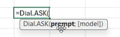
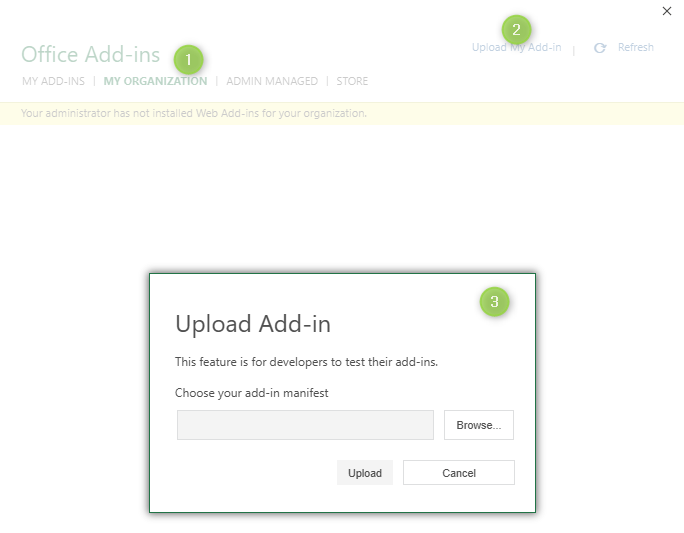
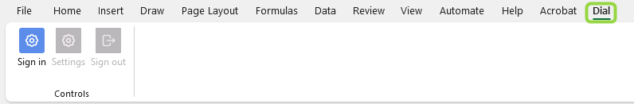
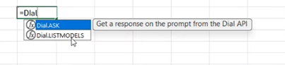

# Integration with Microsoft Excel

In this tutorial, you'll install the DIAL Add-in for Microsoft Excel and call a DIAL model straight from a spreadsheet cell. By the end, a formula in your worksheet will return a model's answer, and a second formula will list the models available to you. This tutorial is for developers and power users who already have access to a running DIAL instance. No prior add-in experience is needed.

**Tip**
> Watch a [demo video](/docs/video%20demos/3.Developers/Integrations/14.dial-excel-plugin.md) to see the add-in in action before you start.

## Prerequisites

This tutorial assumes the add-in is already deployed for your organization. Installing it on a clean machine is not part of this tutorial — your administrator deploys the add-in and gives you its manifest file. Before you begin, make sure you have:

- A deployed DIAL Add-in for Microsoft Excel instance and a running [DIAL Core](https://github.com/epam/ai-dial-core), both reachable from your machine.
- The add-in `manifest.xml` file, provided by your administrator.
- Microsoft Excel — the desktop client or Excel on the web.
- A DIAL account. The add-in signs you in through your organization's identity provider. For background, see [Auth and access control](../../../operating-dial/auth-and-access-control/0.index.md) and, for the default provider, [Keycloak](../../../operating-dial/auth-and-access-control/sso-idp/6.keycloak.md).

## What you'll build

By the end of this tutorial, a spreadsheet cell will hold a live model response generated by the `Dial.ASK` function:



The add-in provides two functions:

- `Dial.ASK` — sends a prompt to a model or application in DIAL and returns the response.
- `Dial.LISTMODELS` — returns the models and applications available to your account.

## Step 1: Sideload the add-in

Sideload the add-in into Excel using the `manifest.xml` file from your administrator. The manifest registers the add-in's functions and points Excel at the add-in backend.

1. Open Excel.
2. Load the `manifest.xml` file using the sideloading method for your platform. For the exact steps on Windows, Mac, and Excel on the web, follow Microsoft's [sideload an Office Add-in](https://learn.microsoft.com/en-us/office/dev/add-ins/testing/sideload-office-add-ins-for-testing) guide.



**Verify:** The DIAL Add-in appears on the Excel ribbon, and typing `=Dial.` in a cell offers `Dial.ASK` and `Dial.LISTMODELS` in the formula autocomplete.

## Step 2: Sign in and choose a model

The add-in calls DIAL on your behalf, so you authenticate once before using the functions.

1. Open the add-in pane from the ribbon and start the sign-in flow.
2. Sign in with your organization's identity provider. After authentication, the add-in receives a token and uses it to authorize requests to DIAL Core.
3. Open the add-in settings dialog and select a default model or application. The functions use this model when a formula does not name one explicitly.



**Verify:** The settings dialog shows your selected model, and the add-in pane indicates you are signed in.

## Step 3: Run your first `Dial.ASK` formula

Send a prompt to your selected model directly from a cell.

1. In cell `A1`, enter some source text — for example, `DIAL is an enterprise platform for orchestrating language models.`
2. In cell `B1`, enter the following formula:

   ```text
   =Dial.ASK("Summarize this in five words: " & A1)
   ```

3. Press `Enter`.

To target a specific model instead of the default, pass its deployment name as an argument. Excel's formula autocomplete shows the exact argument order as you type.

**Verify:** Cell `B1` shows a model-generated summary of the text in `A1`. Editing `A1` and recalculating updates the response, the same as any other Excel formula.

## Step 4: List available models with `Dial.LISTMODELS`

Discover which models and applications your account can reach.

1. In an empty cell, enter the following formula:

   ```text
   =Dial.LISTMODELS()
   ```

2. Press `Enter`.



**Verify:** The formula returns a spilled list of model and application names. Each name is valid as the model argument to `Dial.ASK`.

## What you learned

- How to sideload the DIAL Add-in for Microsoft Excel from a manifest file.
- How to sign in and select a default model for the add-in.
- How to send prompts to DIAL from a cell with `Dial.ASK`.
- How to list available models with `Dial.LISTMODELS`.

## How it works

Excel talks to the add-in backend through the endpoints declared in the manifest. The backend calls DIAL Core over the [Unified API](https://dialx.ai/dial_api) — the [list deployments](https://dialx.ai/dial_api#tag/Deployment-listing) endpoint backs `Dial.LISTMODELS`, and the [chat completion](https://dialx.ai/dial_api#operation/sendChatCompletionRequest) endpoint backs `Dial.ASK`. Your identity token travels with each request, so DIAL enforces the same role-based access control it applies everywhere else.

## Next steps

- [Productivity add-ins](0.index.md) — see other tools that embed DIAL
- [Integration with MS Teams](../chatbot-integrations/1.ms-teams.md) — bring DIAL into your messaging platform
- [Unified API reference](https://dialx.ai/dial_api) — the API the add-in calls into DIAL
