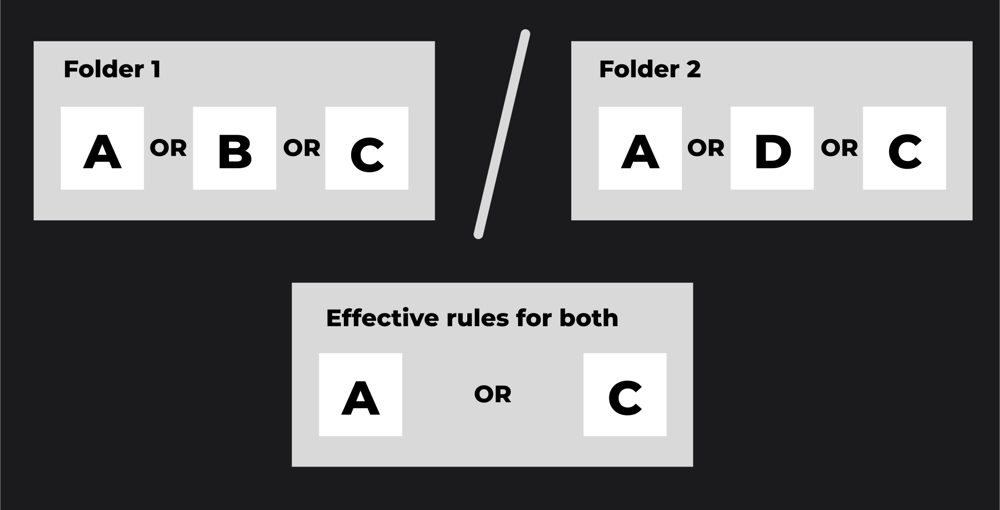

# Publications API

Publish private resources to the shared Public space and control who can see them, using the DIAL Core Publications API. This guide is for developers building publication workflows on top of the [Unified API](https://dialx.ai/dial_api#tag/Publications). You should understand DIAL [access control](../../operating-dial/auth-and-access-control/0.index.md) and how resources are stored in private and public spaces.

When you create resources in DIAL — conversations, prompts, Tool Sets, applications, or files — they are stored in your private folder and accessible only to you. Publishing makes a resource available to other users. By default, published resources go to the Public folder, which every authenticated user can access. You can instead target a subfolder and attach access rules to restrict visibility to specific groups.

:::note
Published resources can be modified by DIAL administrators.
:::

## Prerequisites

- A DIAL deployment and its base URL, referred to below as `<DIAL_URL>`.
- An API key or JWT authorized to publish resources.
- The path of at least one private resource to publish.

## User flow

Create a publication request by calling [`/v1/ops/publication/create`](https://dialx.ai/dial_api#tag/Publications/paths/~1v1~1ops~1publication~1create/post). A single request can mix resources and actions: pass one set with action `ADD` to publish and another with action `DELETE` to unpublish. The supported resource types are `FILE`, `PROMPT`, `CONVERSATION`, `APPLICATION`, and `TOOLSET`.

The response is an object with status `PENDING`, awaiting an administrator decision to approve or reject. While the request is pending, you can withdraw it by calling [`/v1/ops/publication/delete`](https://dialx.ai/dial_api#tag/Publications/paths/~1v1~1ops~1publication~1delete/post).

### Restrict access with rules

All authenticated users can reach the Public folder by default. To publish into a subfolder with restrictions, set `targetFolder` and provide `rules` in the publication request.

Each access rule uses three parameters:

| Parameter | Description |
|---|---|
| `source` | The claim name for JWTs, or `roles` for API keys. DIAL Core supports simple claims such as `roles` and nested claims such as `company.department.roles`. |
| `targets` | The claim value for JWTs, or the role values from the [DIAL Core configuration](../../operating-dial/auth-and-access-control/1.api-keys.md) for API keys. |
| `function` | The matching function: `EQUAL`, `CONTAIN`, or `REGEX`. |

The following request publishes a conversation to `public/my-folder/`, restricting access to users whose JWT carries `roles=user`:

```json
{
  "name": "My publication request",
  "displayAuthor": "John",
  "targetFolder": "public/my-folder/",
  "resources": [
    {
      "action": "ADD",
      "sourceUrl": "conversations/my-conversations/conversation_id",
      "targetUrl": "conversations/public/my-folder/"
    }
  ],
  "rules": [
    {
      "function": "EQUAL",
      "source": "roles",
      "targets": ["user"]
    }
  ]
}
```

### Manage rules for a folder

- **List rules** — call [`/v1/ops/publication/rule/list`](https://dialx.ai/dial_api#tag/Publications/paths/~1v1~1ops~1publication~1rule~1list/post) with a folder path to return all rules that apply to it.
- **Change rules** — call `/v1/ops/publication/create` with the target folder and the new rules. Only the rules for the deepest folder in `targetFolder` are overwritten; rules on parent folders are unchanged. For example, `"targetFolder": "public/folder1/folder2/"` overwrites the rules on `folder2` only.
- **Leave rules unchanged** — omit the `rules` object from the request.

### Effective rules

The effective access rule for a folder structure is derived as follows:

1. **Within a single folder**, the effective rule is the logical OR of all rules assigned to that folder. For folder A with rules a, b, and c, the effective rule is `a OR b OR c`.
2. **Between nested folders**, the effective rule is the logical AND of the parent's effective rule and the subfolder's effective rule. If folder B with rules d, e, and f is nested under folder A, the effective rule for B is `(a OR b OR c) AND (d OR e OR f)`.



## Admin flow

Administrators review pending requests through the same API:

1. Call [`/v1/ops/publication/list`](https://dialx.ai/dial_api#tag/Publications/paths/~1v1~1ops~1publication~1list/post) to list requests awaiting a decision.
2. Call [`/v1/ops/publication/get`](https://dialx.ai/dial_api#tag/Publications/paths/~1v1~1ops~1publication~1get/post) to retrieve a specific request.
3. Call [`/v1/ops/publication/approve`](https://dialx.ai/dial_api#tag/Publications/paths/~1v1~1ops~1publication~1approve/post) or [`/v1/ops/publication/reject`](https://dialx.ai/dial_api#tag/Publications/paths/~1v1~1ops~1publication~1reject/post) to change its status.

DIAL Admin provides a user interface for the same review workflow.

## Result

You can publish and unpublish resources, target restricted subfolders, define and update access rules, and process approvals — all through the Publications API.

## Next steps

- [Sharing API](3.sharing-api.md) — grant access without publishing to the Public space
- [Notifications](4.notifications.md) — get notified when a publication is approved or rejected
- [Publications API reference](https://dialx.ai/dial_api#tag/Publications) — every publication endpoint and field
