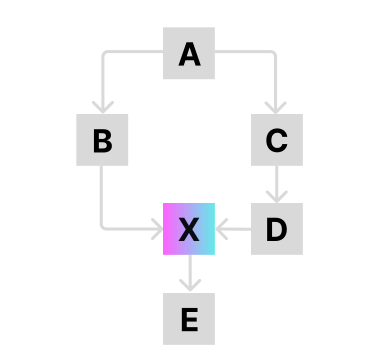

# Auth matrix for apps

The authorization matrix is the model DIAL Core uses to enforce user consent across application dependency chains. When applications call one another, an application deep in the chain may expose sensitive data. The authorization matrix traverses the dependency graph, identifies paths to sensitive applications, and requires explicit user consent before those paths can be used.

This page is a reference for the consent model: its concepts, the consent endpoints, and the configuration that drives it. It is intended for developers building applications that depend on other applications.

## Concepts

| Term | Definition |
|---|---|
| Dependency | A relationship in which one application relies on another to function. Applications form dependency chains. |
| Consent | An explicit agreement from a user that allows an application to access their data or act on their behalf. Consent is captured through a consent form. |

## The problem

Consider an application **X** that returns sensitive data based on user roles. Application **B** can call **X** directly using [per-request keys](5.per-request-keys.md). If **A** depends on **B**, then **A** — potentially an untrusted third-party application — could reach the sensitive data in **X** without the user's knowledge.



The authorization matrix addresses this by traversing the dependency chain, identifying every path that leads to a sensitive application, and requiring that each such path be authorized by the user. The following graph is the example used throughout this page:

```text
A → B, C
B → X
C → D
D → X
X → E
```

## Consent endpoints

The [Unified API](https://dialx.ai/dial_api) includes endpoints that client applications use to request and submit consent before invoking applications that require it.

### `GET /v1/consent/{deployment_id}`

Requests the consent form for a deployment. DIAL Core builds the form by traversing the dependency graph from `{deployment_id}` toward its leaves and marking every application that requires consent.

| Field | Description |
|---|---|
| `deployment_id` | The application the request targets. May be a segment path for a Custom App. |
| `consent` | All dependencies with a `consentRequired` flag indicating whether each requires consent. Omitted when the user has already accepted, or when no dependency requires consent. |
| `accepted` | Whether the user has already accepted the consent. |

For the example graph, DIAL Core returns a form in which only **X** requires consent:

```json
{
  "consent": {
    "app_A": {"consentRequired": false},
    "app_B": {"consentRequired": false},
    "app_C": {"consentRequired": false},
    "app_D": {"consentRequired": false},
    "app_E": {"consentRequired": false},
    "app_X": {"consentRequired": true}
  },
  "accepted": false
}
```

### `POST /v1/consent/{deployment_id}`

Submits an accepted consent form to DIAL Core. The request body has the same shape as the `consent` object returned by the GET endpoint.

```json
{
  "consent": {
    "app_A": {"consentRequired": false},
    "app_B": {"consentRequired": false},
    "app_C": {"consentRequired": false},
    "app_D": {"consentRequired": false},
    "app_E": {"consentRequired": false},
    "app_X": {"consentRequired": true}
  }
}
```

DIAL Core replaces any existing consent with the new one. Accepted consent is stored permanently as a resource in Redis, backed by cloud storage, at `Users/<user_subject>/user_consent/<deployment_id>`.

## Request flow

The following sequence shows the consent flow with DIAL Chat as the client:

1. The user selects an application in the Marketplace.
2. DIAL Chat calls `GET /v1/consent/{deployment_id}`. DIAL Core computes and returns the consent form.
3. DIAL Chat reads the `accepted` flag to decide whether to proceed.
4. DIAL Chat displays the consent form.
5. The user accepts or rejects the form.
6. On acceptance, DIAL Chat submits the form with `POST /v1/consent/{deployment_id}`, and DIAL Core stores it.
7. DIAL Core uses the stored consent to validate future chat completion requests to deployments marked `consentRequired=true`.

## Configuration

Dependencies and consent requirements are declared in the DIAL Core [applications configuration](/docs/NEW/operating-dial/configuration/core/config-json/applications).

### `consentRequired`

`applications.<application_name>.features.consentRequired` indicates whether an application requires consent. The default is `false`. When set to `true`, a dependent application cannot call it through a [per-request key](5.per-request-keys.md) without user consent.

```json
{
  "applications": {
    "A": {
      "endpoint": "http://localhost:7001/openai/deployments/appA/chat/completions",
      "displayName": "Forecast",
      "iconUrl": "https://host/app.svg",
      "features": {
        "consentRequired": true
      }
    },
    "B": {
      "endpoint": "http://localhost:7001/openai/deployments/appB/chat/completions",
      "displayName": "Forecast",
      "iconUrl": "https://host/app.svg",
      "dependencies": ["A"]
    }
  }
}
```

### `dependencies`

`applications.<application_name>.dependencies` is an array of deployments the application relies on. It is optional and absent when an application has no dependencies.

```json
{
  "endpoint": "http://localhost:7001/openai/deployments/10k/chat/completions",
  "displayName": "Forecast",
  "dependencies": ["appB", "appC"]
}
```

## Next steps

- [Per-request keys](5.per-request-keys.md) — the credentials that carry authorization through a dependency chain
- [Applications configuration](/docs/NEW/operating-dial/configuration/core/config-json/applications) — declare dependencies and consent requirements
- [Unified API reference](https://dialx.ai/dial_api) — the consent endpoints and their schemas
