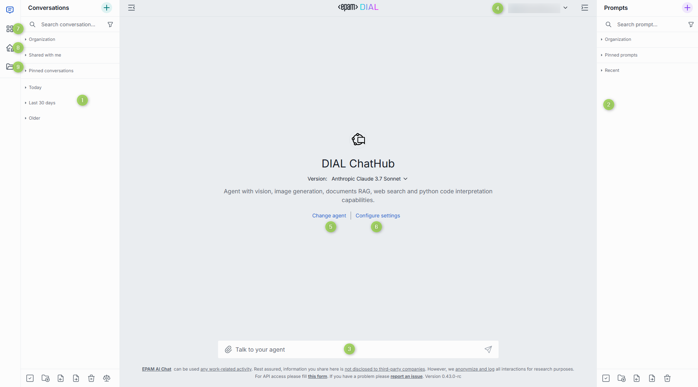
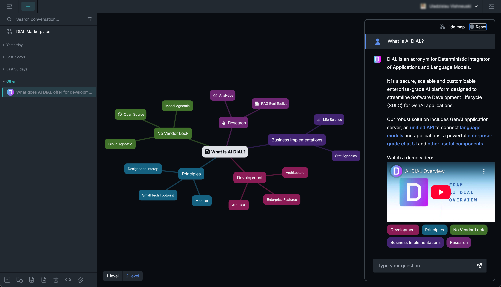
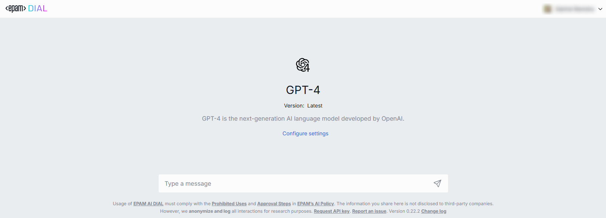

# Overview and interface

This guide shows you how to use DIAL Chat — the web interface most people use to work with DIAL every day. This page introduces the interface layout and the main areas you will use. It is for end users who interact with models and applications through DIAL Chat. No technical background is required.

DIAL Chat is an enterprise-grade application that serves as the default web interface for DIAL users, giving access to the full set of DIAL features.

**Note**
> This guide covers the standard DIAL Chat interface. Self-hosted deployments can replace parts of it with custom interfaces, which are out of scope here.

## Standard interface components

The DIAL Chat interface has several main areas:

1. **Conversations** — access and manage your conversations. Collapse or expand the panel with the **Hide panel** icon above it. See [Conversations](./1.conversations.md).
2. **Prompts** — create, update, and organize prompt templates in folders. Collapse or expand the panel with the **Hide panel** icon above it. See [Prompts](./2.prompts.md).
3. **Chat** — enter a prompt, view results, and interact with conversational agents. See [Conversations](./1.conversations.md).
4. **User settings** — customize the color theme, replace the logo, and access other UI options. See [Settings](./7.settings.md).
5. **Agents** — view and change the conversational agent before or during a conversation.
6. **Conversation settings** — modify settings for the selected agent or change the agent.
7. **DIAL Marketplace** — browse all conversational agents (applications and language models) available in your DIAL environment. See [Marketplace and apps](./3.marketplace-and-apps.md).
8. **My workspace** — create applications and add agents from the Marketplace. See [Marketplace and apps](./3.marketplace-and-apps.md).
9. **Files** — manage your files. See [Files](./5.files.md).

## Custom interfaces

The standard DIAL Chat interface is designed for typical conversational applications. To support applications that need more than a chat interface, DIAL allows new application types with a fully custom interface — even one that is not chat-like — which can replace the standard chat interface when you interact with that application.

For example, [Mind Map](./3.marketplace-and-apps.md) applications use a fully custom interface that overrides the standard chat interface.

## Isolated view mode

Isolated view mode gives you a simplified interface with a single predefined conversational agent. To open it, follow a URL in the form `https://<DIAL_CHAT_HOST>/models/<MODEL_ID>` or `https://<DIAL_CHAT_HOST>/models/<APPLICATION_ID>`. The conversation and prompt panels are hidden in this mode. Conversations you create here also appear in the standard chat view.

For example, to open a chat with the `gpt-4` model, go to `https://<DIAL_CHAT_HOST>/models/gpt-4` for a streamlined interface that contains only a chat input with GPT-4.

Although this mode is simplified, you can still open [conversation settings](./1.conversations.md) the usual way.

## Next steps

- [Conversations](./1.conversations.md) — start chatting, attach files, and organize your history
- [Marketplace and apps](./3.marketplace-and-apps.md) — find agents and add them to your workspace
- [Settings](./7.settings.md) — set your theme, default agent, and keyboard shortcuts
