# Prompts

This page shows you how to create and manage reusable prompts in DIAL Chat: save templates, add variables, organize them in folders, and export or import them. It is for end users of DIAL Chat. No technical background is required. To share or publish a prompt, see [Sharing and publishing](./6.sharing-and-publishing.md).

A prompt is an instruction, question, or message you give a language model to get an answer. In DIAL you can create prompts ahead of time and reuse them across conversations, either for a single message or for a whole conversation. To apply a prompt to an entire conversation, see [System prompt](./1.conversations.md).

The Prompts panel is on the right side of the screen. There you create templates, update them, and organize them in folders.

**Note**
> All your prompts are stored on the server, so you can access them from any device.

## The prompt actions menu

Click the **...** icon to open a prompt's actions menu.


**Note**
> Available actions vary by prompt. For example, **Unpublish** is unavailable if the prompt has not been published.

The supported actions are:

- **Use** — populate the prompt in the chat box. See [Use a prompt](#use-a-prompt).
- **View** — view the prompt's details. See [View a prompt](#view-a-prompt).
- **Select** — select prompts to delete. See [Select prompts to delete](#select-prompts-to-delete).
- **Edit** — edit the prompt. See [Create a prompt](#create-a-prompt).
- **Duplicate** — duplicate a shared prompt. See [Duplicate](#duplicate).
- **Export** / **Import** — export or import prompts as JSON. See [Export and import](#export-and-import).
- **Move to** — organize prompts in folders. See [Organize prompts into folders](#organize-prompts-into-folders).
- **Share**, **Unshare**, **Remove access**, **Publish**, **Unpublish** — see [Sharing and publishing](./6.sharing-and-publishing.md).
- **Info** — view prompt metadata. See [Info](#info).
- **Delete** — delete a prompt. See [Delete](#delete).

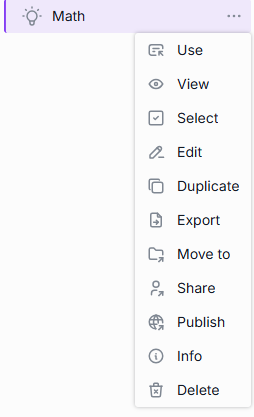

## Organize prompts into folders

To create a folder, click the folder icon in the bottom menu.

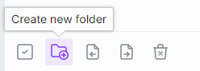

You can also create a folder or move a prompt from the **Move to** menu.

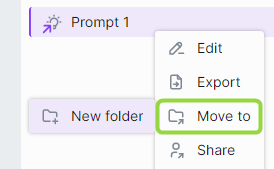

New folders appear in the **Pinned prompts** tab.

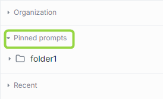

You can nest folders up to three levels. Create a folder and drag it into another to nest it. Drag a prompt into a folder, or use **Move to**, to move it to a parent folder.

**Note**
> Empty folders are deleted after you refresh the page. Folder and prompt names follow the same conventions as conversations — see [Conversations](./1.conversations.md). Names are limited to 160 characters.

## Search and filter

Use the **Search** box to find prompts by name. If you have shared prompts, apply the **Shared by me** filter to list them.

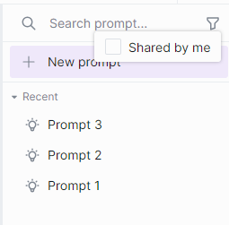

## Use a prompt

Click **Use** in the prompt menu to populate the prompt in the chat box, or open a window where you enter values for prompt [variables](#variables).

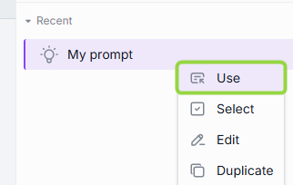

## View a prompt

Click **View** in the prompt menu to preview the prompt. In the **View prompt** window you can act on it and proceed to use it.

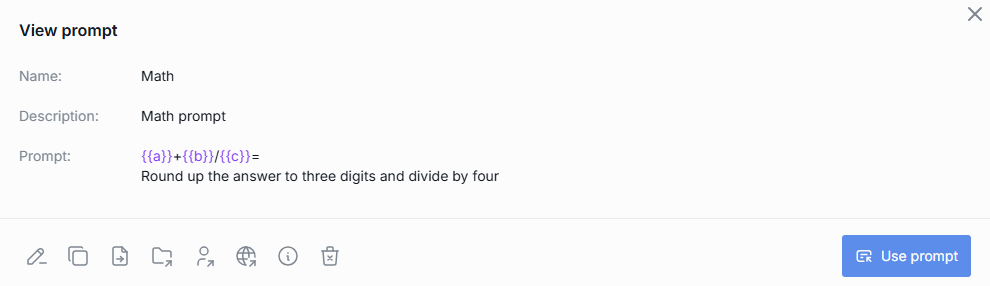

## Create a prompt

1. In the Prompts panel, click **New prompt**.
2. Fill in **Name**, **Description**, and **Prompt**.
3. Click **Save**.

**Note**
> The **Name** and **Description** are required but are not sent to the model — they only help you tell prompts apart. The model uses only the **Prompt** text. The same naming conventions as conversations apply, with a 160-character limit.

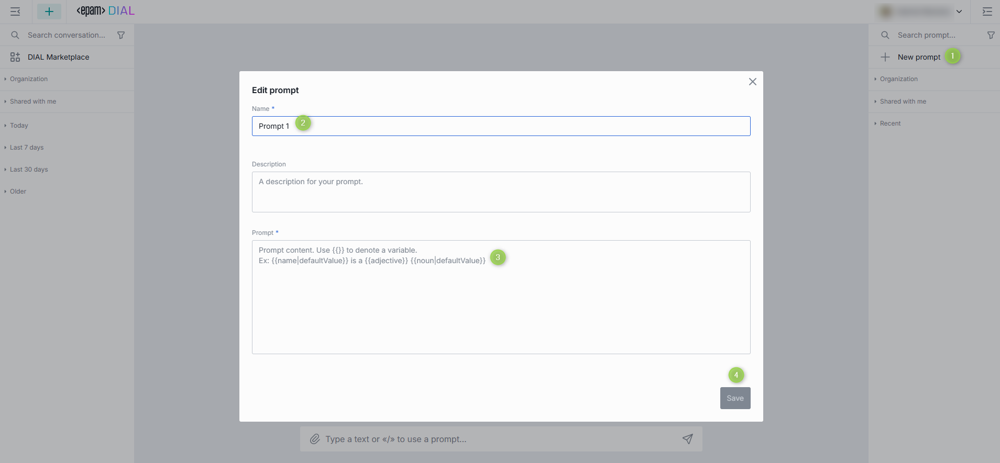

### Variables

You can use prompts as templates and add variables. Use `{{variableName}}` or `{{variableName|Default Value}}` notation.

For [parameterized replay](./1.conversations.md), variables let you and others run the same conversation with different inputs.

For example, to calculate `a + b/c`, round the answer, and divide by four, create this prompt:

```text
{{a}}+{{b}}/{{c}}=
Round up the answer to three digits and divide by four
```

Here `a`, `b`, and `c` are variables, denoted by double curly braces.

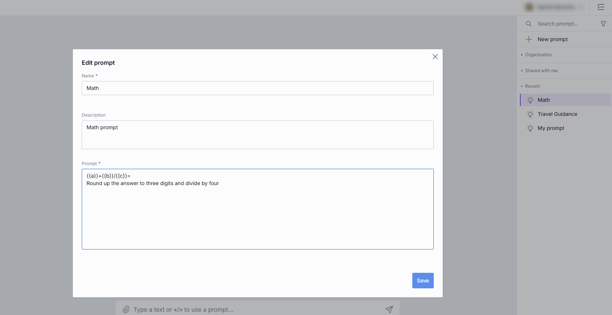

To use it, type `/` in the chat box and select the prompt. You can then enter values:

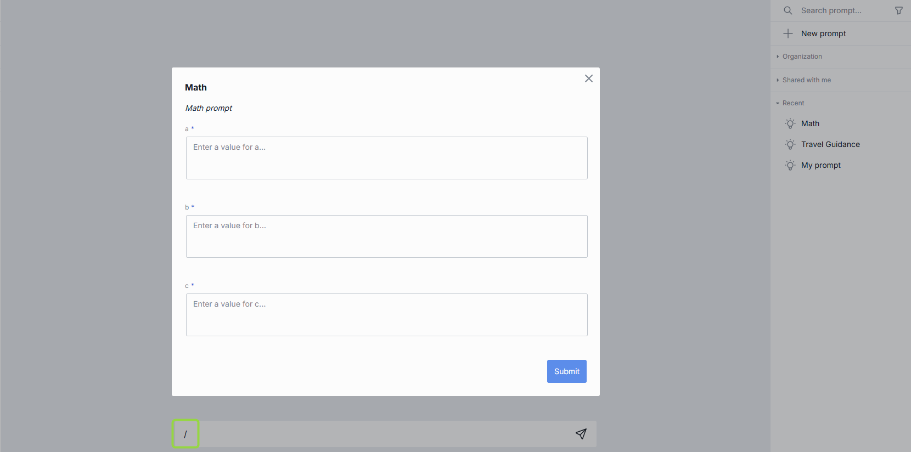

When you submit the form, your message is populated with the values:

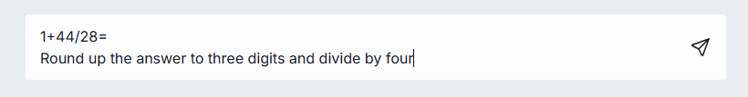

Variables can be anything, not only numbers. For example: `Who played {{character}} in {{movie}}?` or `What is the Latin name of {{plant common name}}?`

## Info

Click **Info** in the prompt menu to view metadata: the update date and the creation date.

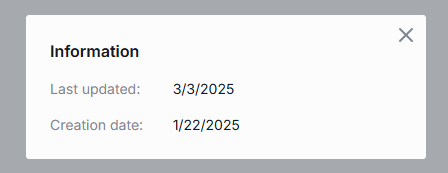

## Delete

You can delete a single prompt, selected prompts, or all prompts.

- **Single** — in the prompt menu, select **Delete** and confirm.
- **All** — click the **Delete all prompts** icon at the bottom of the right panel.

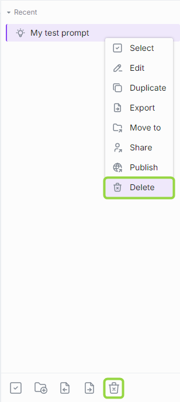

## Select prompts to delete

You can use selection mode to choose prompts to delete:

- Click **Select all** in the bottom panel to preselect all prompts, then unselect the ones to keep. Click **Unselect all** to clear the selection.

  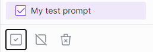

- Click **Select** in a prompt's menu to enter selection mode, then use the checkboxes. Click **Unselect all** to clear the selection.

  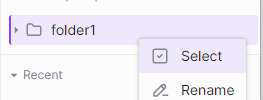

## Duplicate

Duplicate a prompt that was shared with you so you can change it. Click **Duplicate** in the menu.

**Note**
> This is available only for prompts shared with you.

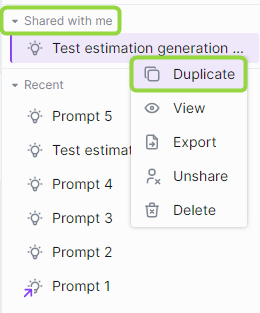

## Export and import

You can export and import prompts as JSON.

- **Single prompt** — select **Export** in the prompt's menu. The prompt is exported as a JSON file.

  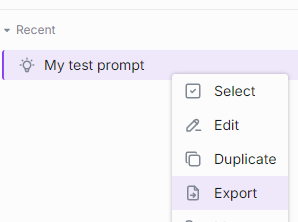

- **All prompts** — click **Export prompts** at the bottom of the right panel.

  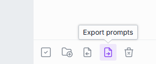

- **Import** — click **Import prompts** at the bottom of the right panel. Only valid JSON files can be imported.

  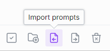

When importing a duplicate of an existing prompt, choose one option:

- **Replace** — replace the original.
- **Ignore** — do nothing.
- **Postfix** — add a postfix to the imported prompt, for example `my-prompt 1`.

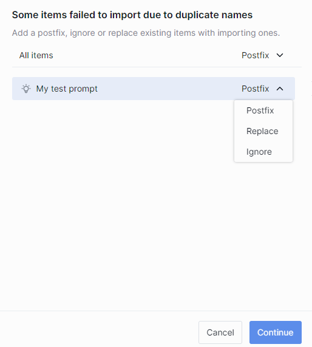

## Next steps

- [Conversations](./1.conversations.md) — use prompts and variables in parameterized replay
- [Sharing and publishing](./6.sharing-and-publishing.md) — share a prompt or publish it to your organization
- [Marketplace and apps](./3.marketplace-and-apps.md) — discover agents to use your prompts with
