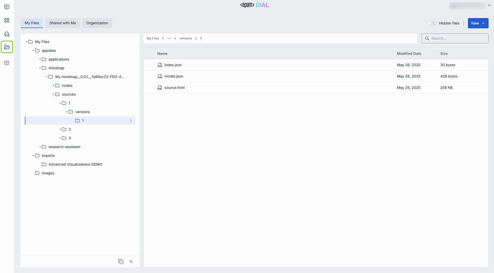
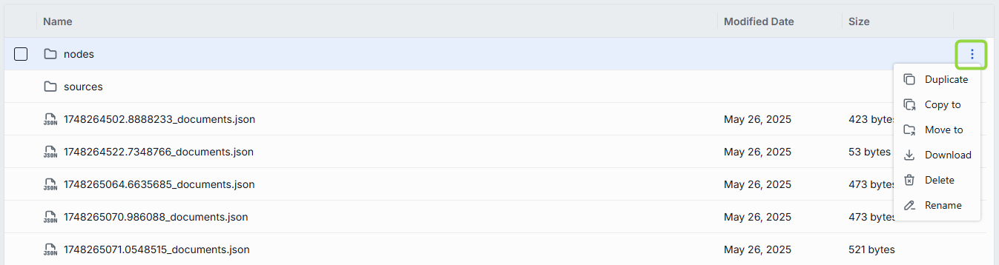
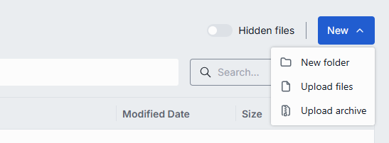

# Files

This page shows you how to use the Files manager in DIAL Chat: work with your private files, files shared with you, and files available across your organization. It is for end users of DIAL Chat. No technical background is required.

In the Files manager you view and manage all your files:

- **My files** — your private files: files you uploaded or attached to conversations. See [My files](#my-files).
- **Shared with me** — files and folders shared with you, and files of applications shared with you. See [Shared with me](#shared-with-me).
- **Organization** — files in the public space, available to authorized users in your organization. See [Organization](#organization).
- **Review files** — files available to [administrators](../administering-dial/6.publications-and-review.md) while reviewing publication requests.
- **Hidden files** — enable the **Hidden files** toggle to preview system files of published applications, whose names start with a dot (for example, `.abc.txt`).

**Note**
> See [Authentication and access control](../understand-dial/security-and-governance/1.authentication-and-access-control.md) to learn more about private and public spaces in DIAL file storage.

## My files

This tab holds all files you have uploaded, manually or during conversations. They are stored in your private space and cannot be accessed by anyone else. Here you can add folders, upload files, and remove files.

**Note**
> Applications can be configured to allow attaching entire folders to conversations. Only folders created in the Files manager can be attached.

You can perform these actions on your files and folders:

- **Duplicate** — duplicate the file or folder in the same location.
- **Copy to** — copy the file or folder to another folder in your private space.
- **Move to** — move the file or folder to another location in your private space.
- **Download** — download the file or folder to your device.
- **Delete** — delete the file or folder from your private space.
- **Rename** — rename the file or folder.
- **Info** — show detailed information about the file.

### Add a file, folder, or archive

1. Navigate to where you want to add the resource.
2. Click **New** and select the option you need.

**Note**
> These symbols are not allowed in file names and are removed: tab, `"`, `:`, `;`, `/`, `\`, `,`, `=`, `{`, `}`, `%`, `&`. You can use `.` at the start or inside a name, but a trailing dot is removed.

## Shared with me

This tab holds files and folders shared with you by other users, and files of applications shared with you.

You can perform these actions on shared files and folders:

- **Download** — download the file or folder to your device.
- **Delete** — if an application was shared with you with editing rights, you can delete its files. For example, if a Code App was shared with rights to edit its source files, open the folder and delete those files. You cannot delete shared files without explicit permission.
- **Unshare** — remove the shared file or folder from this section. You can also unshare folders that hold source files of applications shared with you.

## Organization

This tab holds files in the public space, available across your organization.

You can perform these actions on public files and folders:

- **Download** — download the file or folder to your device.
- **Info** — show detailed information about the file.

## Next steps

- [Conversations](./1.conversations.md) — attach files to a conversation
- [Sharing and publishing](./6.sharing-and-publishing.md) — understand how files are shared and published with assets
- [Marketplace and apps](./3.marketplace-and-apps.md) — use files as context for Quick Apps
