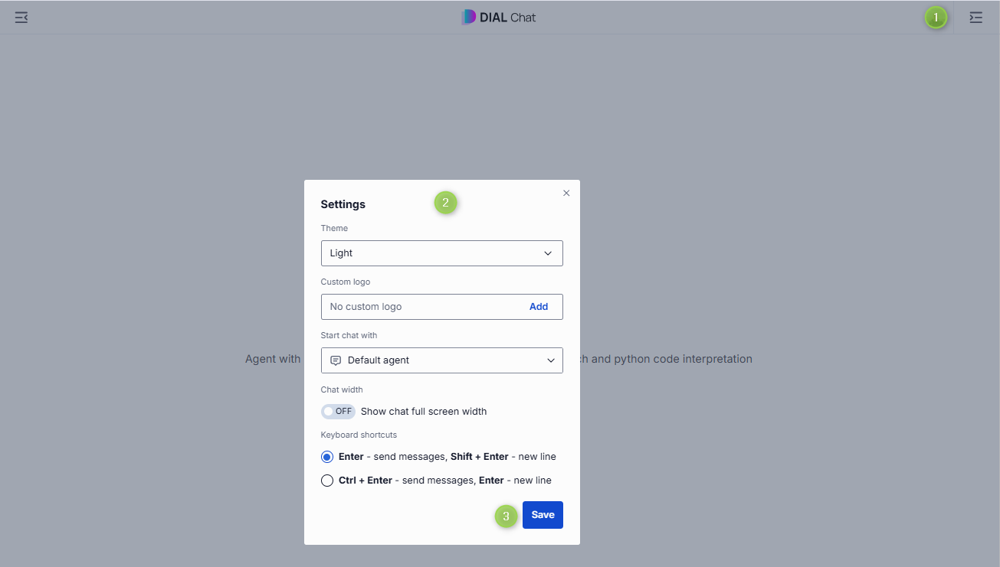

# Settings

This page shows you how to customize DIAL Chat in your user settings: theme, logo, default agent, chat width, and the keyboard shortcut that sends a message. It is for end users of DIAL Chat. No technical background is required.

On the top bar, click the user profile icon to open your settings or to sign out.

You can configure the following:

- **Theme** — choose between the available chat themes.
- **Custom logo** — select an image to display in the chat header.
- **Start chat with** — select a default [agent](./1.conversations.md) — a model or application — to start conversations with.
- **Chat width** — enable or disable full-width chat mode, where the chat box spans the full screen width.
- **Keyboard shortcuts** — choose the keyboard combination that sends a message.

**Tip**
> The default agent you set here is the one shown when you open DIAL Chat. You can still change the agent before or during any conversation — see [Conversations](./1.conversations.md).

## Next steps

- [Conversations](./1.conversations.md) — set a default agent and start chatting
- [Overview and interface](./0.index.md) — revisit the main areas of DIAL Chat
- [Marketplace and apps](./3.marketplace-and-apps.md) — add agents you want as your default
