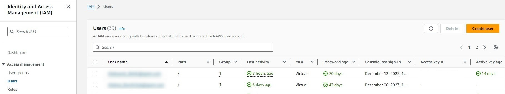

# Deploy Bedrock models

Register an Amazon Bedrock foundation model in DIAL and configure the Bedrock adapter so DIAL Core can route requests to it. This guide covers both IAM user credentials and IAM Roles for Service Accounts (IRSA) for production Kubernetes deployments.

## Prerequisites

- Active AWS account with admin privileges
- DIAL Core running with the Bedrock adapter enabled

## Step 1: Verify Bedrock model access

Amazon Bedrock provides automatic access to serverless foundation models in your AWS Region. No manual enablement step is required for most providers.

:::note
Anthropic models are enabled by default but still require a one-time usage form before first use. Submit it through the Amazon Bedrock playground in the AWS console, or use the [PutUseCaseForModelAccess API](https://docs.aws.amazon.com/bedrock/latest/APIReference/API_PutUseCaseForModelAccess.html).
:::

## Step 2: Grant IAM access

### Create an IAM policy

Use the AWS-managed **AmazonBedrockFullAccess** policy, or create a custom policy with the minimum required permissions:

- `bedrock:GetFoundationModel`
- `bedrock:ListFoundationModels`
- `bedrock:InvokeModel`
- `bedrock:InvokeModelWithResponseStream`

Some models are available through AWS Marketplace and require a subscription before use. To allow just-in-time subscription on the first call, add this statement to your custom policy:

```json
{
  "Sid": "MarketplaceOperationsFromBedrockFor3pModels",
  "Effect": "Allow",
  "Action": [
    "aws-marketplace:Subscribe",
    "aws-marketplace:ViewSubscriptions"
  ],
  "Resource": "*",
  "Condition": {
    "StringEquals": {
      "aws:CalledViaLast": "bedrock.amazonaws.com"
    }
  }
}
```

### Assign the policy to a user or service account

**IAM user (non-Kubernetes setups)**

1. Navigate to **IAM > Users** in the AWS console and click **Create user**.

   

2. On the **Set Permissions** step, attach the policy.
3. After the user is created, open the **Security credentials** tab and click **Create access key**. Copy the access key ID and secret — you will use them in [Step 3](#configure-the-bedrock-adapter).

**Kubernetes service account (IRSA)**

If your cluster runs on EKS, assign the policy to an IAM role and annotate the Kubernetes service account with the role ARN. Refer to [AWS Documentation — IAM roles for service accounts](https://docs.aws.amazon.com/eks/latest/userguide/iam-roles-for-service-accounts.html) for setup instructions.

## Step 3: Add the model to DIAL

### Add model to DIAL Core config

Add an entry for your model in the `models` section of `config.json`. Refer to [Models configuration](../configuration/core/config-json/models) for the full field reference.

### Configure the Bedrock adapter

Refer to [Adapter configuration](../configuration/adapter-configuration) for the complete list of environment variables.

**Using IAM user credentials**

```yaml
bedrock:
  enabled: true
  env:
    DEFAULT_REGION: "<AWS_REGION>"
  secrets:
    AWS_ACCESS_KEY_ID: "<AWS_ACCESS_KEY_ID>"
    AWS_SECRET_ACCESS_KEY: "<AWS_SECRET_ACCESS_KEY>"
```

**Using IRSA (EKS service account)**

Configure the role ARN in the service account annotation. The adapter picks up credentials automatically from the IRSA token — no access keys needed.

```yaml
bedrock:
  enabled: true
  env:
    DEFAULT_REGION: "<AWS_REGION>"
  serviceAccount:
    create: true
    annotations:
      eks.amazonaws.com/role-arn: "<AWS_BEDROCK_ROLE_ARN>"
```

## Related tasks

- [AWS deployment](../cloud-deployment/aws-deployment) — deploy the full DIAL stack to AWS EKS with Bedrock
- [Adapter configuration](../configuration/adapter-configuration) — full Bedrock adapter environment variable reference
- [Models configuration](../configuration/core/config-json/models) — register additional models in config.json

## Next steps

- [Supported models and providers](../../building-with-dial/adapters/supported-providers) — full list of models available through the Bedrock adapter
