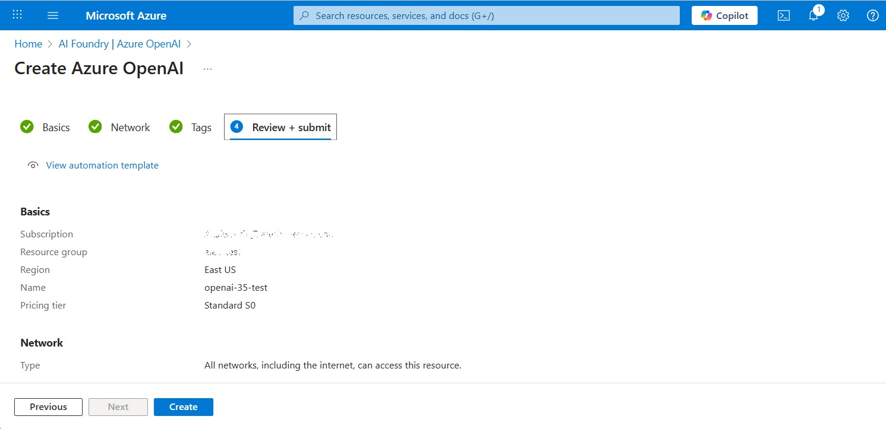
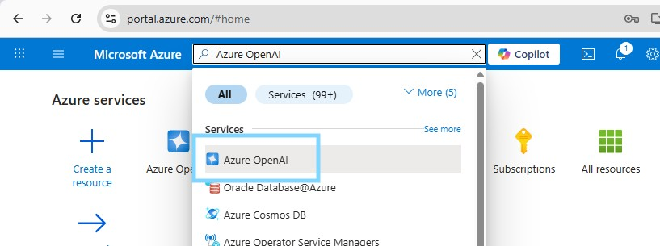
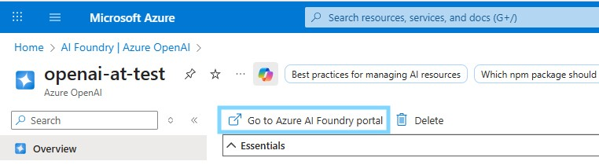
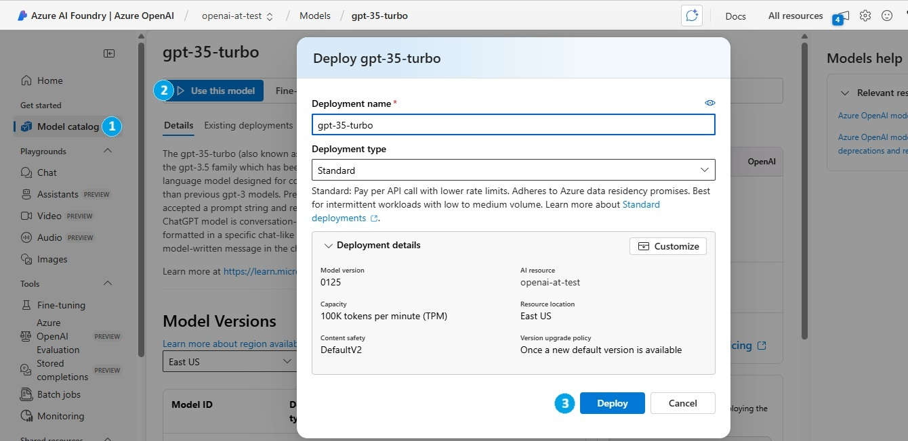
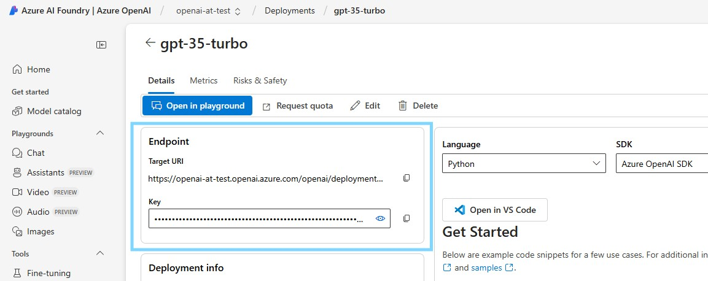
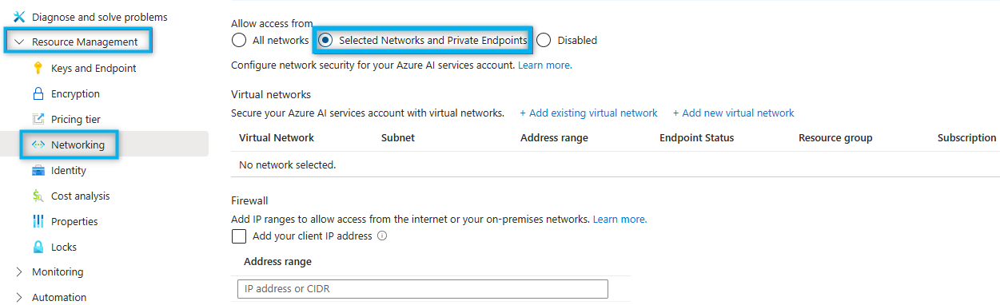

# Deploy Azure OpenAI models

Create an Azure OpenAI model deployment and connect it to DIAL through the OpenAI adapter. This guide covers both API key authentication and passwordless access via Microsoft Entra Workload ID for AKS clusters.

## Prerequisites

- Active Azure account with an Azure OpenAI resource in your subscription

## Step 1: Deploy a model in Azure AI Foundry

### Create an Azure OpenAI resource

1. Sign in to the [Azure portal](https://portal.azure.com/).
2. Navigate to **Azure OpenAI** and click **Create**.
3. Fill in the subscription, resource group, region, and name, then click **Create**.

   

### Create a model deployment

1. Search for **Azure OpenAI** in the portal search bar and click the result to navigate to the **AI Foundry | Azure OpenAI** page.

   

2. Find your Azure OpenAI resource in the list. Click it to open, then click **Go to Azure AI Foundry portal** in the top bar.

   

3. In Azure AI Foundry, click **Model catalog** in the navigation menu. Find your model, open it, and click **Use this model**. Fill in the deployment name and capacity, then click **Deploy**.

   

:::note
Some models are not available in all Azure regions. If a model is unavailable, submit an access request or create the Azure OpenAI resource in a different region.
:::

## Step 2: Get your credentials

### API key and endpoint

1. In Azure AI Foundry, click **Deployments** and open the model you deployed. In the **Endpoint** section, copy the **Target URI** and **Key** — you will supply these in the DIAL Core `config.json` upstreams.

   

### Restrict network access (optional)

Manage default network access rules for your Azure OpenAI resource under **Resource Management > Networking** in the Azure portal.



Refer to [Microsoft Documentation](https://learn.microsoft.com/en-us/azure/ai-services/cognitive-services-virtual-networks) for details.

### Configure Workload Identity (AKS, optional)

For AKS clusters, use Microsoft Entra Workload ID to authenticate the OpenAI adapter without API keys. Refer to [Azure Documentation — Workload Identity with AKS](https://learn.microsoft.com/en-us/azure/aks/workload-identity-overview) for setup instructions.

## Step 3: Add the model to DIAL

### Add model to DIAL Core config

Add an entry for your model in the `models` section of `config.json`, using the Target URI from Step 2 as the upstream endpoint. Refer to [Models configuration](../configuration/core/config-json/models) for the full field reference.

### Configure the OpenAI adapter

Refer to [Adapter configuration](../configuration/adapter-configuration) for the complete list of environment variables.

**Using Azure OpenAI API key**

API keys are stored in DIAL Core's `config.json` upstreams. No additional adapter configuration is required beyond enabling the adapter.

```yaml
openai:
  enabled: true
```

**Using Managed Identity (Entra Workload ID)**

Authentication happens at the adapter level. Do not set the Azure OpenAI API key in DIAL Core `config.json` when using this method.

```yaml
openai:
  enabled: true
  podLabels:
    azure.workload.identity/use: "true"
serviceAccount:
  create: true
  annotations:
    azure.workload.identity/client-id: "<AZURE_CLIENT_ID>"
```

## Related tasks

- [Azure deployment](../cloud-deployment/azure-deployment) — deploy the full DIAL stack to Azure AKS
- [Local setup with Azure OpenAI](../local-setup/docker-compose-with-azure-model) — run DIAL locally with an Azure OpenAI model
- [Adapter configuration](../configuration/adapter-configuration) — full OpenAI adapter environment variable reference

## Next steps

- [Models configuration](../configuration/core/config-json/models) — register additional models in config.json
- [Supported models and providers](../../building-with-dial/adapters/supported-providers) — full list of models available through the OpenAI adapter
