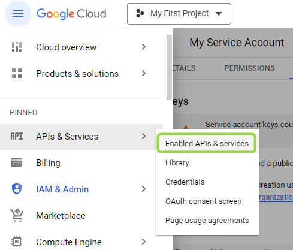
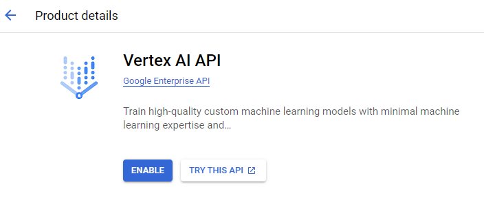
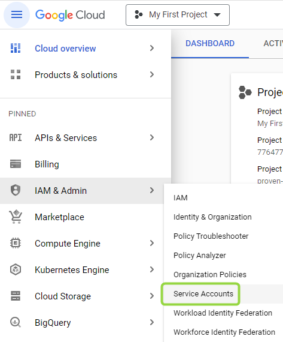
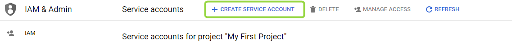
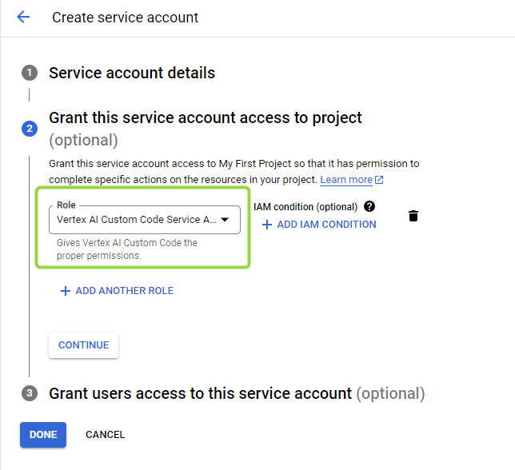
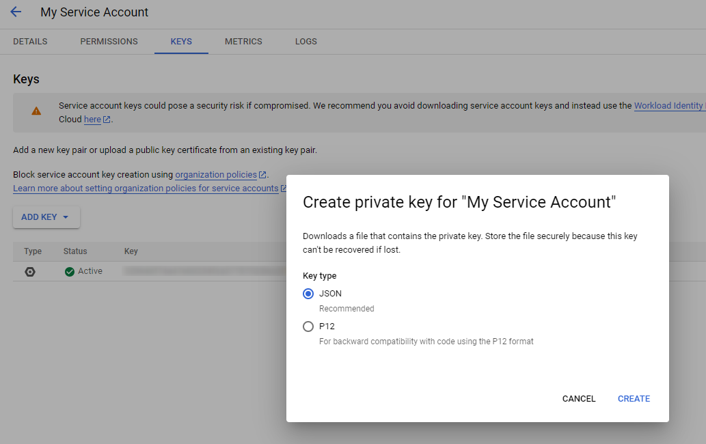

# Deploy Vertex AI models

Enable the Vertex AI API in your Google Cloud project and connect Vertex AI models to DIAL through the Vertex AI adapter. This guide covers both JSON key authentication and Workload Identity Federation for GKE clusters.

## Prerequisites

- Active Google Cloud project with billing enabled

## Step 1: Enable the Vertex AI API

1. Sign in to [Google Cloud Console](https://console.cloud.google.com/).
2. In the navigation menu, go to **APIs & Services** and select **Enable APIs and Services**.

   

3. Click **+ Enable APIs and Services** to open the API library.
4. Search for **Vertex AI API** and select it from the results.
5. Click **Enable**.

   

## Step 2: Set up authentication

### Option A: GCP service account with JSON key

1. Navigate to **IAM & Admin > Service Accounts**.

   

2. Click **+ Create Service Account** and fill in the service account name and description.

   

3. On the **Grant this service account access to project** step, add the **Vertex AI Custom Code Service Agent** role. Refer to [GCP Documentation](https://cloud.google.com/vertex-ai/docs/general/access-control#grant_service_agents_access_to_other_resources) for details.

   

4. Click **Done**.
5. Open the new service account and go to the **Keys** tab. Click **Add Key > Create new key**, select **JSON**, and download the file.

   

### Option B: Workload Identity Federation for GKE

If your cluster runs on GKE, link a Kubernetes service account to a GCP IAM service account to authenticate without JSON key files. Refer to [GCP Documentation — Workload Identity Federation for GKE](https://cloud.google.com/kubernetes-engine/docs/how-to/workload-identity) for setup instructions.

## Step 3: Add the model to DIAL

### Add model to DIAL Core config

Add an entry for your model in the `models` section of `config.json`. Refer to [Models configuration](../configuration/core/config-json/models) for the full field reference.

### Configure the Vertex AI adapter

Refer to [Adapter configuration](../configuration/adapter-configuration) for the complete list of environment variables.

**Using JSON key**

Mount the downloaded JSON key file as a Kubernetes secret:

```yaml
vertexai:
  enabled: true
  env:
    DEFAULT_REGION: "<GCP_REGION>"
    GOOGLE_APPLICATION_CREDENTIALS: "/mnt/secrets-store/gcp-ai-key"
    GCP_PROJECT_ID: "<GCP_PROJECT_ID>"
  secrets:
    gcp-ai-key: |
      {
        "type": "service_account",
        ...
        "universe_domain": "googleapis.com"
      }
  extraVolumes:
    - name: key-file
      secret:
        secretName: '{{ template "dialExtension.names.fullname" . }}'
        items:
          - key: gcp-ai-key
            path: gcp-ai-key
  extraVolumeMounts:
    - name: key-file
      mountPath: "/mnt/secrets-store"
      readOnly: true
```

**Using Workload Identity Federation for GKE**

The adapter authenticates using the GCP IAM service account linked to the Kubernetes service account annotation. No JSON key file is needed.

```yaml
vertexai:
  enabled: true
  serviceAccount:
    create: true
    annotations:
      iam.gke.io/gcp-service-account: <GCP_SERVICE_ACCOUNT>@<GCP_PROJECT_ID>.iam.gserviceaccount.com
  env:
    DIAL_URL: "http://dial-core"
    GCP_PROJECT_ID: "<GCP_PROJECT_ID>"
    DEFAULT_REGION: "<GCP_REGION>"
```

## Related tasks

- [GCP deployment](../cloud-deployment/gcp-deployment) — deploy the full DIAL stack to GKE with Vertex AI
- [Adapter configuration](../configuration/adapter-configuration) — full Vertex AI adapter environment variable reference

## Next steps

- [Models configuration](../configuration/core/config-json/models) — register additional models in config.json
- [Supported models and providers](../../building-with-dial/adapters/supported-providers) — full list of models available through the Vertex AI adapter
