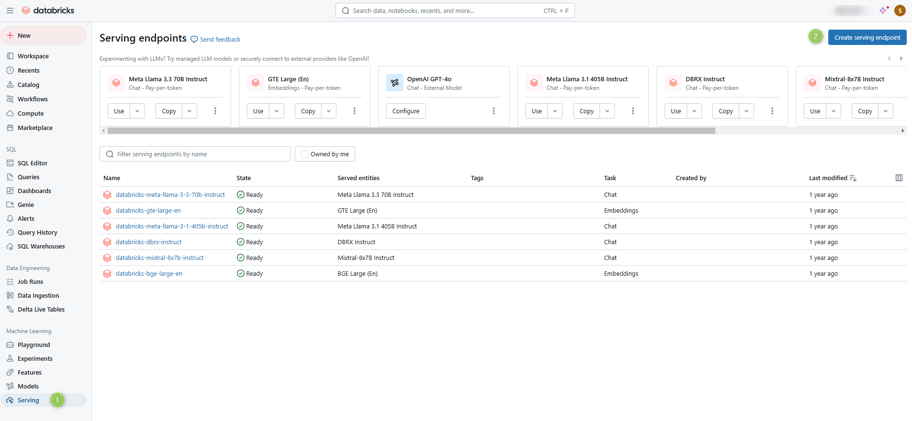
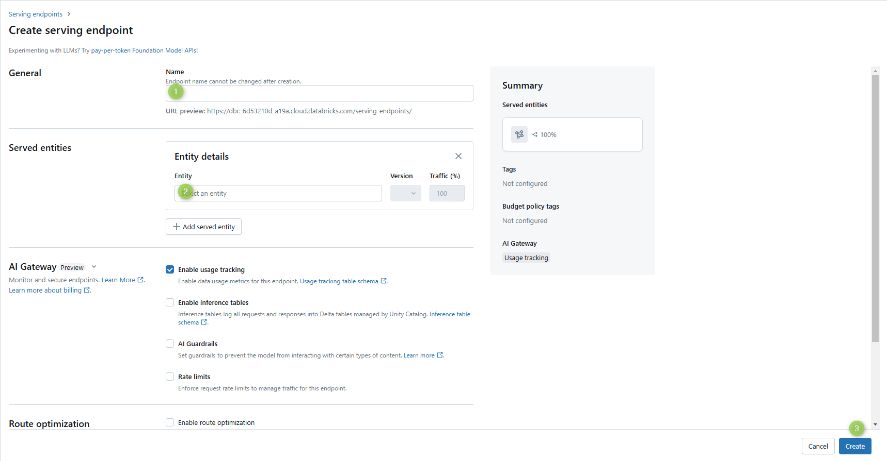
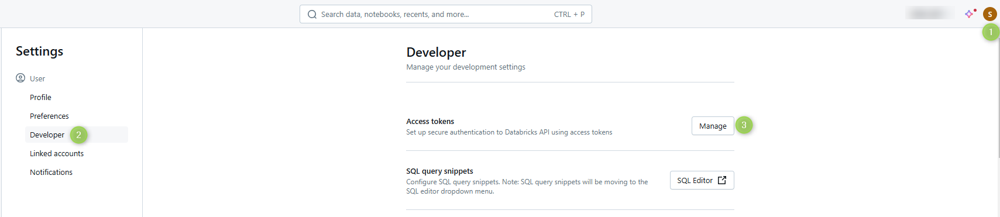

# Deploy Databricks models

Connect a Databricks model serving endpoint to DIAL through the OpenAI adapter. Databricks uses a different authorization flow from OpenAI, which requires declaring the deployment in the `DATABRICKS_DEPLOYMENTS` environment variable on the adapter.

## Prerequisites

- Active Databricks account with ML workspace access
- A model serving endpoint, or permission to create one

## Step 1: Create a serving endpoint (optional)

Skip this step if you already have a serving endpoint for the model you want to use.

1. In your Databricks workspace, navigate to the **Machine Learning** section.
2. Open the **Serving** tab and click **Create serving endpoint**.

   

3. Enter a name for the endpoint — you will reference it in [Step 3](#step-3-add-the-model-to-dial) — and select the model to serve.

   

4. Click **Create**.

## Step 2: Create an access token

1. Open your Databricks workspace **Settings**.
2. Navigate to **User Settings > Developer** and generate a new access token.

   

3. Copy the token — you will supply it in [Step 3](#step-3-add-the-model-to-dial).

## Step 3: Add the model to DIAL

### Register the model in DIAL Core config

Add an entry in the `models` section of `config.json`. Refer to [Models configuration](../configuration/core/config-json/models) for the full field reference.

Use the serving endpoint name and access token from the previous steps:

```json
"<DIAL_DEPLOYMENT_NAME>": {
  "type": "chat",
  "displayName": "<DISPLAY_NAME>",
  "endpoint": "http://<OPENAI_ADAPTER_HOST>/openai/deployments/<DATABRICKS_DEPLOYMENT_NAME>/chat/completions",
  "upstreams": [
    {
      "endpoint": "<DATABRICKS_ACCOUNT_URL>/serving-endpoints/chat/completions",
      "key": "<ACCESS_TOKEN>"
    }
  ]
}
```

### Configure the OpenAI adapter

Databricks serving endpoints use a different authorization flow from standard OpenAI deployments. Declare the Databricks deployment name in the `DATABRICKS_DEPLOYMENTS` environment variable:

```yaml
openai:
  enabled: true
  env:
    DATABRICKS_DEPLOYMENTS: "<DATABRICKS_DEPLOYMENT_NAME>"
```

Restart the OpenAI adapter for the change to take effect.

Refer to [Adapter configuration](../configuration/adapter-configuration) for the complete list of environment variables.

## Related tasks

- [Adapter configuration](../configuration/adapter-configuration) — full OpenAI adapter environment variable reference, including `DATABRICKS_DEPLOYMENTS`
- [Models configuration](../configuration/core/config-json/models) — model config field reference

## Next steps

- [Supported models and providers](../../building-with-dial/adapters/supported-providers) — full list of providers supported through the OpenAI adapter
