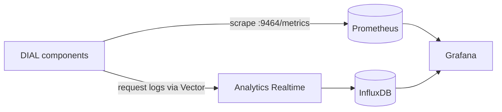

# Observability with Grafana and Prometheus

This guide assembles the default DIAL observability stack on Kubernetes: Prometheus for runtime-health metrics, InfluxDB for usage analytics, and Grafana over both. It is for DevOps engineers running DIAL with the Helm chart who want one end-to-end monitoring setup. For the conceptual model, see [Observability](../index).

## Prerequisites

- DIAL deployed with the `dial-core` Helm chart
- [Prometheus Operator](https://prometheus-operator.dev/) running in the cluster
- Grafana with access to both the Prometheus and InfluxDB datasources

## How the pieces fit

This stack spans both observability planes. Prometheus covers runtime health; InfluxDB covers usage analytics; Grafana visualizes both.



## Step 1: Scrape runtime metrics with Prometheus

Enable the metrics service and the `ServiceMonitor` so the Prometheus Operator discovers DIAL automatically:

```yaml
metrics:
  enabled: true
  serviceMonitor:
    enabled: true
    interval: 30s
    path: /metrics
    port: http-metrics
```

Set `OTEL_METRICS_EXPORTER=otlp,prometheus` on the components so they serve the endpoint. For the full procedure and the metric-name caveat, see [Metrics and monitoring](../metrics-and-monitoring).

## Step 2: Capture usage analytics in InfluxDB

Forward DIAL Core logs through Vector to the Analytics Realtime service and into InfluxDB. See [Analytics Realtime setup](../analytics-realtime-setup) for the Vector sink and InfluxDB connection variables.

## Step 3: Add both datasources to Grafana

Configure two Grafana datasources:

- **Prometheus** — for runtime-health metrics (latency, error rate, resource usage).
- **InfluxDB** — for usage analytics (tokens, cost, topics, ratings).

For usage dashboards, import the aggregated dashboards shipped under `dashboards/customized/influxdb/` in the [Analytics Realtime repository](https://github.com/epam/ai-dial-analytics-realtime).

:::note
The DIAL Helm chart ships no prebuilt Grafana dashboard for the Prometheus metrics. Use a community JVM or OpenTelemetry Java agent dashboard for DIAL Core and adapt it to your labels. The InfluxDB dashboards above cover only the usage-analytics plane and require InfluxDB 2.
:::

## Result

Grafana shows runtime health from Prometheus and usage analytics from InfluxDB, giving one view across both observability planes.

## Related tasks

- [Metrics and monitoring](../metrics-and-monitoring) — the Prometheus half in detail
- [Analytics Realtime setup](../analytics-realtime-setup) — the InfluxDB half in detail

## Next steps

- [Alerting](../alerting) — add Prometheus alert rules on the metrics you now collect
- [Tracing (OpenTelemetry)](../tracing) — add distributed traces to the stack
