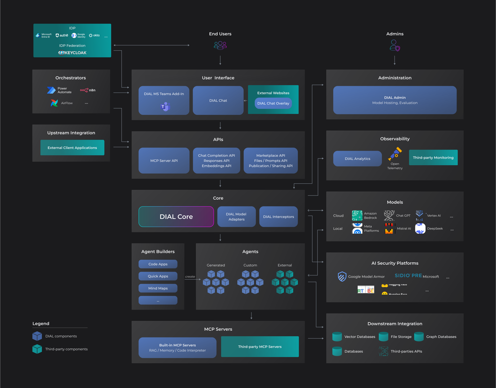
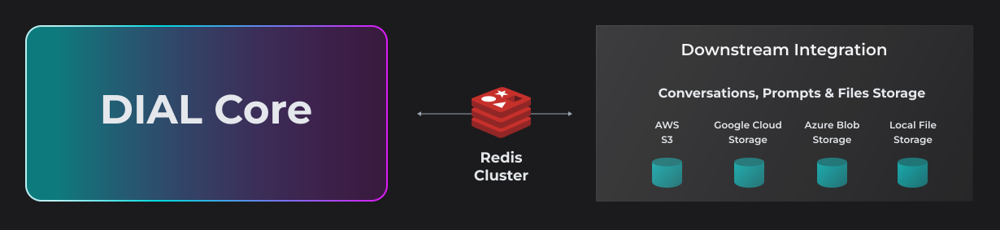
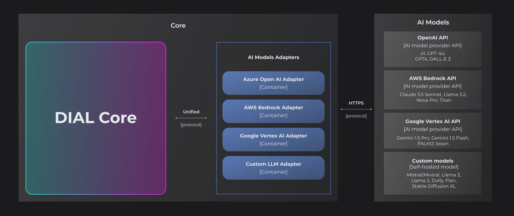
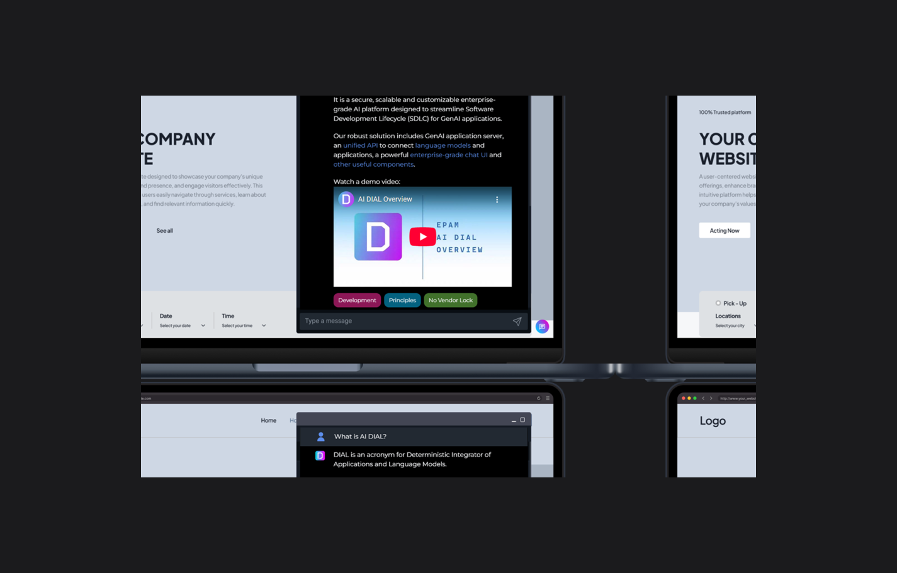

# Architecture highlights

DIAL has a modular architecture: one mandatory component and a set of optional ones that you add as your needs grow. This page explains how those components fit together, what each one is responsible for, and why the design lets you start on a laptop and scale to a full production deployment without rearchitecting. It assumes you have read [What is DIAL](/docs/NEW/understand-dial/positioning/what-is-dial) and want the structural view.

## A modular platform

DIAL is an enterprise-grade AI platform built so that organizations deploy only the parts they need. The minimal setup is a single component — [DIAL Core](#dial-core-required) — which you can run locally to evaluate the platform. A production deployment typically adds DIAL Chat for the user interface, model adapters for connectivity, and the operational components for authentication, observability, and analytics.

The design keeps a small technological footprint and avoids vendor lock-in. DIAL's OpenAI-compatible [Unified API](/docs/NEW/understand-dial/architecture/unified-api-overview) integrates with existing tools and workflows while providing centralized governance, access control, and observability across every AI resource.

## DIAL Core (required)

DIAL Core is the central integration hub and the **only mandatory component**. It exposes the platform's capabilities through the [Unified API](/docs/NEW/understand-dial/architecture/unified-api-overview) and integrates with all your applications and agents, regardless of the platform they were originally built on.

Core provides:

- **Unified API** — a single, OpenAI-compatible API that standardizes communication between clients, AI models, and applications. See [Unified API overview](/docs/NEW/understand-dial/architecture/unified-api-overview).
- **LLM gateway** — unified access to language and embedding models from major and alternative vendors. See [supported providers](/docs/NEW/building-with-dial/adapters/supported-providers).
- **Load balancing** — flexible distribution of requests across model deployments, regions, and cloud subscriptions.
- **Authentication and access control** — centralized attribute- and role-based access control with granular permissions.
- **Cost management** — configurable token usage, request limits, and monetary cost controls for individual users, groups, or API keys.
- **Interceptors** — custom logic over incoming and outgoing requests for PII obfuscation, guardrails, and safety checks. See [What are interceptors](/docs/NEW/building-with-dial/interceptors/index).
- **Observability** — OpenTelemetry-based metrics, traces, and logs.

DIAL Core is headless and stateless. Its persistence relies on a resilient cloud blob storage — AWS S3, Google Cloud Storage, Azure Blob Storage, or a local file system — where conversations, prompts, applications, and user files are stored. Redis (standalone or cluster) sits on top as an in-memory cache to accelerate retrieval, sharing, and publication of stored objects. There is no centralized database to operate.

For the technologies behind each component, see [DIAL Stack](/docs/NEW/understand-dial/architecture/dial-stack). For the source code, see the [DIAL Core repository](https://github.com/epam/ai-dial-core) and the [DIAL Core API reference](https://dialx.ai/dial_api).

## Connecting to models

### AI model adapters

[Adapters](/docs/NEW/building-with-dial/adapters/index) translate provider-specific model APIs into the Unified API. This normalization lets applications interact with any model through one consistent interface, regardless of the provider's native format.

DIAL ships adapters for major providers — [OpenAI](https://github.com/epam/ai-dial-adapter-openai), [AWS Bedrock](https://github.com/epam/ai-dial-adapter-bedrock), and [Google Vertex AI](https://github.com/epam/ai-dial-adapter-vertexai). Organizations can build custom adapters with the [DIAL SDK](https://github.com/epam/ai-dial-sdk) to integrate additional providers or proprietary models.

DIAL reaches models from several sources: major commercial providers (Azure OpenAI, AWS Bedrock, Google Vertex AI), open-source models including those on Hugging Face, self-hosted and fine-tuned models, and specialized platforms such as NVIDIA NIM and DeepSeek. For the full list, see [supported providers](/docs/NEW/building-with-dial/adapters/supported-providers).

### MCP servers

DIAL integrates with [Model Context Protocol](https://modelcontextprotocol.io/) (MCP) servers to extend applications with external tools and data sources. There are two approaches: connect [tool sets](/docs/NEW/building-with-dial/apps/quick-apps/quick-app-2/tool-sets/index) to existing MCP servers hosted outside the platform, or deploy and manage custom MCP servers as Docker containers through DIAL Admin.

## Extending the platform

### Interceptors

[Interceptors](/docs/NEW/building-with-dial/interceptors/index) are middleware that runs at the DIAL Core level, analyzing traffic before it reaches a model or application and before responses return to users. They can leverage external AI security platforms — Google Model Armor, Presidio, and others — and specialized models.

Common uses include PII detection and redaction, content filtering, prompt injection detection, and compliance enforcement. Organizations build custom interceptors with the [Interceptors SDK](https://github.com/epam/ai-dial-interceptors-sdk).

### Agent builders

An [agent builder](/docs/NEW/building-with-dial/apps/index) (technical name: application runner) acts as a *factory* that lets end users create customized AI applications from predefined templates without writing code. Users configure parameters through a UI wizard, then deploy and share the resulting application.

DIAL includes three standard agent builders:

- [Quick Apps](/docs/NEW/building-with-dial/apps/quick-apps/index) — a no-code orchestrator for multi-agent workflows.
- [Code Apps](/docs/NEW/building-with-dial/apps/code-apps/index) — Python applications developed, deployed, and run directly in DIAL Chat.
- [Mind Map Studio](/docs/NEW/building-with-dial/apps/mind-map-studio/index) — deterministic information discovery through interactive knowledge graphs.

Organizations can build custom agent builders with the [DIAL SDK](https://github.com/epam/ai-dial-sdk) to create domain-specific templates.

## User and administration interfaces

### DIAL Chat

DIAL Chat is the default feature-rich web interface, a [Marketplace](/docs/NEW/building-with-dial/developer-tools/chat-customization/marketplace) for agents and tools, and a no-code development workspace — combined in one application with enterprise-grade access control and support for custom applications.

Its capabilities include a conversational interface, the Marketplace, no-code agent builders, collaboration through sharing and publications, advanced rendering (code execution, visualizations, charts, Markdown, LaTeX), and extensibility through [custom UIs](/docs/NEW/building-with-dial/developer-tools/chat-customization/index). For source code, see the [DIAL Chat repository](https://github.com/epam/ai-dial-chat).

### DIAL Overlay

[DIAL Overlay](/docs/NEW/building-with-dial/developer-tools/chat-customization/dial-overlay) is a library that embeds DIAL Chat in an external web application through an iframe event-based protocol, so third-party applications can integrate conversational capabilities without building a UI from scratch.

### DIAL Admin

DIAL Admin gives administrators a UI to configure and manage system resources, set access control policies, moderate publication requests, and monitor the system. It covers model and application management, deployment of adapters, interceptors, and MCP server images, access control, the publication workflow, system monitoring, and usage and cost control.

## Integrations

### Chatbots and productivity tools

A [Microsoft Teams bot](/docs/NEW/building-with-dial/integrations/chatbot-integrations/ms-teams) lets users access DIAL models and applications inside Teams, authenticating through the organization's configured identity provider and respecting access control. DIAL also integrates with other [chatbot](/docs/NEW/building-with-dial/integrations/chatbot-integrations/index) and [productivity](/docs/NEW/building-with-dial/integrations/productivity-add-ins/index) surfaces.

### Workflow orchestration

The OpenAI-compatible Unified API lets DIAL plug into workflow automation and process orchestration platforms — such as [n8n](/docs/NEW/building-with-dial/integrations/workflow-automation/n8n), Power Automate, and Airflow — so organizations embed AI into multi-step business processes.

### Upstream and downstream systems

External clients use the Unified API to access models, applications, and resources programmatically. In the other direction, DIAL applications connect to the external systems their logic requires: relational databases and data warehouses, vector databases (Pinecone, Weaviate, Qdrant, ChromaDB) for retrieval-augmented generation, cloud and document storage, graph databases (Neo4j, Neptune), and third-party APIs.

## Identity, analytics, and observability

### Identity providers

DIAL natively supports [OpenID Connect](https://openid.net/developers/how-connect-works/) and [OAuth 2.0](https://oauth.net/2/), integrating with enterprise identity providers to manage authentication, roles, and attributes. Supported providers include AWS Cognito, Auth0, Google Identity, Microsoft Entra ID, and Okta; Keycloak acts as an identity broker for a broader range of providers. See the [SSO / IdP setup](/docs/NEW/operating-dial/auth-and-access-control/sso-idp/index).

### Analytics

DIAL Analytics Realtime processes chat completion logs to extract usage insights and operational metrics without storing sensitive user information. It operates as a data sink for Vector and computes statistical artifacts — topic analysis, sentiment, cost tracking, language distribution, anonymized user activity — that are stored in time-series databases such as InfluxDB and visualized in tools such as Grafana. See the [Analytics Realtime repository](https://github.com/epam/ai-dial-analytics-realtime).

### Observability

DIAL uses [OpenTelemetry](https://opentelemetry.io/) to collect metrics, logs, and distributed traces from every component through a single, vendor-agnostic framework. Telemetry can be exported to any OTEL-compatible backend without lock-in, giving you unified observability and a consistent view of system behavior and performance.

## Further reading

- [DIAL Stack](/docs/NEW/understand-dial/architecture/dial-stack) — the technologies and infrastructure each component requires
- [Application server](/docs/NEW/understand-dial/architecture/application-server) — how DIAL hosts and runs applications across their lifecycle
- [Unified API overview](/docs/NEW/understand-dial/architecture/unified-api-overview) — the protocol that ties the components together

## Next steps

- [DIAL Apps overview](/docs/NEW/building-with-dial/apps/index) — choose an application type and start building
- [Architect overview](/docs/NEW/home/architect-overview) — design a deployment with these components
