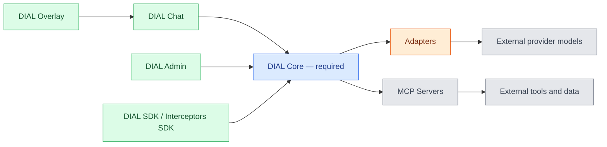
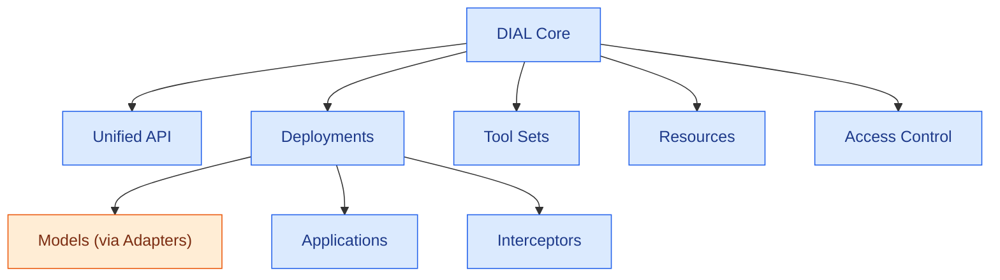
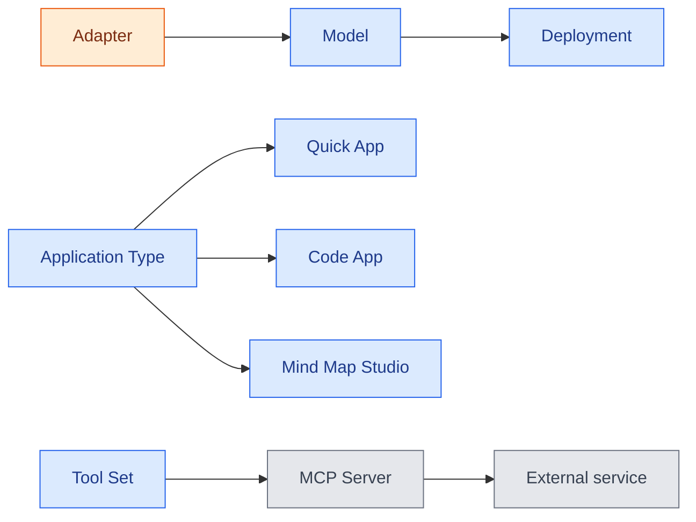

# Concept map

DIAL has many moving parts — Core, adapters, applications, tool sets, interceptors, and the UI layers around them — and the names alone do not reveal how they fit together. This page is a visual and narrative map of those relationships. It is written for architects and developers who have read [What is DIAL](/docs/NEW/understand-dial/positioning/what-is-dial) and want a single picture of the platform before diving into any one part. For one-line definitions of every term used here, see the [glossary](/docs/NEW/understand-dial/foundations/core-concepts-and-glossary/glossary).

## One required component, everything else optional

The central idea of DIAL is that [DIAL Core](/docs/NEW/understand-dial/foundations/core-concepts-and-glossary/glossary#dial-core) is the only mandatory component. Core exposes the [Unified API](/docs/NEW/understand-dial/foundations/core-concepts-and-glossary/glossary#unified-api) and routes every request through it. Everything else — the chat UI, the admin panel, adapters, applications, interceptors — plugs into Core or sits in front of it. This is why the concept map is best read as concentric layers radiating out from Core, rather than as a flat list of features.

The diagram below shows those layers. Color marks the component category, and the same scheme is reused in the diagrams that follow: Core is blue, the optional UI layers (DIAL Chat, DIAL Admin, DIAL Overlay, and the SDKs) are green, provider integration through adapters is orange, and external systems are gray.

## Inside DIAL Core

DIAL Core is itself made of a few major parts. The [Unified API](/docs/NEW/understand-dial/foundations/core-concepts-and-glossary/glossary#unified-api) is the entry point. [Deployments](/docs/NEW/understand-dial/foundations/core-concepts-and-glossary/glossary#deployment-configuration-sense) expose models, [applications](/docs/NEW/understand-dial/foundations/core-concepts-and-glossary/glossary#application), and [interceptors](/docs/NEW/understand-dial/foundations/core-concepts-and-glossary/glossary#interceptor). [Tool sets](/docs/NEW/understand-dial/foundations/core-concepts-and-glossary/glossary#tool-set), [resources](/docs/NEW/understand-dial/foundations/core-concepts-and-glossary/glossary#resource), and [access control](/docs/NEW/understand-dial/security-and-governance/authentication-and-access-control) round out what Core manages.

## How the building blocks compose

The platform's power comes from composition: most concepts are building blocks that snap together through the Unified API. Three chains carry most of that composition — wrapping a provider model, defining an application from a template, and reaching external services through a tool set:

Reading from the smallest unit outward:

- An [adapter](/docs/NEW/understand-dial/foundations/core-concepts-and-glossary/glossary#adapter) wraps an external provider model so it speaks the Unified API. Once wrapped, a model is just another [deployment](/docs/NEW/understand-dial/foundations/core-concepts-and-glossary/glossary#deployment-configuration-sense) in Core.
- An [application](/docs/NEW/understand-dial/foundations/core-concepts-and-glossary/glossary#application) is also a deployment. Because applications and models both speak the Unified API, an application can call a model — or another application — through the same interface. This interchangeability is the basis of the [agentic platform](/docs/NEW/understand-dial/capabilities/agentic-platform).
- Schema-rich applications are defined by an [application type](/docs/NEW/understand-dial/foundations/core-concepts-and-glossary/glossary#application-type). The standard types — [Quick App](/docs/NEW/understand-dial/foundations/core-concepts-and-glossary/glossary#quick-app), [Code App](/docs/NEW/understand-dial/foundations/core-concepts-and-glossary/glossary#code-app), and [Mind Map Studio](/docs/NEW/understand-dial/foundations/core-concepts-and-glossary/glossary#mind-map-studio) — let end users create applications without writing code.
- A [tool set](/docs/NEW/understand-dial/foundations/core-concepts-and-glossary/glossary#tool-set) connects an application to external services through an [MCP server](/docs/NEW/understand-dial/foundations/core-concepts-and-glossary/glossary#mcp-server). Quick Apps use tool sets to reach beyond the model.
- An [interceptor](/docs/NEW/understand-dial/foundations/core-concepts-and-glossary/glossary#interceptor) sits in the request path of a deployment, modifying requests or responses — for example, redacting PII before a prompt reaches a model.

The UI layers reuse the same blocks rather than introducing new ones. [Agent builders](/docs/NEW/understand-dial/foundations/core-concepts-and-glossary/glossary#agent-builder) in [DIAL Chat](/docs/NEW/understand-dial/foundations/core-concepts-and-glossary/glossary#dial-chat) are wizards over application types; the [Marketplace](/docs/NEW/understand-dial/foundations/core-concepts-and-glossary/glossary#marketplace) lists deployments the user can access; and [DIAL Overlay](/docs/NEW/understand-dial/foundations/core-concepts-and-glossary/glossary#dial-overlay) embeds Chat into another web application without rebuilding any of it.

## One canonical name per concept

Several concepts in DIAL carry more than one name across source code, UI labels, and informal speech. The glossary resolves each to a single canonical term. The most important example is the [agent builder](/docs/NEW/understand-dial/foundations/core-concepts-and-glossary/glossary#agent-builder): it appears as "application runner" in source code, "application builder" in the Chat UI, and "builder" in the Admin sidebar. Documentation uses **agent builder** everywhere. When a diagram or page seems to introduce a new concept, check the glossary first — it is often an existing one under a different label.

## Further reading

- [Glossary](/docs/NEW/understand-dial/foundations/core-concepts-and-glossary/glossary) — canonical definition of every term in this map
- [Architecture highlights](/docs/NEW/understand-dial/architecture/architecture-highlights) — how these components behave at runtime
- [Agentic platform](/docs/NEW/understand-dial/capabilities/agentic-platform) — why composition through the Unified API is the core design choice

## Next steps

- [DIAL Stack](/docs/NEW/understand-dial/architecture/dial-stack) — the concrete services and dependencies behind these concepts
- [DIAL evolution](/docs/NEW/understand-dial/foundations/dial-evolution) — how the platform grew into this shape
