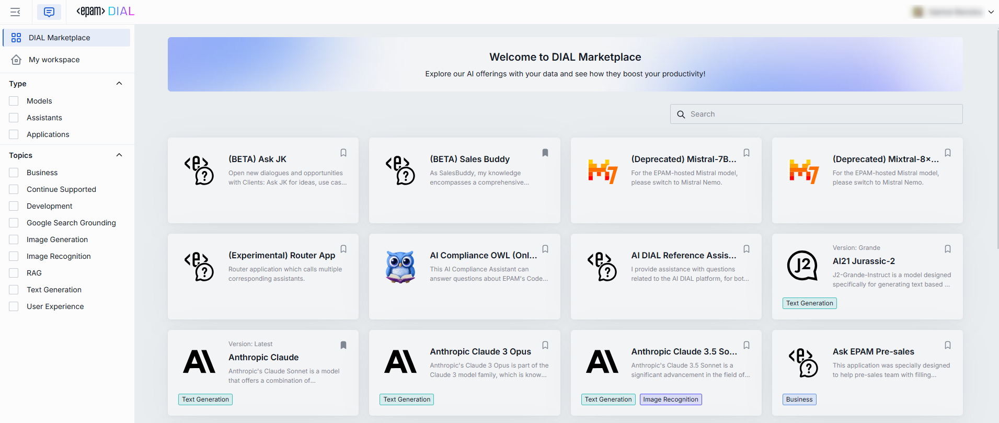

# DIAL Marketplace

> Watch our [demo video](/docs/video%20demos/demos/10.marketplace.md) to explore the capabilities of DIAL Marketplace.

DIAL Marketplace is a comprehensive hub for all applications, language models, and GenAI assistants available in the DIAL environment of your organization.

##### Collaboration Center

DIAL Marketplace is a powerful platform for fostering collaboration within organizations. It encourages the creation and publishing of custom applications, models, and assistants, thereby enhancing knowledge sharing and fostering GenAI experimentation. As a GenAI collaboration hub, DIAL Marketplace empowers your entire organization, while maintaining all required permissions and roles.

##### Development Studio

Another powerful feature of DIAL Marketplace is its functionality as a development studio, facilitating the rapid creation of low-code quick apps and providing access to a full-scale Integrated Development Environment (IDE) for Python code app development and deployment.

> For a detailed understanding of all that DIAL Marketplace has to offer, please refer to our  [User Guide](/docs/user-guide.md#marketplace).

