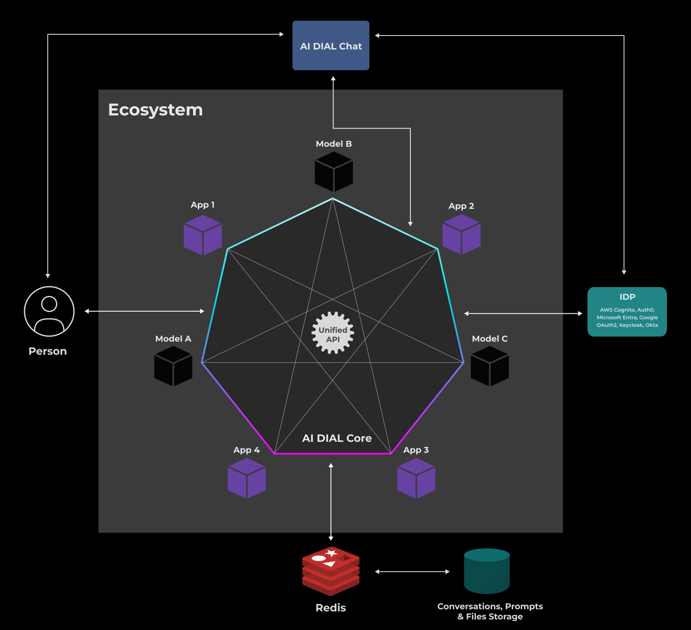
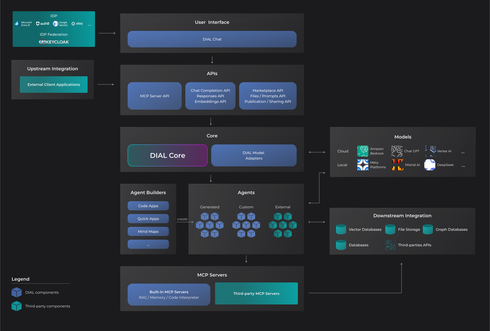
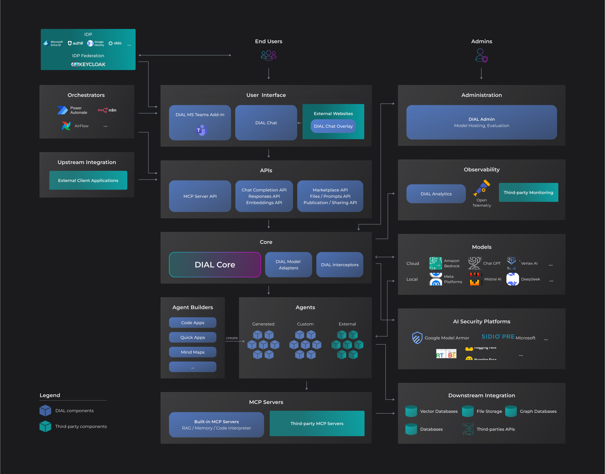

# DIAL Architecture

## Introduction

Modular architecture of DIAL allows implementing scalable and customized solutions to fit specific business needs. Its key building blocks include [Core](/docs/platform/0.architecture-and-concepts/3.components.md#dial-core) (the main and the only mandatory component), [Chat](/docs/platform/0.architecture-and-concepts/3.components.md#chat) (web application with user interface), [Adapters](/docs/platform/0.architecture-and-concepts/3.components.md#model-adapters) (align APIs of LLMs with the Universal API), [Applications](/docs/platform/0.architecture-and-concepts/3.components.md#extensions) (any custom logic with a conversation interface packaged as a ready-to-use solution), and a [persistent layer](/docs/platform/0.architecture-and-concepts/3.components.md#persistent-layer) that relies on a configured resilient and scalable cloud blob storage, with Redis layer on top to enhance performance. DIAL, allows to use various Identity Service Providers (IDPs) to manage user identities.

The [Unified API](https://dialx.ai/dial_api) enables universal connectivity between models (including models of different modalities), unified access to different embedding models, and facilitates communication with the DIAL Core for both external and internal clients. 

Applications can form an **ecosystem and interact with each other** through the Unified API with access to all DIAL Core features among which is [connectivity to models](/docs/platform/2.supported-models.md), file storage, access control, [per-request API keys](/docs/platform/3.core/3.per-request-keys.md) and other - see the following illustration. To enhance performance and fault tolerance, DIAL Core employs a proprietary [load balancer](/docs/platform/3.core/5.load-balancer.md) and a retry mechanism. This significantly reduces delays and boosts throughput especially during peak demand. Refer to the [document](/docs/platform/9.high-load-performance.md) with the overview of the performance tests to learn more.

You can have a [minimal installation](#minimal-installation) (it includes only DIAL Core) which can be easily installed even on a personal laptop or a desktop computer and is a good starting point for getting familiar with DIAL. To engage chat users and access different LLMs, you can have a setup with Core, Chat and model adapters – we call it a [standard installation](#standard-installation). This package is more suitable for use in enterprise-level production environments.

A modular architecture allows adding as many components as needed up to a [full platform landscape](#full-platform-landscape).

## Minimal Installation

DIAL has only one required component – [DIAL Core](/docs/platform/0.architecture-and-concepts/3.components.md#dial-core).

DIAL Core is headless. It exposes a **Unified Protocol** that can be used by custom extensions, internal and external API clients to get full access to all DIAL Core features.

Unified Protocol streamlines communication and fosters interoperability by eliminating the need for multiple protocols for each integration. It is fully compatible with OpenAI API and supports streaming, tokens, seeds, tools, and multi-modality.

## Standard Installation

A **Standard** installation of DIAL includes, Core (including API), Chat and Adapters to selected LLMs. It can also include custom applications, [agents](/docs/platform/0.architecture-and-concepts/4.agentic-platform.md) and tools.

This configuration enables the utilization of Chat functionality, allowing users to engage with LLMs, as well as the integration of custom extensions with DIAL Core through the DIAL API.

## Full Platform Landscape

The diagram below demonstrates the most complete landscape of DIAL ecosystem:

