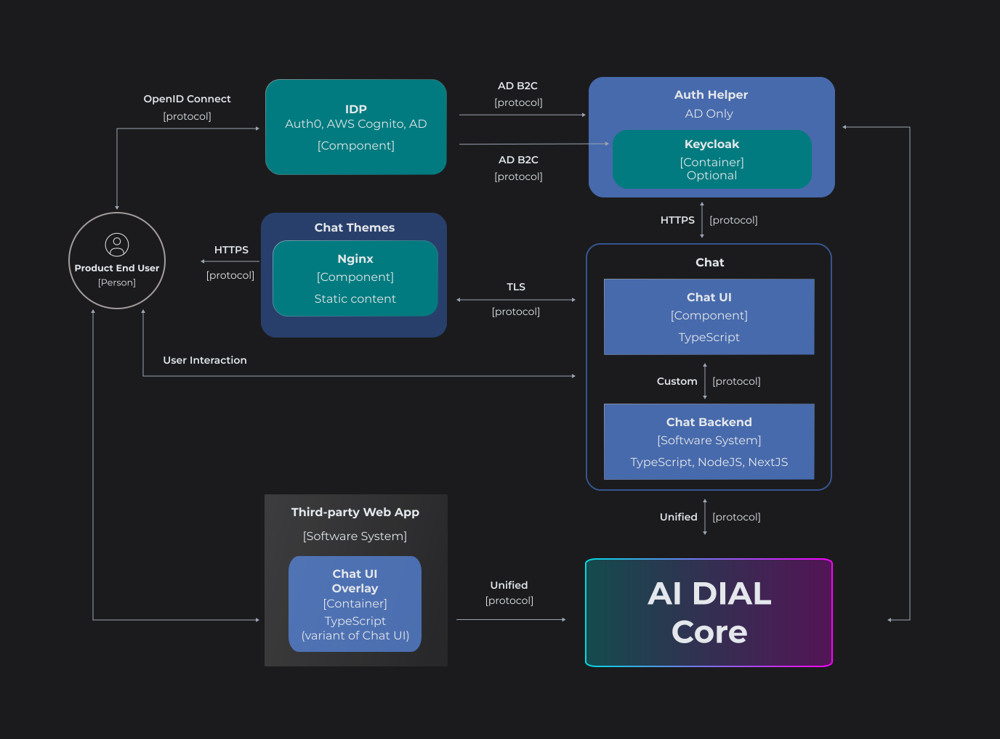
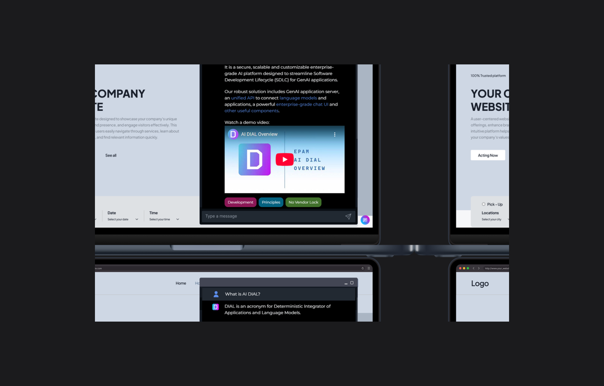

# DIAL Architecture

## Introduction

DIAL has modular architecture which enables implementing custom and scalable solutions to fit specific business needs. You can have a minimal setup installed even on your personal laptop that includes only DIAL Core to get familiar with the system and build on top of it adding more components from DIAL ecosystem.


## Components

### DIAL Core

> * Refer to [DIAL Core](https://github.com/epam/ai-dial-core) GitHub repository to access source code and additional documentation.
> * Refer to [Core](/docs/platform/3.core/0.about-core.md) to learn more about DIAL Core and its features.
> * Refer to [DIAL Core API Reference](https://dialx.ai/dial_api) to access API documentation.

**DIAL Core** serves as the primary and the **only mandatory** system component, acting as a **main integration center**, that employs a **Unified Protocol** ([OpenAI](https://learn.microsoft.com/en-us/azure/ai-services/openai/reference) compatible) for communication between internal and external clients, including all LLM models and applications to access all its features in a governed and unified manner.

### DIAL Chat

DIAL Chat is a default user interface of the DIAL Platform. It is a powerful and highly customizable application for end-users, with enterprise-grade access control, extendable functionality and ability to add custom GenAI applications.

> * Refer to [Chat](https://github.com/epam/ai-dial-chat) repository in GitHub to access source code and additional documentation.
> * Refer to [About Chat](/docs/platform/4.chat/0.about-chat.md) to learn about DIAL Chat features.
> * Refer to [User Guide](/docs/tutorials/0.user-guide.md) to see the detailed description of DIAL Chat features for end users.



### Chat Overlay

Chat Overlay allows adding DIAL Chat to a web application with zero effort by simply inserting a short HTML block.

> Refer to [Chat Overlay](https://github.com/epam/ai-dial-chat/blob/development/libs/overlay/README.md) repository in GitHub to access source code and additional documentation.

```html
<html>
  <head>
    <meta name="viewport" content="width=device-width, initial-scale=1.0" />
  </head>
  <body>
    <script type="module">
      import CHATAIOverlay from "./script.js";

      const chatAiOverlay = new CHATAIOverlay("http://localhost:3000");
      chatAiOverlay.load();
    </script>
  </body>
</html>
```




### Persistent Layer

DIAL architecture includes a persistent layer, that relies on a resilient and scalable cloud blob storage (you can configure either AWS S3, Google Cloud Storage, Azure Blob Storage or a local file storage) where all conversations, prompts, custom applications and user files will be stored. Redis Cache (either cluster or a standalone) is deployed on top of it to enhance performance.


This architecture facilitates the swift retrieval of stored resources, supporting features such as sharing and publication of conversations and prompts.

### Analytics

The DIAL Analytics Realtime tool uses diverse techniques such as embedding algorithms, clustering algorithms, frameworks, light-weight self-hosted language models, to analyze the conversation data and extract the needed results, which can be presented in tools such as Grafana for visualization.

> * Refer to [Analytics Realtime](https://github.com/epam/ai-dial-analytics-realtime) GitHub repository.
> * Refer to [Tutorials](/docs/platform/6.realtime-analytics-intro.md) to learn more about configuration and usage of this service.

Analytics Realtime tool is a sink of `vector.dev`. It does not retain any private information, such as user prompts or conversations, beyond the system. Instead, only the computed artifacts are collected and stored in time-series databases like InfluxDB or any scalable database capable of handling voluminous, constantly changing information.

Examples of the computed artifacts:

- Who has used the AI? – user hash, title, and never personal data such as names.
- What areas have people asked questions about?
- Are there any recurring patterns?
- Topics of conversations.
- Unique users.
- Sentiments.
- Cost analysis of the communication.
- Language of conversations.
- Any other calculated statistics based on conversations.

### Model Adapters

Model Adapters unify the APIs of respective AI models to align with the Unified Protocol of DIAL Core. Each Adapter operates within a dedicated container. Multi-modality allows supporting non-textual communications such as image-to-text, text-to-image, file transfers and more.

Compatibility with [Azure OpenAI API](https://learn.microsoft.com/en-us/azure/ai-services/openai/reference), makes it simple to add new adapters for language models or develop them with [DIAL SDK](https://github.com/epam/ai-dial-sdk).

DIAL includes adapters for all major LLM providers:

* [OpenAI](https://github.com/epam/ai-dial-adapter-openai)
* [Bedrock](https://github.com/epam/ai-dial-adapter-bedrock/?tab=readme-ov-file#supported-models)
* [Vertex](https://github.com/epam/ai-dial-adapter-vertexai/?tab=readme-ov-file#supported-models) 


### Admin

The DIAL Admin Panel provides system administrators with powerful and intuitive UI tools to configure, manage, and monitor the DIAL ecosystem.

> Refer to [Admin Panel](/docs/platform/11.admin-panel.md) to learn more.

### Agent Builders

Agent Builders can be seen as *factories* that enable end users create logical instances of predefined application types with custom configurations via intuitive UI tools.

DIAL includes pre-built builders for Quick Apps, Code Apps and Mind Maps. You can use DIAL SDK to create custom application builders.

### DIAL Bot for MS Teams

Modern workplaces rely on multiple specialized tools, but constantly switching between applications disrupts workflow and reduces productivity. We recognized that users needed access to DIAL's powerful AI capabilities without leaving their primary communication environment in Microsoft Teams.

> Refer to [DIAL Integration with Microsoft Teams](/docs/tutorials/1.developers/5.integrations/4.msteams-bot.md) to learn about DIAL bot for MS Teams.

## Upstream Integrations

TBD

External clients can use DIAL API to access DIAL resources.

## Downstream Integrations

DIAL enables agents to leverage any technology of their choice that is required to execute their logic be it external data sources, vector databases, files storages, graph databases, third-party APIs and more.

> You can use [DIAL SDK](https://github.com/epam/ai-dial-sdk/blob/development/README.md) to create custom agents.

## Orchestrators

DIAL is an open-ended platform that can be easily integrated with other process automation and orchestration systems like Power Automate, n8n or AirFlow.

> Refer to [Integration of DIAL with n8n](/docs/tutorials/1.developers/5.integrations/3.n8n-integration.md) to learn how DIAL can be integrated with n8n via a custom node.

## Identity Providers

DIAL provides native support for [OpenID Connect](https://openid.net/developers/how-connect-works/) and [OAuth2](https://oauth.net/2/) and offers [integration with various Identity Providers (IDP)](/docs/tutorials/2.devops/2.auth-and-access-control/2.configure-idps/0.overview.md) such as [AWS Cognito](/docs/tutorials/2.devops/2.auth-and-access-control/2.configure-idps/cognito.md), [Auth0](/docs/tutorials/2.devops/2.auth-and-access-control/2.configure-idps/auth0.md), [Google Identity](/docs/tutorials/2.devops/2.auth-and-access-control/2.configure-idps/google.md), [Microsoft Entra ID](/docs/tutorials/2.devops/2.auth-and-access-control/2.configure-idps/entraID.md), [Okta](/docs/tutorials/2.devops/2.auth-and-access-control/2.configure-idps/okta.md) and others, where you can define user roles and attributes to support your custom permissions model. Additionally, you can leverage [Keycloak](/docs/tutorials/2.devops/2.auth-and-access-control/2.configure-idps/keycloak.md) to work with even wider range of IDPs.

## MCP Servers

DIAL enables a seamless connectivity with external MCP servers and using them as tools in DIAL agents. You can also deploy custom MCP servers via Docker images using DIAL Admin.

> * Refer to [Admin](/docs/tutorials/3.admin/deployments-mcp.md) to learn how to deploy and use custom MCP Servers via Docker images.
> * Refer to [DIAL Chat User Guide](/docs/tutorials/0.user-guide.md#toolsets) to learn how end users can add custom toolsets leveraging external MCP servers.

## Security Platforms

DIAL enables development of custom interceptors that can leverage external AI security platforms (Google Model Armor, Presidio, Bert, Hugging Face and more) to process incoming and outgoing requests to AI models and applications.

DIAL uses interceptors to facilitate the implementation of a so-called Responsible AI approach and enforce compliance with internal and external privacy regulations and policies.

> * Refer to [Interceptors](/docs/platform/3.core/6.interceptors.md) to learn more.
> * Refer to [Interceptors GitHub Repository](https://github.com/epam/ai-dial-interceptors-sdk) to access examples and documentation.

## AI Models

DIAL allows you to access and use AI models from all major LLM providers, language models from the open-source community, alternative vendors, and fine-tuned micro models, as well as self-hosted or models listed on Hugging Face, NVIDIA NIM or DeepSeek.

> Refer to [Supported Models](/docs/platform/2.supported-models.md) to learn more.

## Observability Tools

DIAL leverages the power of OpenTelemetry (OTEL) to provide comprehensive system observability. This framework offers a unified and vendor-agnostic approach to collecting, processing, and exporting telemetry data, making it ideal for cloud-native environments.

DIAL empowers you with:

* **Unified Observability**: Gain a holistic view of your AI system's health and performance.
* **Vendor Agnosticity**: Flexibility to choose from a variety of compatible backend systems.
* **Deep Insights**: Analyze detailed metrics and traces to understand system behavior and identify bottlenecks.
* **Simplified Monitoring**: Standardized data collection and powerful visualization tools streamline the monitoring process.

> Refer to [Observability and Monitoring](/docs/platform/8.observability-intro.md) to learn more.
