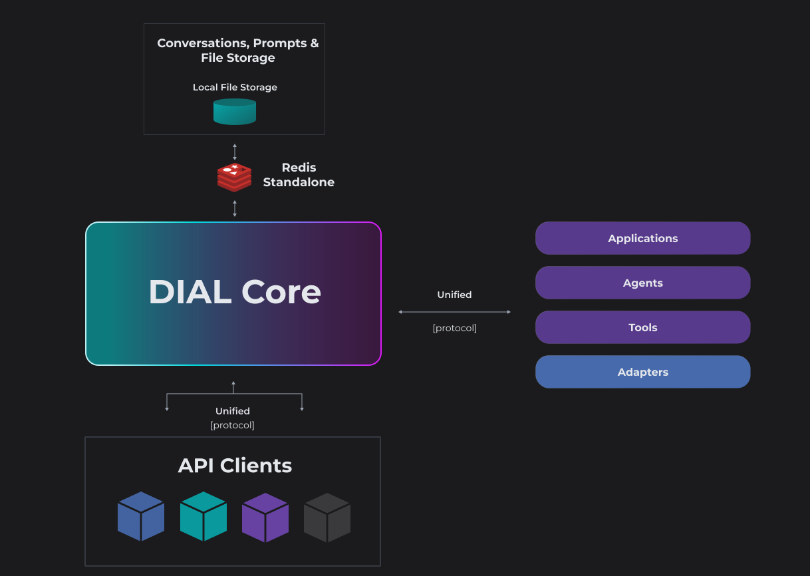
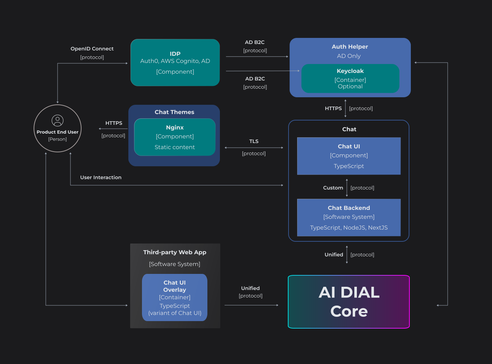
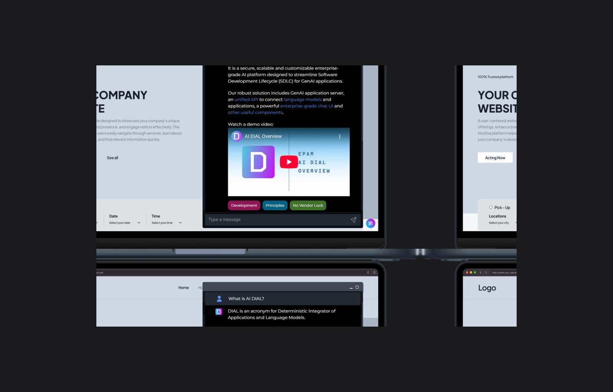
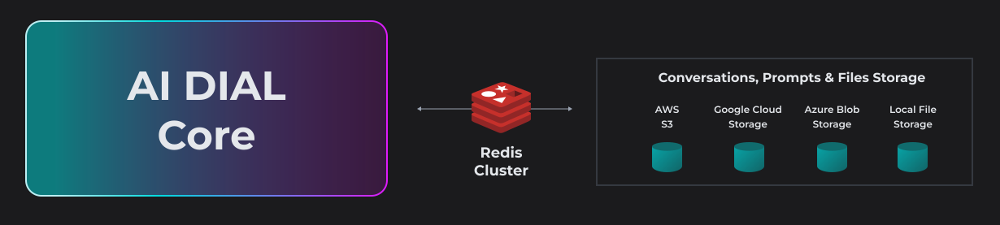
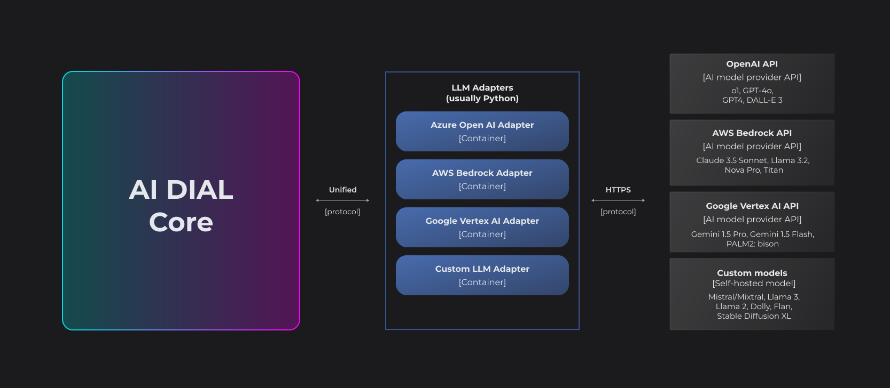

# DIAL Components

In this section, you can find an introduction to the components of the DIAL Platform.

> * Refer to [DIAL Stack](/docs/platform/0.architecture-and-concepts/4.stack.md) to see the technological stack and minimal resources that are required to operate the platform.
> * In the [Architecture Highlights](/docs/platform/0.architecture-and-concepts/2.architecture.md) you can find diagrams of a minimal, standard and complete ecosystem of DIAL Platform components.
> * Refer to the [Open Source Resources](https://dialx.ai/open-source) to see all the open-source components of DIAL.

## DIAL Core

> * Refer to [DIAL Core](https://github.com/epam/ai-dial-core) GitHub repository.
> * Refer to [Core](/docs/platform/3.core/0.about-core.md) to see documentation of DIAL Core and its features.

**DIAL Core** serves as the primary and the **only mandatory** system component, acting as a **main integration center**, that employs a **Unified Protocol** ([OpenAI](https://learn.microsoft.com/en-us/azure/ai-services/openai/reference) compatible) for communication between internal and external clients, including all LLM models and applications to access all its features in a governed and unified manner.



### Authentication and Authorization

DIAL provides native support for [OpenID Connect](https://openid.net/developers/how-connect-works/) and [OAuth2](https://oauth.net/2/) and offers [integration with various Identity Providers (IDP)](/docs/tutorials/2.devops/2.auth-and-access-control/3.configure-idps/0.overview.md) such as [AWS Cognito](/docs/tutorials/2.devops/2.auth-and-access-control/3.configure-idps/cognito.md), [Auth0](/docs/tutorials/2.devops/2.auth-and-access-control/3.configure-idps/auth0.md), [Google Identity](/docs/tutorials/2.devops/2.auth-and-access-control/3.configure-idps/google.md), [Microsoft Entra ID](/docs/tutorials/2.devops/2.auth-and-access-control/3.configure-idps/entraID.md), [Okta](/docs/tutorials/2.devops/2.auth-and-access-control/3.configure-idps/okta.md) and others, where you can define user roles and attributes to support your custom permissions model. Additionally, you can leverage [Keycloak](/docs/tutorials/2.devops/2.auth-and-access-control/3.configure-idps/keycloak.md) to work with even wider range of IDPs.

There are two methods of CORE API calls authorization supported: JWT token and key. Both options provide granular permission management, allowing you to control access to specific functionalities or resources. Additionally, these authorization methods also enable rate and cost control, giving you the ability to manage the frequency of API calls.

> Refer to [Authentication](/docs/platform/3.core/1.auth-intro.md) to learn how to authenticate API keys and JWT and to [Access & Cost Control](/docs/platform/3.core/2.access-control-intro.md) to learn how to implement a custom role-based access policy.

### Per-Request Keys

DIAL Core generates a unique key for each request, which is valid during the lifetime of this particular request.

Per-request keys are used to manage access to user and application files, enable open telemetry for tracing and realize cost control in a lifespan of a particular request. They also play a key role for external applications accessing language models and applications deployed in DIAL.

> Refer to [Per-Request Keys](/docs/platform/3.core/3.per-request-keys.md) to learn more.

### Load Balancer

For self-hosted models, you can use the standard load balancer (LB) capabilities provided by the target cloud platform. As for cloud-deployed models like Azure OpenAI and others, we typically rely on our custom-developed load balancing solution.

[Standard load balancer](/docs/platform/3.core/5.load-balancer.md#standard-load-balancer) forwards requests to one of the configured endpoints following the round-robin method. If an upstream returns an overload limit error such as a 429 (Too Many Requests) or a 504 (Gateway Timeout), the system attempts another upstream and temporarily excludes the one that generated the error. This strategy ensures efficient load distribution and fault tolerance for optimal performance and reliability. Refer to the [document](/docs/platform/9.high-load-performance.md) with the overview of the performance tests to learn more.

You can also configure a [more sophisticated load balancing strategy](/docs/platform/3.core/5.load-balancer.md#advanced-load-balancer) using a combination of weight and tiers, where endpoints get a share of requests with probability proportional to their weights.

DIAL load balancer can be configured to flexibly distribute load across model deployments, regions, and cloud subscriptions, prioritizing PTU deployments before using per-token-cost options.

> Refer to [Load Balancer](/docs/platform/3.core/5.load-balancer.md) to learn more.

### Interceptors

Interceptors is a middleware that modifies incoming or outgoing requests according to a specific logic. DIAL uses Interceptors to add custom logic to in/out requests for models and apps, enabling PII obfuscation, guardrails, safety checks, and beyond.

Interceptors can be defined and assigned in [DIAL Core dynamic settings](https://github.com/epam/ai-dial-core?tab=readme-ov-file#dynamic-settings).

> Refer to [Interceptors](/docs/platform/3.core/6.interceptors.md) to learn more.

### Rate Limits & Cost Control

A well-distributed rate-limiting mechanism ensures the control over the total number of tokens that can be sent to a model (typically a one-minute or 24-hour window) by any application.

> Refer to [Roles & Access Control](/docs/platform/3.core/2.access-control-intro.md) to learn how to configure limits for API keys and JWT.

### Extensions

DIAL is an open-ended system that can be extended to satisfy a variety of business cases. Extensions have freedom to employ a technology of their preference, be it any LLM framework, [LlamaIndex](https://github.com/run-llama/llama_index/tree/main), [LangChain](https://github.com/langchain-ai/langchain), [Semantic Kernel](https://github.com/microsoft/semantic-kernel?tab=readme-ov-file), vector DBs or any other.

Both :cloud: SaaS and :floppy_disk: Self-hosted editions of DIAL support the following extensions:

* **Agents**: Agents are DIAL-native applications and language models deployed in DIAL. Agents can be used as building blocks to create applications. Refer to [Agentic Platform](/docs/platform/0.architecture-and-concepts/4.agentic-platform.md) to learn more.
* **DIAL-native Applications**: DIAL-native apps have API that adheres to Unified protocol of DIAL. Refer to [DIAL-Native Apps](/docs/platform/3.core/7.apps.md) to learn about available application types and how to create DIAL-native apps.
* **Tools**: Tools allow your apps to interact with external services to perform specific actions. Register your tools using OpenAPI. Use tools in your agents or share with others on DIAL Marketplace.
* [Adapter](#llm-adapters): Adapters unify APIs of respective LLMs to align with the Unified Protocol of DIAL Core. Refer to [AI Model Providers](/docs/platform/2.supported-models.md) to view all the supported model adapters and language models.

You can use [DIAL SDK](https://github.com/epam/ai-dial-sdk) to develop DIAL-native apps and model adapters. Applications and model adapters implemented using DIAL SDK will be compatible with [DIAL API](https://dialx.ai/dial_api) that was designed based on [Azure OpenAI API](https://learn.microsoft.com/en-us/azure/ai-services/openai/reference).

> Refer to [Development Examples](https://github.com/epam/ai-dial-sdk/tree/development/examples)


:floppy_disk: [Self-hosted edition of DIAL](https://dialx.ai/editions) offers additional extensibility options:

* **Application Types**: In addition to standard application types, you can add new types. Application type is a schema-rich template for creating applications of a specific type. Refer to [Application Types](/docs/platform/3.core/7.apps.md#application-types) to learn more.
* **Custom Visualizers**: Visualizers are special applications for rendering a specific type of content in DIAL Chat UI. Refer to [Create Custom Visualizer](/docs/tutorials/1.developers/3.chat/2.create-custom-visualizer.md) to learn more.
* **Interceptors**: Create custom interceptors to modify in/out requests for models and apps, enabling PII obfuscation, guardrails, safety checks, and beyond. Refer to [Interceptors](/docs/platform/3.core/6.interceptors.md) to learn more.
* **Integrate Applications**: Create a single access point for all your apps built on other platforms by bringing them to DIAL. Register the app's UI to list it on Marketplace or API to access all DIAL Core features. Refer to [Enable Applications](/docs/tutorials/1.developers/4.apps-development/3.enable-app.md#enable-not-dial-native-apps) to learn more.

### Logging

DIAL uses an external open-source solution [Vector](https://vector.dev/docs/reference/configuration/sinks/) (a lightweight, ultra-fast tool for building observability pipelines) as a log collector to transfer a .log file with **chat completion logs** to [Analytics Realtime](/docs/platform/6.realtime-analytics-intro.md). All log data is stored securely within object storage solutions, such as Azure Blob Storage, Google Cloud Storage, Amazon S3 or any other "sink", which are provisioned within your organization's cloud infrastructure.

To comply with data privacy regulations, we anonymize all API calls before logging them, retaining only information essential for analytics.
You can create and use [secured API keys](/docs/platform/3.core/4.privacy.md#applications-audit-logs) to prevent the system from collecting logs for users requests and responses.

You can gather standard **system logs** (which do not contain user messages) from components using the ELK stack (Elasticsearch, Logstash, Kibana) or other log collection system.

> Refer to [Observability](/docs/platform/8.observability-intro.md) to learn more.

### Entitlements

DIAL allows you to establish a centralized attribute and role-based access control (ARBAC) with granular permission management.

The system can integrate with a range of Identity Providers (IDPs), enabling you to define roles and attributes for your users. You can then use these attributes to regulate access to resources such as  applications, conversations, prompts and files.

> Refer to [About Roles](/docs/platform/3.core/2.access-control-intro.md#about-roles) to learn about roles-based access to resources.

## Chat

DIAL Chat is a default user interface of the DIAL Platform. It is a powerful and highly customizable application for end-users, with enterprise-grade access control, extendable functionality and ability to add custom GenAI applications.

> * Refer to [Chat](https://github.com/epam/ai-dial-chat) repository in GitHub to see the project source code.
> * Refer to [About Chat](/docs/platform/4.chat/0.about-chat.md) to learn about DIAL Chat features.
> * Refer to [User Guide](/docs/tutorials/0.user-guide.md) to see the detailed description of DIAL Chat features for end users.



### Overlay

UI Overlay allows adding Chat to a web application with zero effort by simply inserting a short HTML block.

```html
<html>
  <head>
    <meta name="viewport" content="width=device-width, initial-scale=1.0" />
  </head>
  <body>
    <script type="module">
      import CHATAIOverlay from "./script.js";

      const chatAiOverlay = new CHATAIOverlay("http://localhost:3000");
      chatAiOverlay.load();
    </script>
  </body>
</html>
```



> Refer to [Chat Overlay](https://github.com/epam/ai-dial-chat/blob/development/libs/overlay/README.md) repository in GitHub to learn more.

### Themes

You can customize the Chat UI with Chat Themes.

> Refer to [DIAL Chat Themes](https://github.com/epam/ai-dial-chat-themes) GitHub repository to learn more.

## Persistent Layer

DIAL architecture includes a persistent layer, that relies on a resilient and scalable cloud blob storage (you can configure either AWS S3, Google Cloud Storage, Azure Blob Storage or a local file storage) where all conversations, prompts, custom applications and user files will be stored. Redis Cache (either cluster or a standalone) is deployed on top of it to enhance performance.



This architecture facilitates the swift retrieval of stored resources, supporting features such as sharing and publication of conversations and prompts.

## Auth Helper

Auth Helper is used to resolve challenges (such as access control issues with the `/userinfo` endpoint and retrieving user profile pictures) that may arise during integration with IDPs like Microsoft Entra ID.

It is a proxy service that implements OpenID-compatible Web API endpoints to avoid direct interaction with such IDPs.

> Refer to [DIAL Auth Helper](https://github.com/epam/ai-dial-auth-helper) repository in GitHub to learn more.

## Analytics Realtime

The DIAL Analytics Realtime tool uses diverse techniques such as embedding algorithms, clustering algorithms, frameworks, light-weight self-hosted language models, to analyze the conversation data and extract the needed results, which can be presented in tools such as Grafana for visualization.

> Refer to [Analytics Realtime](https://github.com/epam/ai-dial-analytics-realtime) GitHub repository.

Analytics Realtime tool is a sink of `vector.dev`. It does not retain any private information, such as user prompts or conversations, beyond the system. Instead, only the computed artifacts are collected and stored in time-series databases like InfluxDB or any scalable database capable of handling voluminous, constantly changing information.

Examples of the computed artifacts:

- Who has used the AI? – user hash, title, and never personal data such as names.
- What areas have people asked questions about?
- Are there any recurring patterns?
- Topics of conversations.
- Unique users.
- Sentiments.
- Cost analysis of the communication.
- Language of conversations.
- Any other calculated statistics based on conversations.

> Refer to [Tutorials](/docs/platform/6.realtime-analytics-intro.md) to learn more about configuration and usage of this service.


## LLM Adapters

LLM Adapters unify the APIs of respective LLMs to align with the Unified Protocol of DIAL Core. Each Adapter operates within a dedicated container. Multi-modality allows supporting non-textual communications such as image-to-text, text-to-image, file transfers and more.

> Refer to [Azure OpenAI](https://github.com/epam/ai-dial-adapter-openai), [GCP Vertex AI](https://github.com/epam/ai-dial-adapter-vertexai) and [AWS Bedrock DIAL](https://github.com/epam/ai-dial-adapter-bedrock) repositories in GitHub.



