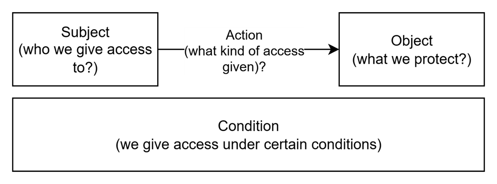

# Introduction to Access Control in DIAL

## Introduction

Access control is the system that determines who (Subject) can see and use different resources (Objects) within DIAL. At its most basic level, access control answers these questions:

- What are resources (Objects)?
- Who is allowed to access a particular resource (Subjects)?
- What actions Subjects are permitted to take with resources and under what conditions (authorization rules)?

In DIAL, we use access control to restrict access to resources (Objects) such as models, applications, files, conversations, prompts and toolsets while ensuring that authorized Subjects can still access and work with them efficiently. The system of access control is essentially a gatekeeper that verifies a Subjects's permissions before allowing them to interact with protected resources.

## Private and Public Spaces

Objects in DIAL can belong to either *Private* or *Public* logical space. 

* In **Private** space, Objects are only accessible to their owners and users with whom they have been explicitly [shared](/docs/tutorials/1.developers/1.work-with-resources/1.sharing.md). 
* In **Public** space, Objects are accessible to all users of the DIAL instance by default, with the possibility to restrict access to specific [roles](#roles). To become a part of the Public space, Object can be manually added via DIAL Core config files or [published](/docs/tutorials/1.developers/1.work-with-resources/0.work-with-publications.md) by users. 

## Roles

In DIAL Core, JWTs and API keys can be associated with specific roles to define what Objects they can access and the authorization rules.

Other than access control, roles in DIAL enable mechanisms for:

* **Usage Limits**: Roles can enforce limits on resource usage, preventing overuse and abuse. You can set daily, weekly, or monthly token limits for specific roles using a model. You can also define a global cost limits in USD for a specific role.
* **Custom Application Logic**: Developers can leverage roles within their applications to create custom behaviors. By accessing role information from user tokens, applications can tailor responses or restrict access to internal assets.
* **System Feature Access**: Roles manage access to system-level features, ensuring only authorized users have access. For example, only users with the "admin" role might be able to access the administration console.
* **Sharing Limits**: For a role, you can configure the maximum number of users who can accept a shared resource and the TTL of the invitation link.

> * You can use [DIAL Admin Panel](/docs/tutorials/3.admin/access-management-roles.md) and [DIAL Core configuration files](https://github.com/epam/ai-dial-core/blob/development/docs/dynamic-settings/roles.md) to define roles in DIAL.
> * Refer to Tutorials to learn how to associate roles for [JWT](/docs/tutorials/2.devops/2.auth-and-access-control/2.chat-users-roles.md#add-roles) and [API keys](/docs/tutorials/2.devops/2.auth-and-access-control/1.api-key-roles.md#roles-and-access-control-for-api-keys).
> * Refer to [Authentication](/docs/platform/3.core/1.auth-intro.md) to learn about authentication mechanisms in DIAL.

## DIAL Administrators

By default, DIAL defines one dedicated role - DIAL Administrator, which has elevated access over [DIAL Core configuration (dynamic settings)](https://github.com/epam/ai-dial-core?tab=readme-ov-file#dynamic-settings) and [DIAL Core API](https://dialx.ai/dial_api):

* Can command DIAL Core to reload *"dynamic settings"* configuration files without restarting DIAL Core services.
* Have access to certain DIAL Core APIs and Objects that other Subjects cannot access.
* Can add Objects to Public space, and moderate publication requests from other users.

> Refer to [Admin Panel](/docs/platform/11.admin-panel.md) to learn more.

## Managing Access Control 

DIAL Core manages access to all Objects via [configuration files](https://github.com/epam/ai-dial-core?tab=readme-ov-file#dynamic-settings) and [APIs](https://dialx.ai/dial_api). 

DIAL also provides the following UI tools to manage access control:

* [DIAL Chat](/docs/platform/4.chat/0.about-chat.md): In DIAL Chat UI, end-users can add, share and publish their resources, explicitly defining the scope of authorized users.
* [DIAL Admin Panel](/docs/platform/11.admin-panel.md): A UI for system administrators, where they can manage roles and publicly available resources among other features.

## Access Control Specification

> Refer to [Access Control document](/docs/platform/3.core/2.access-control-intro.md) for a deep dive into technical details of how DIAL handles access control.

