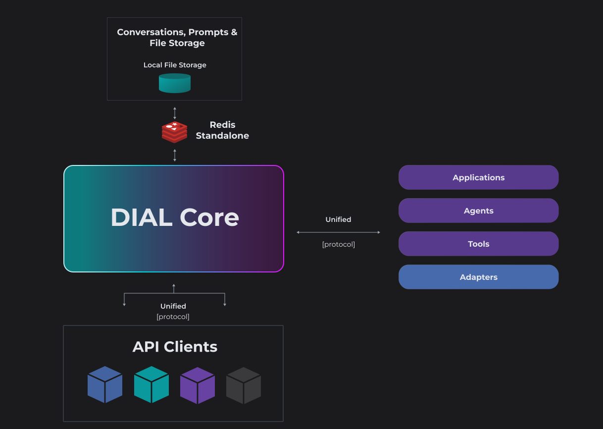

# DIAL Core Unified Completion API

DIAL Core provides a single [Unified API](https://dialx.ai/dial_api#operation/sendChatCompletionRequest), based on OpenAI API, for accessing all language models, embedding models and applications. 

https://youtu.be/PqIHlRKQMkw

The key design principle is to create a unification layer that allows all models and applications to be interchangeable, delivering a cohesive conversational experience and future-proof development of custom GenAI applications.

**Key features**:

* **Streaming**: Real-time token-level response delivery via server-sent events, enabling low-latency conversational experiences.
* **Token usage** (even in the streaming mode): Accurate token consumption reporting, including during streaming, for cost and quota management.
* **Seeds**: Support for seed parameters enables deterministic, reproducible outputs.
* **Tools**: Specialized utilities that streamline development by implementing standardized methods for LLMs to access external APIs.
* **Multi-modality**: Support for non-textual communications such as image-to-text, text-to-image, text-to-video, image-to-video, video-to-video file transfers and more.
* **Interactive controls**: Support for interactive controls in AI-generated response such as buttons, dropdowns, checkboxes and more for richer user interaction.
* **Custom renderers**: Ability to define custom renders for conversation chats using any visualization library.
* **Stages**: Ability to render steps AI agent has taken to generate the response.
* **State management**: Ability for maintaining and passing application's and AI model's state across requests.
* **Configuration management**: Ability to leverage application-specific configuration in the request.
* **Attachments**: Ability to accept and produce file attachments by applications.
