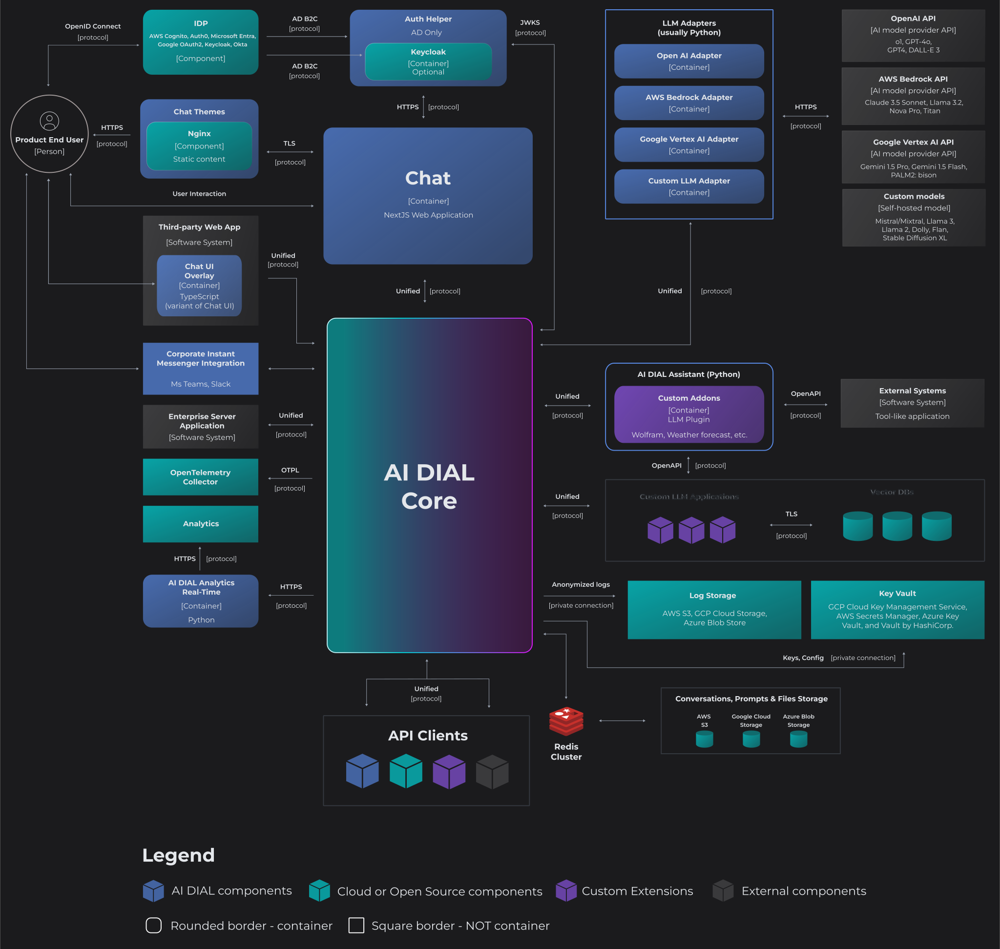

# DIAL Deployment Highlights

> Refer to [DevOps Tutorials](/docs/tutorials/2.devops/0.deployment/0.custom_apps_deployment.md) to view more in-depth information and tutorials for system deployment.

DIAL is designed to be lightweight and efficient, requiring minimal resources to run. It primarily relies on community-driven and cost-effective solutions, helping to reduce technical complexity, avoid licensing risks, and keep the total cost of ownership (TCO) as low as possible. Refer to [Stack](/docs/platform/0.architecture-and-concepts/6.stack.md) to learn more.

#### Installation Options

DIAL is designed with flexibility in mind, allowing you to deploy it on the cloud, as a self-hosted solution, or even install it on a personal laptop. 

Whether you're starting with a basic prototype or deploying a full-fledged production application, DIAL provides a smooth and scalable path. Begin with a minimal setup and seamlessly expand to a complete ecosystem as your needs evolve. 

The diagram below demonstrates the most complete landscape of DIAL ecosystem:

> Refer to [Architecture](/docs/platform/0.architecture-and-concepts/2.architecture.md) to view all installation options.

#### Infrastructure

DIAL is an enterprise-grade, open-source platform designed for flexibility and scalability. Its cloud-agnostic architecture empowers you to deploy on your preferred cloud platform — be it Microsoft Azure, AWS, GCP, or any other — or even on-premises. This freedom extends to hardware choices as well, allowing you to run DIAL on anything from a personal laptop to a full-fledged Minikube cluster.

Our commitment to openness means DIAL isn't tied to any specific vendor's products or services. You have the freedom to choose the infrastructure and tools that best suit your business needs, without vendor lock-in. 

> In [DIAL Helm](https://github.com/epam/ai-dial-helm) you find stable assemblies of Helm charts.

* To deploy DIAL, you can use a container technology of your choice, such as Docker, Podman, or other containerization tools. 
* For observability, you have the freedom to integrate with tools like the ELK Stack (Elasticsearch, Logstash, Kibana) or similar alternatives such as OpenTelemetry. 
* Monitoring can be achieved using Grafana or equivalent visualization tools, paired with Prometheus or other metrics collection systems. 
* For log aggregation, we use Vector.
* To manage secrets, the system can be integrated with a wide variety of popular secret management tools such as Azure Key Vault, Hashicorp Vault, AWS Secrets Manager, GCP Cloud Key Management.

#### Storage

You can operate DIAL both as a cloud or a self-hosted solution. In each case you will require storage for system and user files. 

* DIAL is cloud-agnostic, meaning you can use a BLOB storage of your choice (e.g. AWS S3, Google Cloud Storage, Azure Blob Storage) or a file system for self-hosted deployments.
* Redis is used for in-memory caching.
* If you want to collect real-time user analytics, you will need a time-series database (e.g. InfluxDB).

#### Authentication

DIAL provides native support for [OpenID Connect](https://openid.net/developers/how-connect-works/) and [OAuth2](https://oauth.net/2/) and offers integration with various [Identity Providers (IDP)](/docs/tutorials/2.devops/2.auth-and-access-control/3.configure-idps/0.overview.md) such as Azure AD, Auth0, Okta, Microsoft Entra, Google OAuth2, and AWS Cognito where you can define user roles and attributes to support your custom permissions model. Additionally, you can leverage Keycloak to work with an even wider range of IDPs.

Refer to [Authentication](/docs/platform/3.core/1.auth-intro.md) for more information.