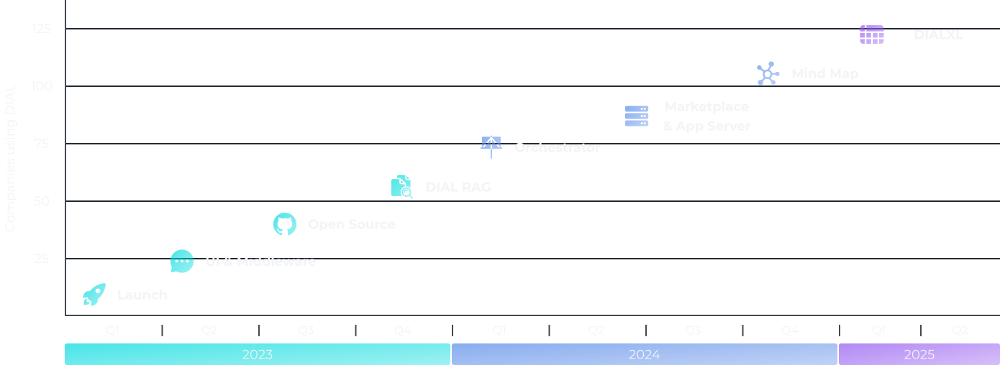

# Evolution & History of DIAL

## Our Journey

- **How it all started**: DIAL was born from a collaboration between industry experts and young champions, attracting AI talent from [EPAM](https://www.epam.com/).  
- **Taking off**: Internally [launched](https://www.epam.com/about/newsroom/press-releases/2023/epam-launches-dial-a-unified-generative-ai-orchestration-platform) at EPAM, achieving 30,000 weekly active users providing a secure, centralized access to AI tools through both API and UI.  
- **Driving business value**: DIAL evolves into a vendor-agnostic, [open-source](https://dialx.ai/open-source) middleware with a [Unified API](https://dialx.ai/dial_api), driving ROI through targeted AI solutions.  
- **Advanced applications**: Specialized apps like [DIAL RAG](/docs/video%20demos/2.Applications/1.dial-rag.md), [StatGPT](/docs/video%20demos/2.Applications/6.dial-statgpt.md), [DIAL XL](https://xl.dialx.ai/), and [Mind Map](/docs/video%20demos/2.Applications/mindmap-studio.md) are added to the DIAL ecosystem.  
- **App Server, Agentic Framework, Marketplace**: DIAL supports app hosting, development, and a [Marketplace](/docs/platform/4.chat/1.marketplace.md) for multi-agent solutions.  

DIAL roadmap is not publicly available, but you can refer to [About Us](https://dialx.ai/about-us) to learn more about DIAL history and evolution timeline.