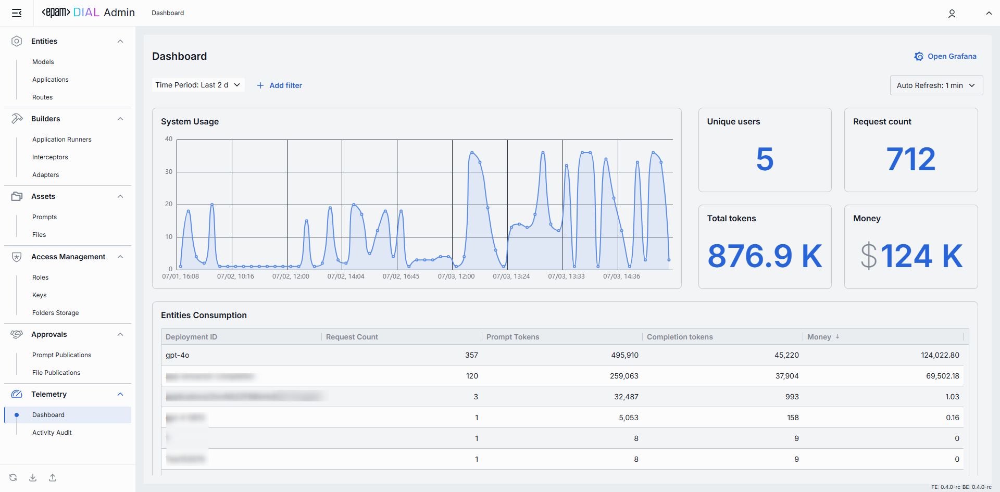

# DIAL Admin Panel

## Who is Admin

System admin(s) can be defined in [DIAL Core static settings](https://github.com/epam/ai-dial-core?tab=readme-ov-file#static-settings) in the `access.admin.rules`. Admin has the following privileges:

* Has `READ` and `WRITE` access to all system resources (conversations, prompt, files and applications).
* Can view, approve and reject publication requests from DIAL users. 
* Has access to all DIAL Core API endpoints.

## About Admin Panel

> Watch a [video demo](/docs/video%20demos/4.dial-admin-panel.md).

The DIAL Admin Panel provides system administrators tools to configure, manage, and monitor the DIAL ecosystem via a feature-rich, intuitive, and customizable interface. Admin Panel serves as a powerful UI for administrators. System configurations can be done also by a direct modification of a [DIAL Core config](https://github.com/epam/ai-dial-core).

### GitHub Repositories

Admin Panel is licensed under the Apache License 2.0. 

It is developed in two separate repositories for frontend and backend components:

* [Frontend](https://github.com/epam/ai-dial-admin-frontend)
* [Backend](https://github.com/epam/ai-dial-admin-backend)

Refer to DIAL Helm repository to see [DIAL Admin Helm Chart](https://github.com/epam/ai-dial-helm/tree/main/charts/dial-admin) documentation.

### User Guide

Refer to [Admin User Guide](/docs/tutorials/3.admin/home.md) for a detailed overview of the Admin Panel features and functionalities.

