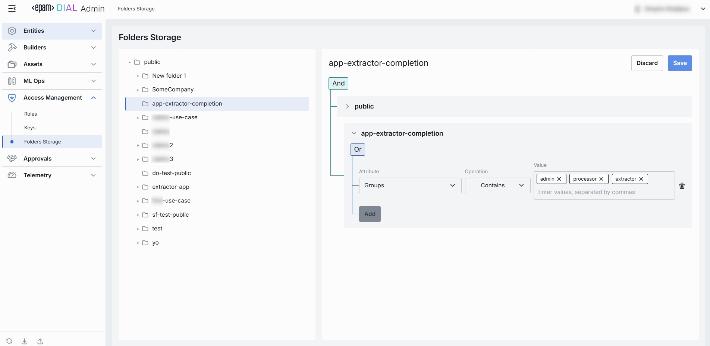
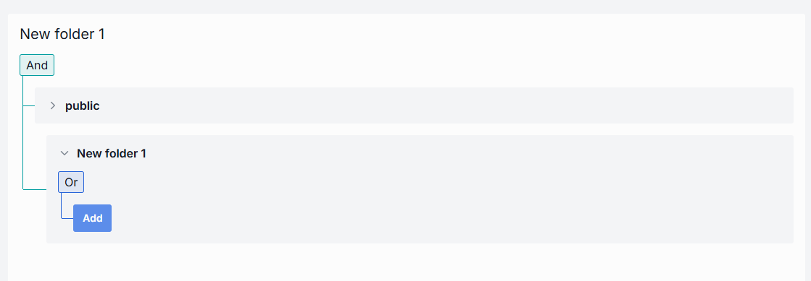
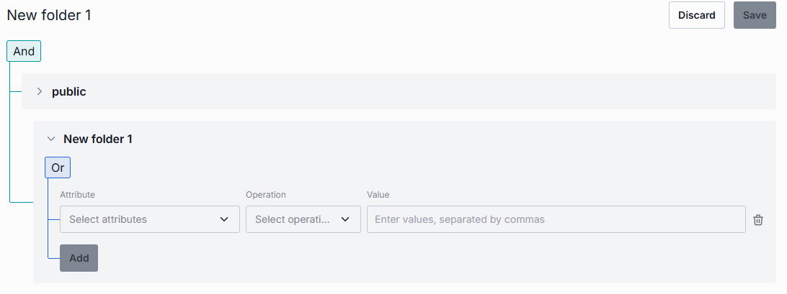

# Folders

## About Folders Storage

The Folders Storage section of DIAL Admin lets you control which users or roles can browse and access different directories in the [Assets (Prompts & Files) area](/docs/platform/11.admin-panel/assets-files.md). 
You define per-folder ACL rules - built on user groups, so only authorized users see or upload assets in each folder.

## Folders List

The **Folders Storage** section is where you manage all folders and their hierarchy.

### Folders Hierarchy

**Folders Structure (Left Pane)**: Shows a hierarchical view of all storage folders under the root.

| Element                  | Behavior                                                                                  |
|--------------------------|-------------------------------------------------------------------------------------------|
| **Public folder**        | Root folder visible to all users.                                                         |
| **User-defined folders** | Collapsible folders you create to group files by project, team, domain, or environment.   |
| **⯈ Icons**              | Click to expand or collapse subfolders, drilling down to the set of sub-folders you need. |

### Folders Permissions

When a folder is selected, the right pane displays its access-control rules. These determine who can view or add assets within that folder.

Rules can be nested under And / Or blocks to form complex access policies:
* **And**: All rules must be satisfied.
* **Or**: At least one rule must be satisfied.

> **Note**: All the parent folders' access rules apply along with the rules to the current

##### Adding & Removing Access Rules

1. Click the Add button beneath any rule node to append a new permission rule to the given folder. 
2. Specify attribute, operation and value. 

Click the trash-can icon on the right edge of any rule to remove it.

