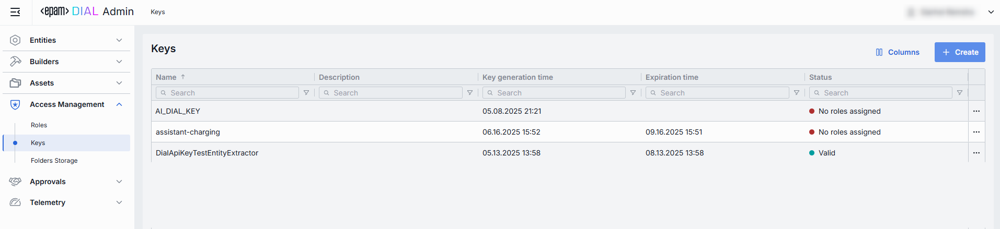

# Keys

## About API Keys

In DIAL, API Keys play a crucial role in managing access and ensuring security:

* API keys are used for authentication and access control.
* They can be configured to be secured and can have specific roles and limits assigned to them.
* API keys are essential for external applications accessing language models and applications deployed in AI DIAL.

> Refer to [Access & Cost Control](/docs/platform/3.core/2.access-control-intro.md#api-keys) to learn more. 

## Keys List

The Keys page provides a centralized view and management interface for all API keys in DIAL Admin.

##### Keys Grid

| Column | Definition |
|-------------------------|------------|
| **Name**     | User-friendly identifier of the key (e.g. `analytics-service-key`). Names help you map keys to consumers or services in logs and configs. |
| **Description**   | Optional notes explaining the key’s purpose, owner/team, or special instructions.   |
| **Key generation time** | Timestamp when the key was created. Useful for auditing and correlating key use with system changes or deployments.|
| **Expiration time**     | Timestamp when the key automatically becomes invalid. Setting expirations enforces regular key rotation. |
| **Status**   | Current key's lifecycle state.|

## Create Keys

Use the **Create Key** dialog to register a key in your DIAL instance. Once added, it appears in the **Keys** listing.

##### To create a new key

1. Click **Create** to invoke the **Create Key** modal.
2. In the modal, specify the following for the new key:

    | Field    | Required | Description & Use Cases|
    |---------------------|-----------|--------------|
    | **Name** | Yes   | A user-friendly identifier for the key. Use meaningful names to tie keys back to projects, environments, or teams.     |
    | **Description**     | No  | Optional free-form text. Document the key’s purpose, owner team, or usage context.   |
    | **Project**   | Yes   | Logical project or department grouping (e.g. “AnalyticsTeam”). Helps organize keys and apply cost/usage reporting by project.     |
    | **Key value** | Yes   | The actual secret string used for authentication. Initially hidden; click **👁️** to reveal. Press **Generate** to have its value automatically generated. |
    | **Validity Period** | Yes   | The period after which the key will become invalid. Use to enforce credential rotation and retirement.  |

3. Once all required fields are filled, click **Create**. The dialog closes and the new [key configuration](#key-configuration) screen is opened.

    > This entry will appear immediately in the listing once created.

## Key Configuration

##### Top Bar Controls

* **Delete**: Permanently removes this key definition. All related entities still bound to it may fail.
* **JSON Editor** (Toggle): Switch between the form-based UI and raw [JSON view](#json-editor) of the key’s configuration. Use JSON mode for copy-paste or advanced edits.
* **Rotation** button lets you safely refresh an existing API key in one step: click **Rotate**, paste or auto-Generate a new secret in the Key value field, pick a Validity period—the default is three months.

### Properties

In the Properties tab, you can view and manage all metadata and settings for a specific API key. 

| Field| Required | Description & Use Cases |
| -----|----------|--------------------|
| **Name** | Yes  | A user-friendly identifier for the key. Use meaningful names to tie keys back to projects, environments, or teams. |
| **Description**| No | Free-form text. Document the key’s purpose, owner team, or usage context (e.g. “Used by QH Data Ingestion pipeline”).   |
| **Project**    | Yes  | Logical project or department grouping (e.g. “QH”, “AnalyticsTeam”). Helps organize keys and apply cost/usage reporting by project.|
| **Project contact point** | No | Email of the responsible person or group.     |
| **Key value**  | Yes  | The actual secret string used for authentication. Initially hidden; click **👁️** to reveal. Press **Copy** to copy it to your clipboard. |
| **Secured**    | Yes  | Toggle whether the key value is treated as a “secure” credential.  |

### Roles

In the Roles tab, you can grant or revoke access to this API key by associating it with one or more DIAL Roles. Only clients possessing this key and belonging to one of the assigned roles can invoke protected Models or Applications.

| Column    | Description|
| --------------- |-----------------------------------------------|
| **Name**  | A unique identifier of the role.     |
| **Description** | User-friendly summary of the Role’s purpose. |

#### Add

1. Click **+ Add** (top-right of the Roles Grid).
2. **Select** one or more role in the modal.
3. **Confirm** to insert them into the table.

#### Remove
 
1. Click the **actions** menu in the role's line.
2. Choose **Remove** in the menu.

### JSON Editor

For advanced scenarios of bulk updates, copy/paste between environments, or tweaking settings not exposed in the form UI—you can switch to the **JSON Editor** in any key's configuration page.

##### Switching to the JSON Editor

1. Navigate to **Access Management → Keys**, then select the key you want to edit.
2. Click the **JSON Editor** toggle (top-right). The UI reveals the raw JSON.

> **TIP**: You can switch between UI and JSON only if there are no unsaved changes.

