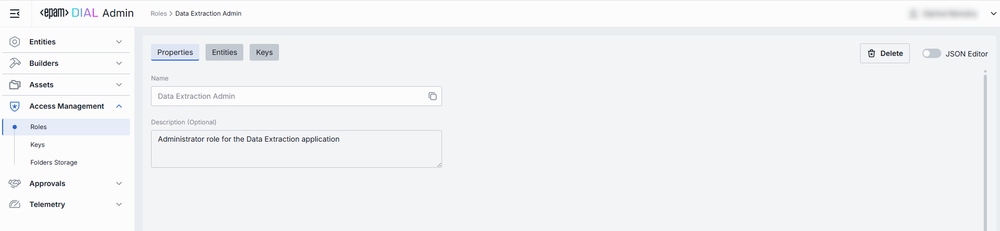
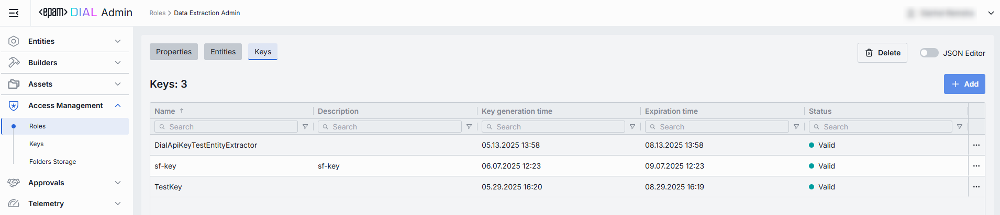

# Roles

## About Roles

Roles in DIAL are used to enable roles-based access to resources (applications, models, files, conversations, and prompts) and also for cost control. Here are the key aspects of roles in DIAL:

* **Resource Access Control**: Roles determine who can use specific resources like AI models or applications. For instance, you can grant "operator" users access to the "chat-gpt-35-turbo" model.
* **Usage Limits**: Roles can enforce limits on resource usage, preventing overuse and abuse. You can set daily, weekly, or monthly token limits for specific roles using a model.
* **Custom Application Logic**: Developers can leverage roles within their applications to create custom behaviors. By accessing role information from user tokens, applications can tailor responses or restrict access to internal assets.
* **System Feature Access**: Roles manage access to system-level features, ensuring only authorized users have access. For example, only users with the "admin" role might be able to access the administration console.

> * Refer to [Access & Cost Control](/docs/platform/3.core/2.access-control-intro.md) to learn more about how roles are used in DIAL.
> * Refer to [Tutorials](/docs/tutorials/2.devops/2.auth-and-access-control/1.api-key-roles.md) to learn how to configure roles for API keys.
> * Refer to [Tutorials](/docs/tutorials/2.devops/2.auth-and-access-control/2.chat-users-roles.md) to learn how to configure roles for JWT.

## Roles List

In Roles, you can define and manage the authorization groups used throughout DIAL. 

##### Roles Grid

| Column          | Definition & Use Case|
|-----------------|-----------------------------------------------------------------------------------------------------------|
| **Name**        | Unique, user-friendly identifier for the role (e.g. Data Extraction Admin, Analysts, Business User).     |
| **Description** | Free-form summary of the role’s purpose (e.g. “Business User role for the Data Extraction application”).  |

## Create Role

Use the **Create Role** dialog to register a role in your DIAL instance. Once added, it appears in the **Roles** listing.

##### To create a new role

1. Click **Create** to invoke the **Create Role** modal.
2. Define role's parameters:

    | Column          | Definition & Use Case|
    |-----------------|-----------------------------------------------------------------------------------------------------------|
    | **Name**        | Unique, user-friendly identifier for the role (e.g. Data Extraction Admin, Analysts, Business User).     |
    | **Description** | Free-form summary of the role’s purpose (e.g. “Business User role for the Data Extraction application”).  |

3. Once all required fields are filled, click **Create**. The dialog closes and the new role configuration screen is opened.

    > This entry will appear immediately in the listing once created.

## Role Configuration

#### Top Bar Controls

* **Delete**: Permanently removes this role.
* **JSON Editor** (Toggle): Switch between the form-based UI and raw JSON view of the role's configuration. Use JSON mode for copy-paste or advanced edits.

### Properties

In the Properties tab, you can define the identity and metadata for the role. These settings determine how the role appears throughout DIAL and help administrators understand its purpose.

| Field           | Required | Description                                                                 |
|-----------------|-----------|-----------------------------------------------------------------------------|
| **Name**        | Yes   | The unique identifier of the role, used in ACL selectors and in API calls. |
| **Description** | No        | Optional free-form text describing the role’s intended audience or use.     |

### Entities

In the Entities tab, you can assign which Models or Applications this role can access, and with what rate limits.

| Column                | Definition                       |
| --------------------- |-----------------------------------------------------------------------------------------------------------------------|
| **Display Name**      | User-friendly name of the entity (Model, Application, or Route) as shown in DIAL.                                    |
| **Version**           | Version tag of the entity (e.g. `v1.2`, `1.0.0`).                                                                     |
| **Description**       | Brief summary of the entity’s function.                                                                               |
| **Deployment ID**     | The unique internal identifier used by DIAL to call the resource’s endpoint.                                          |
| **Type**              | Resource category: one of **Models**, **Applications**, or **Routes**.                                                |
| **Tokens per minute** | Maximum number of tokens this role may consume per minute when calling this resource. “Unlimited” if no limit is set. |
| **Tokens per day**    | Maximum number of tokens this role may consume per day when calling this resource. “Unlimited” if no limit is set.    |
| **Tokens per week**   | Maximum number of tokens this role may consume per week when calling this resource. “Unlimited” if no limit is set.   |
| **Tokens per month**  | Maximum number of tokens this role may consume per month when calling this resource. “Unlimited” if no limit is set.  |

#### Add

1. Click **+ Add** (top-right of the Entities Grid).
2. **Select** one or more apps/models in the modal.
3. **Confirm** to insert them into the table.

#### Remove
 
1. Click the **actions** menu in the entity's line.
2. Choose **Remove** in the menu.

### Keys

In the Keys tab, you can issue, manage, and revoke API keys scoped specifically to this Role.

| Column                  | Definition      |
|-------------------------|------|
| **Name**                | A user-friendly identifier for this API key. Typically reflects the intended consumer or purpose (e.g. `mobile-sdk-key`, `data-extraction-worker`). |
| **Description**         | Optional free-text notes about this key’s purpose or scope.     |
| **Key generation time** | Timestamp when this key was created.|
| **Expiration time**     | Optional timestamp after which the key automatically becomes invalid. Blank means no expiration (i.e. permanent until manually revoked).             |
| **Status**              | Current state of the key.|

#### Add

1. Click **+ Add** (top-right of the Keys Grid).
2. **Select** one or more keys in the modal.
3. **Confirm** to insert them into the table.

#### Remove
 
1. Click the **actions** menu in the key's line.
2. Choose **Remove** in the menu.