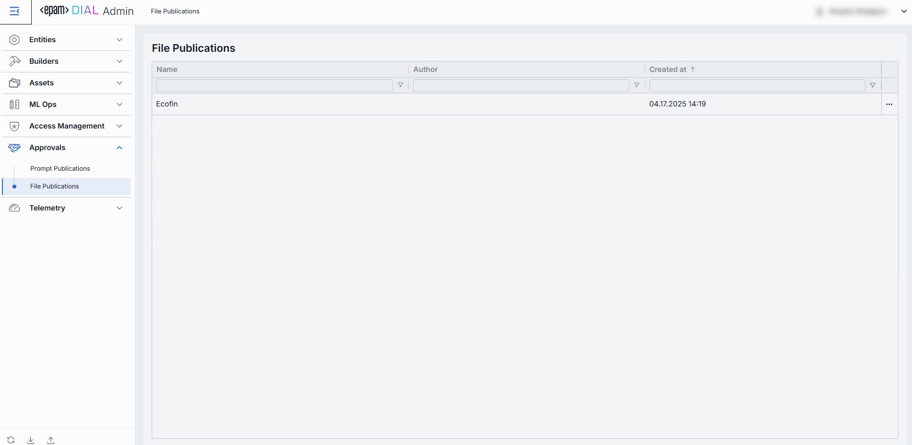
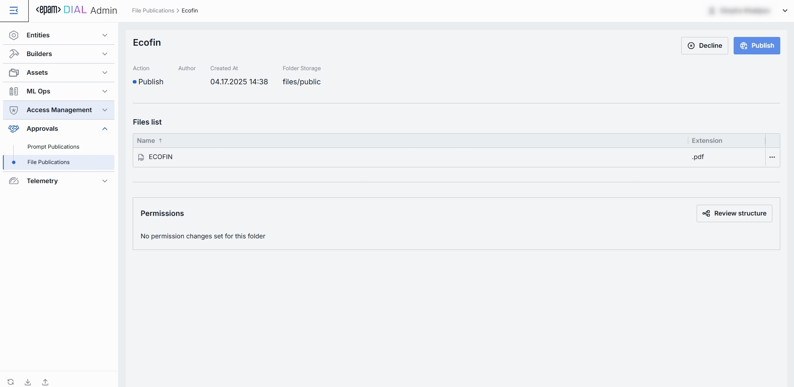

# File Publications

## What Are “File Publications” in DIAL?

File Publication in DIAL is the workflow by which end-users push files from their chat sessions into the shared “Assets → Files” library—but only after an administrator has reviewed and approved them.

Related DIAL Core documentation on File Publications:

* https://docs.dialx.ai/video%20demos/Chat/dial-publications

## File Publications Listing

The File Publications view under Approvals is where administrators review user-submitted files that have been shared from the DIAL chat interface and decide whether to publish them into the central Assets → Files repository or to decline them.

### 1. Navigate to File Publications

In the sidebar, expand **Approvals** and click **File Publications**.

### 2. File Publications Grid

**Columns are**:

| Column         | Definition                                                                                                                      |
|----------------|---------------------------------------------------------------------------------------------------------------------------------|
| **Name**       | The user-friendly name of the file submitted for publication.                                                                  |
| **Author**     | The username of the one that submitted the file.                                                                                |
| **Created at** | Timestamp when the file was submitted for publication. Sorted ascending/descending to find newest or oldest submissions easily. |

**Filtering & Sorting**
* Each column header has sort arrows; click to reorder.
* Beneath each header is a filter box - type text to narrow the list in real time.

Click on any row to review the respective file publication request.

## File Publications - Review Page

When a DIAL Core user publishes a file from a chat session, it appears here for administration approval. 
On the File Publications → Review page, you inspect each file-request and either Publish it into the central Assets store or Decline it (with feedback).

### Top Bar Controls

* **Publish**: Accept the submission. This adds the file into the Assets → Prompts folder (under the specified Folder).
* **Decline**: Reject the submission. Prompts you to enter a decline reason that will be sent back to the author for revision.

### Fields

| Element            | Definition                                                                       |
|--------------------|----------------------------------------------------------------------------------|
| **Action**         | Suggested action. Is **Publish** when file publication is pending review.        |
| **Author**         | Username of the account that created the file publication request in DIAL Core.  |
| **Created At**     | Timestamp of when the file was submitted for review.                             |
| **Folder Storage** | Default target folder under **Assets → Files** if published.                     |
| **File Name**      | File display name.                                                               |
| **File Extension** | File type/extension (e.g. .pdf, .csv, .docx).                                    |
| **Permissions**    | Shows the target folder's place in folders hierarchy and respective permissions. |