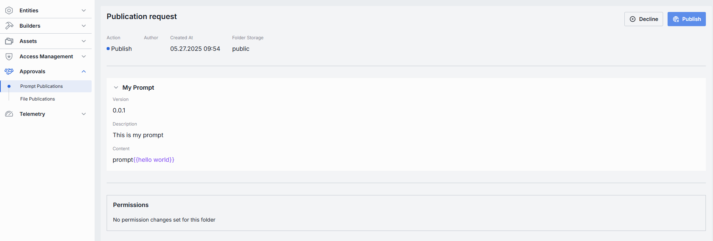

# Prompt Publications

## About Prompt Publications

DIAL offers [API](https://dialx.ai/dial_api#tag/Publications/operation/createPublication) for creating publication requests for resources, including prompts.
In Prompt Publications, administrators can view and manage publication requests. Prompts from approved requests are available in [Assets → Prompts](/docs/platform/11.admin-panel/assets-prompts.md).

> * Refer to [Publications](/docs/platform/7.collaboration-intro.md#publication) to learn more about publications in DIAL.
> * Refer to [User Guide](/docs/tutorials/0.user-guide.md#prompts) to learn how to work with prompts in DIAL Chat.

### Prompt Publications List

The Prompt Publications screen shows all prompts that end-users have submitted for publication from the DIAL Chat UI. 

##### Prompt Publications Grid

| Column         | Definition                                                                                                                        |
|----------------|-----------------------------------------------------------------------------------------------------------------------------------|
| **Name**       | The user-friendly name of the prompt submitted for publication.                                                                  |
| **Author**     | The username of the one that submitted the prompt.                                                                                |
| **Created at** | Timestamp when the prompt was submitted for publication. Sorted ascending/descending to find newest or oldest submissions easily. |
| **Folder Storage** | The location on [Assets](/docs/platform/11.admin-panel/assets-prompts.md). |

### Prompt Publication Review

In the Prompt Publications – Review page you can inspect prompt publication requests and decide whether to **Publish** it into the shared [Assets → Prompts](/docs/platform/11.admin-panel/assets-prompts.md) library or **Decline** it.

* **Publish**: Accept the publication request. This adds the prompt into the [Assets → Prompts](/docs/platform/11.admin-panel/assets-prompts.md) folder (under the specified Folder).
* **Decline**: Reject the publication request. Prompts you to enter a decline reason that will be sent back to the author.

| Element                | Definition                                                                        |
|------------------------|-----------------------------------------------------------------------------------|
| **Action**             | Suggested action. The **Publish** action button is highlighted when review is pending.                            |
| **Author**             | Username of the account that created the prompt publication request. |
| **Created At**         | Timestamp of when the prompt publication request was submitted for review.                            |
| **Folder Storage**     | The default target folder under [Assets → Prompts](/docs/platform/11.admin-panel/assets-prompts.md), if published.                    |
| **Prompt Identifier**  | Header showing the prompt’s **name**.                                             |
| **Version**            | Version string assigned by the author.                                            |
| **Description**        | Optional user-friendly summary provided by the author.                           |
| **Content**            | The actual prompt string.         |
| **Permissions**        | Shows the target folder's place in [folders hierarchy](/docs/platform/11.admin-panel/access-management-folders-storage.md) and respective permissions.  |
