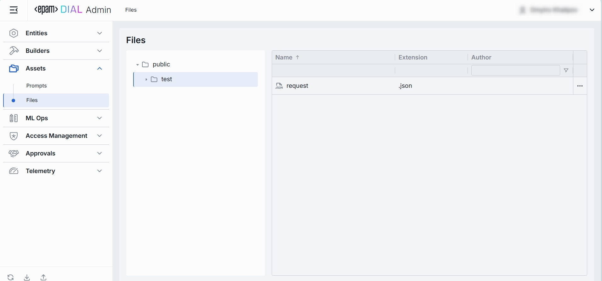
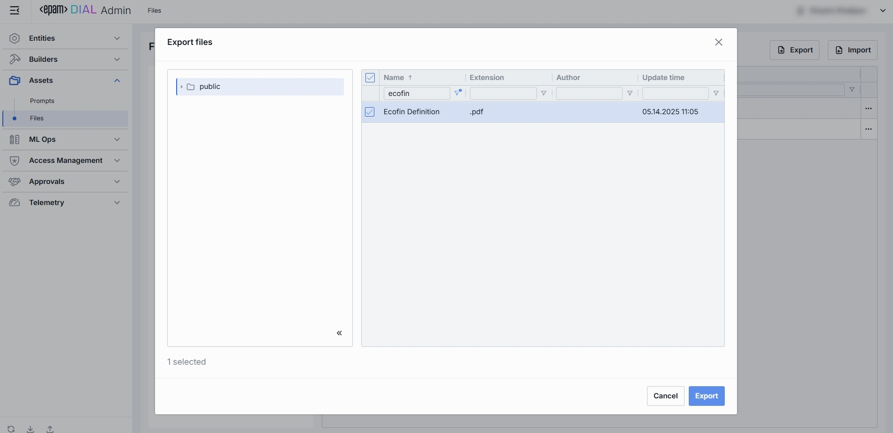
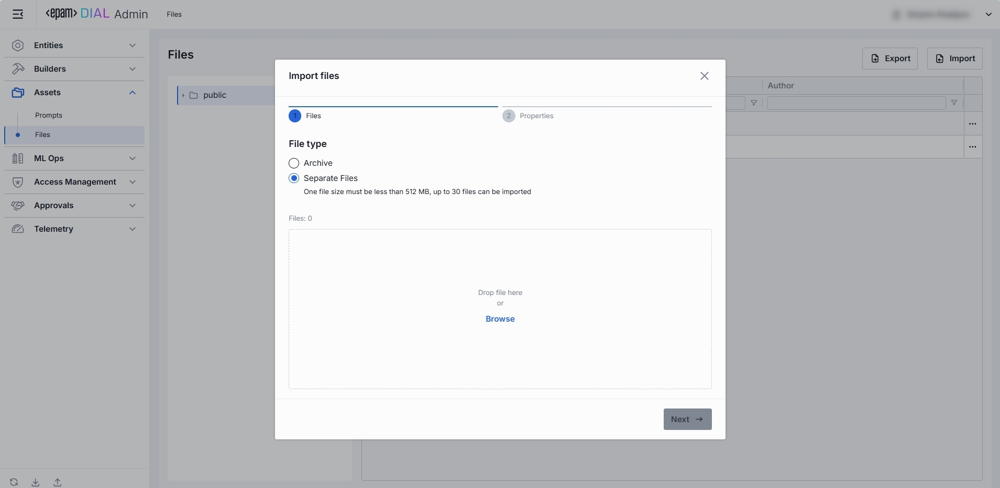
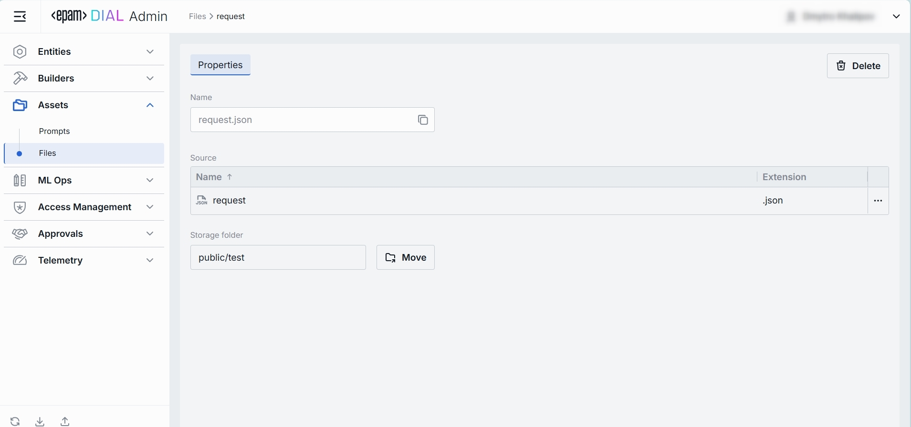

# Files

## What Is a stored “File” in DIAL?

Files in DIAL are arbitrary binary or text assets—JSON, CSV, PDF, images, etc. that you upload and version under Assets → Files so your Models and Applications can reference them at runtime.

## Files Listing

The Files section under Assets → Files is where you manage all binary or document assets—JSON, CSV, PDF, images, etc.

### 1. Navigate to Files

In the sidebar, expand **Assets** and click **Files**.

### 2. Files Grid and Folders

**Folders Structure (Left Pane)**:

| Element                  | Behavior                                                                                |
|--------------------------|-----------------------------------------------------------------------------------------|
| **Public folder**        | Root folder visible to all users, containing shared files.                              |
| **User-defined folders** | Collapsible folders you create to group files by project, team, domain, or environment. |
| **⯈ Icons**              | Click to expand or collapse subfolders, drilling down to the set of files you need.     |

**Files Grid (Right Pane)**:

| Column            | Definition                                                                      |
|-------------------|---------------------------------------------------------------------------------|
| **Name**          | Technical key for the file (e.g. `exclusion-words`).                            |
| **Extension**     | The original extension of the file.                                             |
| **Author**        | Username or system ID who created or last modified this file.                 |
| **••• (Actions)** | Row menu to **Move to another folder** or **Delete** the file.   |

**Filtering & Sorting**
* Each column header has sort arrows; click to reorder.
* Beneath each header is a filter box - type text to narrow the list in real time.

## Export Files

The **Export** feature on the **Files** Listing page lets you package one or more stored files into a downloadable archive. 
This is helpful for backup, sharing, or migrating supporting assets alongside your DIAL configuration.

### 1. Launching the Export Modal

1. Navigate to **Assets → Files**.
2. Click the **Export** button at the top right.

### 2. Select Folder

* **Browse** your storage hierarchy exactly as in the main listing.
* **Select** the folder whose contents you want to export.

> Clicking a folder highlights it and lists its files in the right pane.

### 3. Choose Files

* **Check** the box next to each file you wish to include.
* Alternatively, use **Select All** checkbox in the header to export every file in the chosen folder.

Click **Export** to start the process.

> Files are downloaded as .zip archive with all selected files within it.

## Import Files

The **Import** feature on the **Files** Listing page allows you to upload external files into DIAL’s asset storage. 
This is useful for adding reference documents, data or other supporting assets.

### 1. Launching the Import Modal

1. Navigate to **Assets → Files**.
2. Click the **Import** button at the top right.

### 2. Select File Type

* **Archive**:
  * Upload a single ZIP archive containing one or more files.
  * Only 1 archive file can be imported at a time.

* **Separate Files**:
  * Upload up to 30 individual files.
  * Each file must be ≤ 512 MB.
  
### 3. Select Files 

* **Drag & drop** files (or archive) into the drop zone.
* Or click **Browse** to open your local file browser.

Once files appear in the list, click **Next** to proceed.

### 4. Select Conflicts Resolution Strategy

When an incoming file’s name and path clashes with an existing file, the conflict arises. You have three conflict-resolution strategies:

| Option            | Description                                                                                                                               |
| ----------------- |-------------------------------------------------------------------------------------------------------------------------------------------|
| **Override**      | Replace all existing files with the new ones.                                                                                             |
| **Skip**          | Do not import the conflicting files; keep the existing files unchanged.                                                                   |
| **Edit manually** | Rename incoming files one by one. Each conflicting file is flagged with red and becomes editable - update its **Name** to avoid conflict. |

Once all conflicts are resolved, click **Finish**.

## File Configuration - Top Bar Controls

* **Delete**: Permanently removes this file from your DIAL instance.

## File Configuration - Properties Tab

The Properties tab within Assets → Files lets you inspect and manage an individual file asset’s or move it across folders.

### 1. Properties Fields

| Field                | Required? | Definition & Use Case                                                                                                                  |
|----------------------|-----------|----------------------------------------------------------------------------------------------------------------------------------------|
| **Name**             | -         | The filename including extension (e.g. request.json, lookup.csv). Display-only but with a copy-to-clipboard button for easy reference. |
| **Source/Name**      | -         | File name without extension (e.g. request). Clicking on additional actions button you can download the file.                           |
| **Source/Extension** | -         | file type (e.g. .json, .csv, .pdf).                                                                                                    |
| **Storage Folder**   | **Yes**   | The actual path of the file in the folders hierarchy. Allows you to move the file across folders.                                      |  
