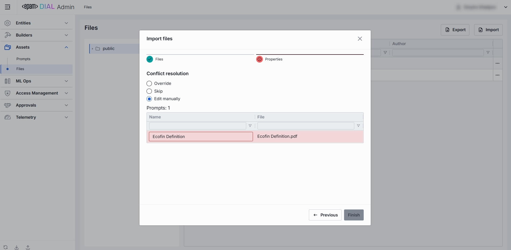

# Files

## About Files

Files in DIAL are arbitrary binary or text assets (JSON, CSV, PDF, images, etc.) your models and applications can reference at runtime.

> Refer to [User Guide](/docs/tutorials/0.user-guide.md#attachments) to learn more about attachments.

## Files List

In Files, you can manage all binary or document assets like JSON, CSV, PDF, images, etc.

### Grid and Folders

##### Folders Structure (Left Pane)

| Element                  | Behavior                                                                                |
|--------------------------|-----------------------------------------------------------------------------------------|
| **Public folder**        | A root folder with hared files accessible to all users.                              |
| **User-defined folders** | Collapsible folders you create to group files by project, team, domain, or environment. |

##### Files Grid (Right Pane)

| Column            | Definition                                                                      |
|-------------------|---------------------------------------------------------------------------------|
| **Name**          | A technical key for the file (e.g. `exclusion-words`).                            |
| **Extension**     | The original extension of the file.                                             |
| **Author**        | A username or system ID of the user who created or last modified this file.                 |
| **Actions** | Row menu with actions:   - Move to another folder - Delete  |

## Export

Use Export to bulk download files. This is helpful for backup, sharing, or migrating supporting assets alongside your DIAL configuration.

##### To export files:

1. Click **Export** in the toolbar to launch the export modal.
2. Select a folder from which you want to export files. Clicking a folder highlights it and lists its files in the right pane.
3. Choose the files you want to export by checking their boxes. Alternatively, use **Select All** checkbox in the header to export every file in the selected folder.
4. Click **Export** to start the process. Files are downloaded as .zip archive.

## Import

Use Import to upload external files into DIAL’s assets storage. This is useful for adding reference documents, data or other supporting assets.

##### To import files:

1. Click **Import** in the toolbar to launch the import modal.
2. Select the type of files you want to import. Drag & drop files or an archive into the drop zone, or click **Browse** to open your local file browser.
    * **Archive** (single ZIP file). Only 1 archive file can be imported at a time.
    * **Separate Files** (up to 30 individual files). Each file must be ≤ 512 MB.
3. Once files appear in the list, click **Next** to proceed.
4. Resolve any conflicts by choosing a strategy for handling files with the same name and path:
   * **Override**: Replace existing files with the new ones.
   * **Skip**: Do not import conflicting files and keep existing files unchanged.
   * **Edit manually**: Rename incoming files one by one to avoid conflicts. Each conflicting file is flagged with red color and becomes editable - update its **Name** to avoid conflicts.
5. Once all conflicts are resolved, click **Finish** to complete the import.

    

## Configuration

##### Top Bar Controls

* **Delete**: Permanently removes the selected file from your DIAL instance.

### Properties

In the Properties tab, you can view and manage files, including moving them across folders.

| Field                | Required | Definition & Use Case    |
|----------------------|-----------|-------------------------------------|
| **Name**             | -         | The filename including extension (e.g. request.json, lookup.csv). Display-only but with a copy-to-clipboard button for easy reference. |
| **Source/Name**      | -         | The name of the file without the extension (e.g. request). To download, click on additional actions button.|
| **Source/Extension** | -         | The file type (e.g. .json, .csv, .pdf).   |
| **Storage Folder**   | Yes   | The actual path of the file in the folders hierarchy. Allows you to move the file across folders. |  
