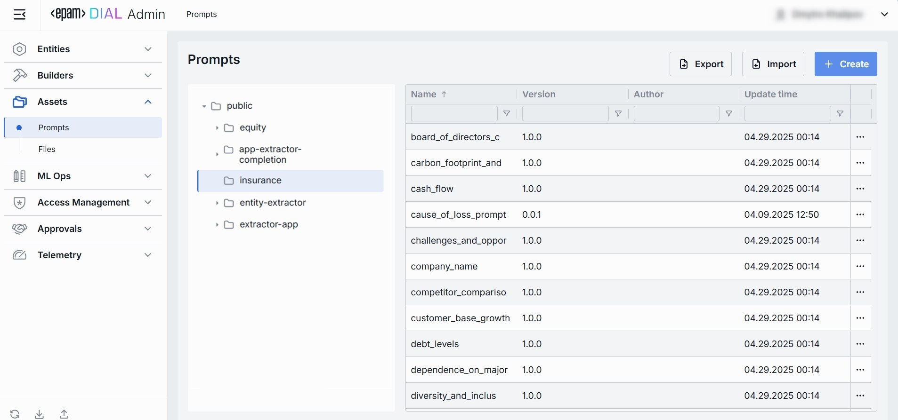

# Prompts

## What Is a stored “Prompt” in DIAL?

Prompts in DIAL are your reusable, versioned text templates that can be used either in the chat or by custom applications.
Everything from system instructions (“You are a financial advisor…”) to few-shot examples and user-message wrappers.

## Prompts Listing

The Prompts section is where you centrally manage reusable system‐ and user‐prompt templates. 
Organize prompts into folders, version them, and then use them in applications or chats.

### 1. Navigate to Prompts

In the sidebar, expand **Assets** and click **Prompts**.

### 2. Prompts Grid and Folders

**Folders Structure (Left Pane)**:

| Element                     | Behavior                                                                                  |
|-----------------------------|-------------------------------------------------------------------------------------------|
| **Public folder**           | Root folder visible to all users, containing shared prompt libraries.                     |
| **User-defined folders**    | Collapsible folders you create to group prompts by project, team, domain, or environment. |
| **⯈ icon next to a folder** | Click to expand or collapse subfolders, drilling down to the set of prompts you need.     |

**Prompts Grid (Right Pane)**:

| Column            | Definition                                                                         |
|-------------------|------------------------------------------------------------------------------------|
| **Name**          | Technical key for the prompt (e.g. `customer_onboarding_intro`).                   |
| **Version**       | Semantic version of this prompt template (e.g. `1.0.0`).                           |
| **Author**        | Username or system ID who created or last modified this prompt.                    |
| **Update time**   | Timestamp of the last modification, helping you track freshness and audit changes. |
| **••• (Actions)** | Row menu to **Duplicate**, **Move to another folder**, or **Delete** the prompt.   |

**Filtering & Sorting**
* Each column header has sort arrows; click to reorder.
* Beneath each header is a filter box - type text to narrow the list in real time.

## Create Prompt

Use the Create Prompt dialog to add a new reusable prompt template to your DIAL instance. Once added, it appears in the **Prompts** listing.

### 1. Select folder
Before clicking + Create, select the folder in the left tree where you want this prompt to live (e.g. public/marketing, private/project-x).
The new prompt will be placed in that folder.

### 2. Hit **Create** button 

Opens the **Create Prompt** modal.

### 3. Define key parameters

In the modal, specify the following for the new prompt:

| Column          | Definition                                                                                                                                          |
|-----------------|-----------------------------------------------------------------------------------------------------------------------------------------------------|
| **Name**        | Unique identifier for the interceptor (e.g. reject-blacklisted-words, audit-logger). This key is used when you attach it to a Model or Application. |
| **Version**     | Semantic version string (e.g. 1.0.0, 0.1.2) that enables safe updates.                                                                              |
| **Description** | Free-text summary of the prompt’s purpose and key placeholders.                                                                                     |

### 4. Click Create 

Once all required fields are filled hit **Create** button. The dialog closes and the new prompt configuration screen opened.

  > This entry will appear immediately in the listing once created.

## Export Prompts

The Export feature in the Prompts Listing page lets you bundle selected prompt definitions and a download them. 
This is useful for migrating prompts between environments, sharing sets of prompts with another users, or keeping a point-in-time backup.

### 1. Launching the Export Modal

1. Navigate to **Assets → Prompts**.
2. Click the **Export** button in the top-right toolbar.

### 2. Selecting Source Folder

**Folder Tree (left pane)**:
1. Browse the hierarchical tree of folders.
2. **Select** the folder whose prompts you wish to export (the currently highlighted folder is the source).

> You can export prompts from multiple folders at one go.

### 3. Choosing Prompts & Versions

**Prompt List (right pane)**:
1. **Select** prompts by checking the boxes in each row. 
2. Select desired versions to export in the respective column's dropdown.

> You may mix and match versions (e.g. export `prompt_A` v1.0.0 alongside `prompt_B` v0.1.2).

After configuring, click **Export** to start.

## Import Prompts

The **Import** feature in the **Prompts** Listing page allows you to bulk bring in new or update existing prompts from external JSON files or ZIP archive. 
This is essential for migrating, restoring, or sharing prompt assets between DIAL users.

### 1. Launching the Import Modal

1. Go to **Assets → Prompts**.
2. Click the **Import** button in the top-right corner.

### 2. Select File Type

* **Archive**:
  * Select when you have a single ZIP (or tarball) containing JSON files exported from DIAL.
  * Only 1 archive can be imported at a time

* **JSON**:
  * Select when you have individual prompt `.json` files.
  * Up to 30 files can be imported at once.

### 3. Select Files

* **Drag & Drop** your archive or JSON files into the files area.
* Or click **Browse** to open a file picker.

### 4. Select Conflict resolution Strategy

Allows to decide how to handle the situation when importing prompt matches existing one:
  * **Skip**: leave existing prompts untouched
  * **Override**: replace prompts of the same name & version

After configuring, click **Import** to start.

## Prompt Configuration - Top Bar Controls

* **Delete**: Permanently removes this prompt (currently selected versions) from your workspace. Any Applications that reference it will break until you reattach a valid prompt.

* **JSON Editor** (Toggle): Switch between the form-based UI and raw JSON view of the prompt’s configuration. Use JSON mode for copy-paste or advanced edits.

## Prompt Configuration - Properties Tab

The Properties tab for a Prompt lets you view and edit its core metadata and template content.

### 1. Properties Fields

| Field              | Required | Definition & Use Case                                                                                                                                               |
|--------------------|-----------|---------------------------------------------------------------------------------------------------------------------------------------------------------------------|
| **Update Time**    | —         | Read-only timestamp of the last save (e.g. `04.29.2025 00:14`). Helps you track when the prompt was last modified.                                                  |
| **Name**           | **Yes**   | Immutable key for the prompt (e.g. `customer_base_growth`).                                                                                                         |
| **Version**        | **Yes**   | Select the semantic version of this prompt (e.g. `1.0.0`, `0.1.2`). '+ Create' option in the dropdown allows you to create new version                              |
| **Description**    | No        | Free-form summary of the prompt’s intent, variables, or context requirements (e.g. “Extracts customer base growth; variables: `{{growth}}`”).                       |
| **Content**        | **Yes**   | The actual prompt template text. Supports: **Plain text** with Markdown formatting. **Mustache-style variables** `{{variableName}}` for dynamic substitution. |  
| **Storage Folder** | **Yes**   | The actual path prompt of the prompt in the folders hierarchy.                                                                                                      |  

