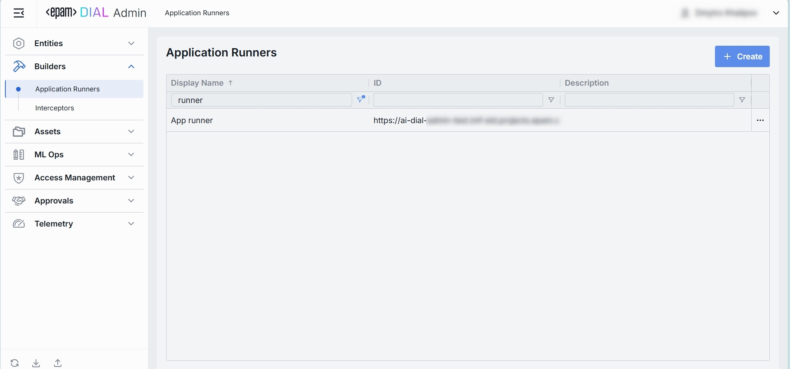
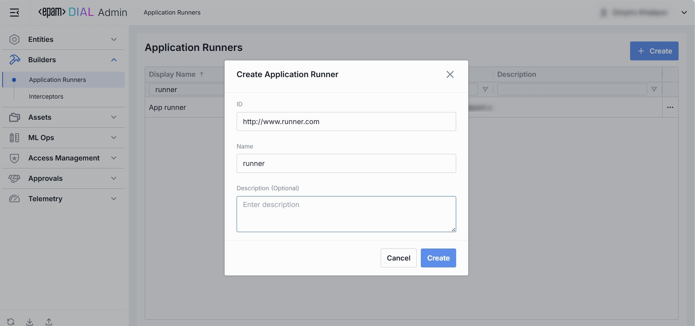
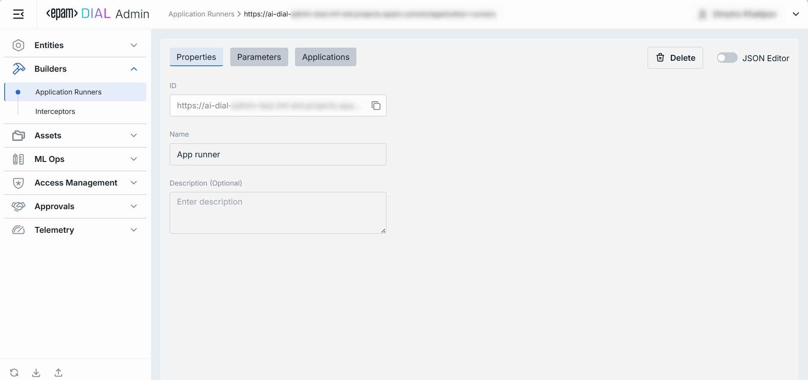
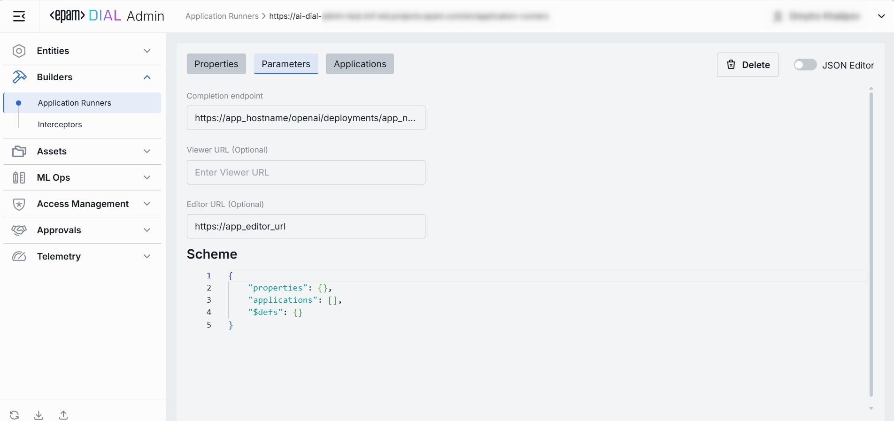
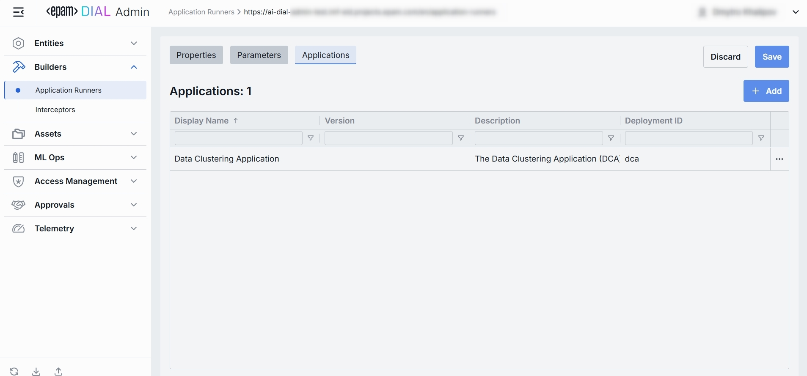

# Application Runners

## What Is an “Application Runner” in DIAL?

**Application Runners** (known as ApplicationTypeSchemas in DIAL Core config) are predefined templates used for creating custom implementations of applications in DIAL. These schemas enable low and no-code UI wizards for end-users to create applications. In self-hosted setups, you can extend the standard package with custom types to support specific business cases, allowing for fully custom UI and application wizards.

## Application Runners Listing

The page under Builders lets you manage the Application Runners you have in your DIAL instance. 
Use this page to view, filter, and create new artefacts.

### 1. Navigate to Application Runners

In the sidebar, expand **Builders** and click **Application Runners**.

### 2. Application Runners Grid

**Filtering & Sorting**
* Each column header has sort arrows; click to reorder.
* Beneath each header is a filter box - type text to narrow the list in real time.

| Column           | Definition & Use Case                                                                                                                                                            |
|------------------|----------------------------------------------------------------------------------------------------------------------------------------------------------------------------------|
| **Display Name** | A human-friendly label for the runner (e.g. “Python Lambda Runner”, “NodeJS App Service”). Helps you pick the right runtime when creating an Application.                        |
| **ID**           | The unique identifier for this runner—typically the base URL of the service (e.g. `https://my-runner.example.com`). DIAL Core uses this endpoint to POST orchestration payloads. |
| **Description**  | Free-text notes about the runner’s capabilities, cluster location, version, or SLA (e.g. “v2 on GKE, 2 vCPU, 8 GB RAM”).                                                         |

## Create Application Runner

Use the **Create Application Runner** dialog to register a new runner in your DIAL instance. Once added, it appears in the **Application Runners** listing.

> It may take some time for the changes to take effect after saving.

### 1. Hit **Create** button 

Opens the **Create Application Runner** modal.

### 2. Define key parameters

In the modal, specify the following for the new runner:

| Field           | Required | Definition                                                                   |
|-----------------|-----------|------------------------------------------------------------------------------|
| **ID**          | **Yes**   | The unique identifier for this runner—typically the base URL of the service. |
| **Name**        | **Yes**   | Human-friendly name of the Application Runner.                               |
| **Description** | No        | Free-text notes about the runner’s capabilities.                             |

### 3. Click Create 
Once all required fields are filled hit **Create** button. The dialog closes and the new runner configuration screen opened.

  > This entry will appear immediately in the listing once created.

## App Runner Configuration - Top Bar Controls

* **Delete**: Permanently removes this runner definition. All related Applications still bound to it will be deleted as well.

* **JSON Editor** (Toggle): Switch between the form-based UI and raw JSON view of the runner’s configuration. Use JSON mode for copy-paste or advanced edits.

## App Runner Configuration - Properties Tab

The Properties tab on an Application Runner lets you define its core identity and metadata - so DIAL Core knows where to send orchestration payloads and how to present this runner in the UI.

### 1. Properties Fields

| Field           | Required | Definition                                                                                                                                                                                                           |
|-----------------|-----------|----------------------------------------------------------------------------------------------------------------------------------------------------------------------------------------------------------------------|
| **ID**          | **Yes**   | The base URL or unique identifier where this runner’s service is hosted (e.g. https://my-runner.example.com/v1/execute). DIAL Core will POST orchestration payloads to this endpoint for any Application bound here. |
| **Name**        | **Yes**   | A human-friendly label for this runner (e.g. “Python Lambda Runner” or “NodeJS Service Worker”).                                                                                                                     |
| **Description** | No        | Free-text notes about the runner - its environment (staging vs. prod), resource profile (2 vCPU, 8 GB RAM), or any special instructions.                                                                             |                                                                      |
 

## App Runner Configuration - Parameters Tab

The Parameters tab on an Application Runner defines how DIAL Core calls your runner service (its endpoints) and what parameter schema it expects. 
This lets DIAL validate, document, and render input forms for any Application bound to this runner.

### 1. Parameters Fields

| Field                   | Required | Definition                                                                                                                                                                                                           |
|-------------------------|-----------|----------------------------------------------------------------------------------------------------------------------------------------------------------------------------------------------------------------------|
| **Completion endpoint** | **Yes**   | The base URL or unique identifier where this runner’s service is hosted (e.g. https://my-runner.example.com/v1/execute). DIAL Core will POST orchestration payloads to this endpoint for any Application bound here. |
| **Viewer URL**          | No        | A link to a web UI where end-users can preview applications backed by this runner.                                                                                                                                   |
| **Editor URL**          | No        | A link to an external editing interface where the Application logic can be modified or configured.                                                                                                                   |                                                                      |
| **Scheme**              | Yes       | A JSON Schema document that defines the Parameters object your runner expects in its payload—under the properties, applications, and optional sections.                                                              |
 

## App Runner Configuration - Applications Tab

The Applications tab on an Application Runner’s detail page shows which DIAL Applications are bound to this runner.
By assigning applications here, you tell DIAL Core to dispatch orchestration payloads for those apps to this specific runner endpoint.

### 1. Applications List

| Column            | Definition                                                                                                        |
| ----------------- | ----------------------------------------------------------------------------------------------------------------- |
| **Display Name**  | Human-friendly name of the Application (e.g. “Data Clustering Application”).                                      |
| **Version**       | The Application’s version tag (e.g. `v1.0`, `2024-07-15`) as defined in **Entities → Applications → Properties**. |
| **Description**   | Free-text summary of what the Application does.                                                                   |
| **Deployment ID** | The unique alias used in the Application’s endpoint URL (e.g. `dca`, `support-bot`).                              |

### 2. Adding Application

1. Click **+ Add** (top-right of the Applications Grid).
2. **Select** one or more apps in the modal.
3. **Confirm** to insert them into the table.

### 3. Removing Application
 
1. Click the actions menu (•••) in the app's line.
2. Choose **Remove** in the menu.